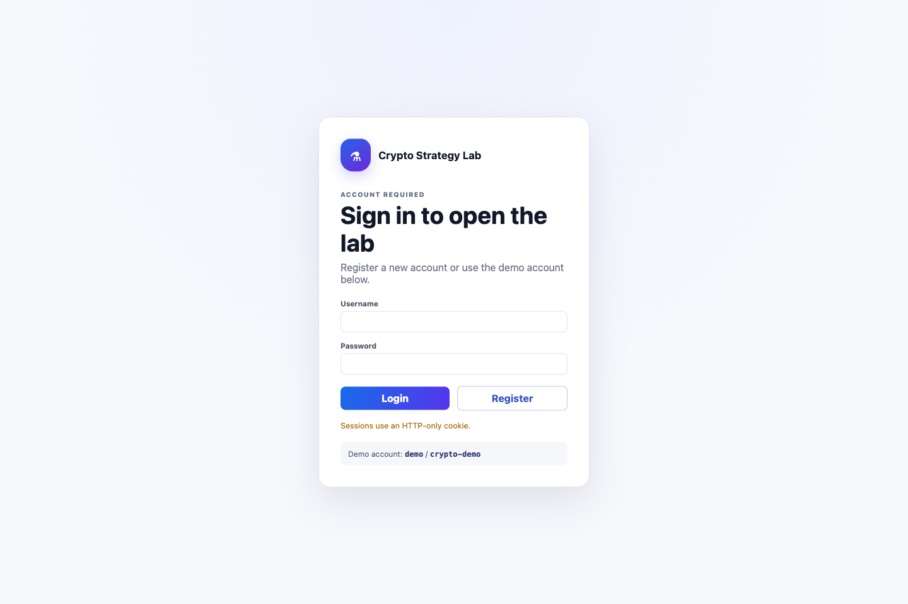
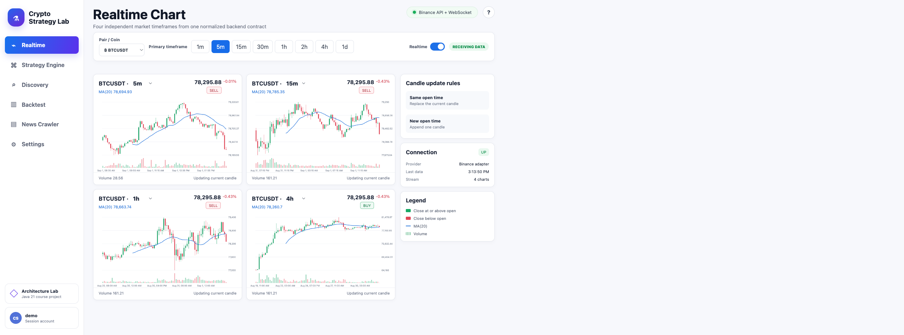
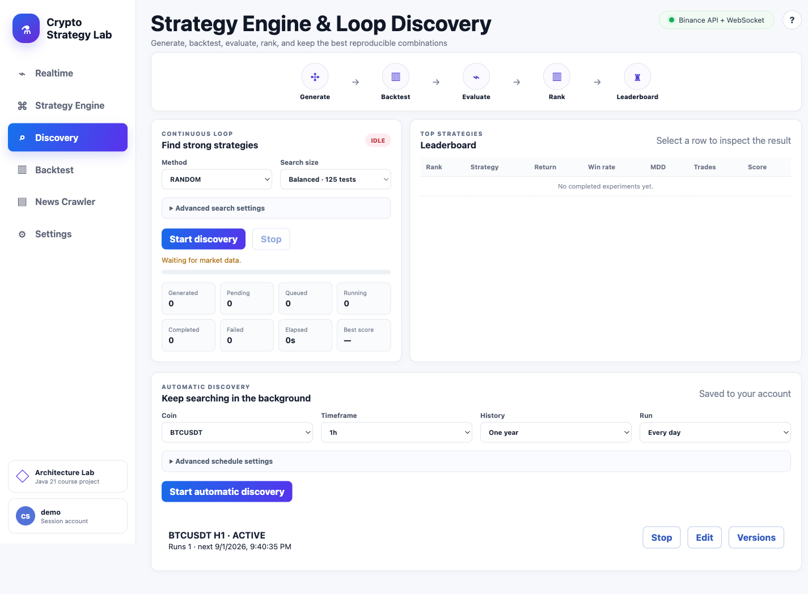
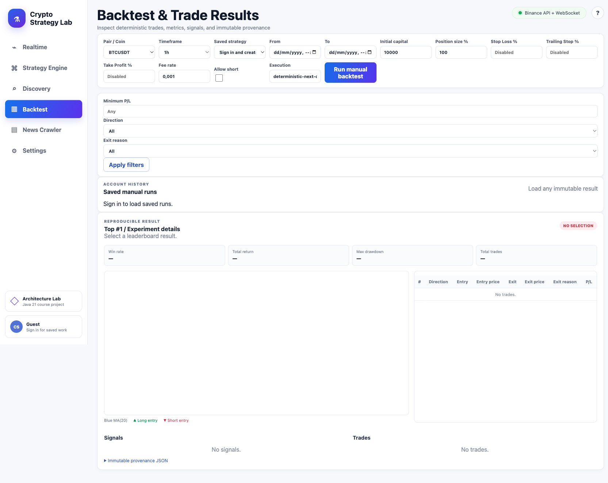

# Crypto Strategy Lab

Crypto Strategy Lab is a research and backtesting application for cryptocurrency
strategies. It streams market candles, combines technical and news-based signals,
searches strategy configurations, and stores reproducible backtest results. It is
for study and experimentation only. It does not place real orders.

The application is a Java 21 modular system with a Spring Boot API, a separate
backtest worker, PostgreSQL, RabbitMQ, and a browser dashboard.

## Screenshots

### Account gate



### Realtime market charts



### Strategy discovery



### Backtest results



## Implemented features

- A first-visit account gate that hides the dashboard until registration or
  login succeeds. Sessions use an HTTP-only cookie and BCrypt password hashes.
- A configurable local demo account for immediate access.
- Four independent real-time candlestick charts for different timeframes, backed
  by Java `HttpClient` REST and WebSocket adapters for Binance or OKX.
- Interactive canvas charts with paged earlier history, wheel zoom, drag pan,
  crosshair/OHLC inspection, volume, and continuously changing open candles.
- Binance or OKX market provider selection.
- MA, RSI, Bollinger Bands, Support/Resistance, MACD, News Sentiment, and a safe
  executable `RULE` strategy DSL for AI-authored metric/operator conditions.
- Majority and weighted signal-combination policies.
- Random Search and multi-generation Genetic Search.
- Durable job queue, scalable workers, retry, cancellation, and outbox/inbox
  processing.
- Deterministic backtesting with immutable datasets and provenance. Result charts
  reload the experiment's own candles and display indicator, signal, entry, and
  exit overlays rather than using the current realtime chart.
- Long and Short positions, position sizing, Stop Loss, Take Profit, and Trailing
  Stop.
- Performance metrics, trade history, filters, chart markers, and leaderboards.
- Manual account-owned backtests with reloadable history and exact historical
  date ranges up to 20,000 candles by default.
- Natural-language and public article URL strategy authoring through Gemini.
  A validated `RULE` is converted to deterministic Java source, stored with the
  strategy, compiled, and executed. The compiler rejects edited source.
- Strategy idea confirmation, JSON repair attempts, smoke tests, version history,
  and deletion.
- Account-owned continuous Genetic Search schedules with start, stop, recovery,
  and immutable configuration versions. The default interval is 24 hours.
- News collection from CryptoCompare, RSS or Atom feeds, and HTML websites.
  Composite mode merges CryptoCompare and RSS while tolerating one provider
  failure. Sentiment uses the local keyword model by default or Gemini when
  selected.
- Versioned crawler selector templates, scheduled live-page selector checks, and
  Gemini-assisted replacement selectors that remain `NEEDS_REVIEW` until the
  account owner confirms them. Active selectors also extract, store, and analyze
  articles from HTML pages.
- Flyway database migrations V1 through V19.
- A real-time load proof in which 1,000 of 1,000 sessions received all four
  timeframe topics.

## Deliberate limits and not fully verified

- Automatic runtime failover from Binance to OKX. Select one provider at startup.
- Arbitrary AI source is never accepted. The application compiles only Java that
  it generates from validated `RULE` fields and verifies before execution.
- Each experiment uses one selected timeframe from the supported set. Strategies
  that synchronize signals from several timeframes inside one experiment are not
  implemented.
- Real trading and exchange order execution. The application is a backtester.
- A literal 24-hour soak test. Schedule recovery and repeated execution have
  automated coverage, but a full-day run has not been recorded.
- Automated browser coverage for navigation, chart updates, and trade selection.
- Tablet and mobile visual QA.

Gemini strategy authoring, semantic sentiment, and selector repair require
`GEMINI_API_KEY`. Live CryptoCompare collection requires `NEWS_API_KEY`.
Deterministic keyword sentiment does not require an external key. The checked-in
example leaves both keys blank.

## Run with Docker

Requirements:

- Docker Engine with Docker Compose
- Internet access for Maven dependencies and live market data

Create local configuration:

```bash
cp .env.example .env
```

The defaults run without Gemini and without authenticated CryptoCompare news.
The default local account is `demo` with password `crypto-demo`. Change or
disable it in `.env` before exposing the application outside a local machine:

```dotenv
DEFAULT_ACCOUNT_ENABLED=true
DEFAULT_ACCOUNT_USERNAME=demo
DEFAULT_ACCOUNT_PASSWORD=crypto-demo
GEMINI_API_KEY=
GEMINI_MODEL=gemini-2.5-flash
NEWS_API_KEY=
NEWS_PROVIDER=all
NEWS_RSS_URLS=https://www.coindesk.com/arc/outboundfeeds/rss/,https://cointelegraph.com/rss
SENTIMENT_PROVIDER=keyword
CRAWLER_CHECK_INTERVAL=15m
```

Set `SENTIMENT_PROVIDER=gemini` to use Gemini semantic sentiment. Selector checks
run every 15 minutes by default; a failed check never activates an AI proposal
without user confirmation.

Choose the provider from the News screen and click **Apply**. The choice affects
manual and scheduled collection immediately. `NEWS_PROVIDER` sets the initial
dropdown value:

```dotenv
# CryptoCompare only
NEWS_PROVIDER=cryptocompare

# RSS and Atom feeds only
NEWS_PROVIDER=rss

# CryptoCompare and RSS together
NEWS_PROVIDER=all
```

`rss` and `all` require at least one comma-separated URL in `NEWS_RSS_URLS`.
The older value `composite` is accepted as an alias for `all`. HTML website
templates are managed from the News screen and can run alongside any mode.

Build and start the complete application:

```bash
docker compose up -d --build
docker compose ps
```

Open `http://localhost:8080`. RabbitMQ management is available at
`http://localhost:15672` with the credentials from `.env`.

Stop the application without deleting its database volume:

```bash
docker compose down
```

To run three worker replicas:

```bash
docker compose up -d --build --scale worker=3
```

## Use the application

1. Open `http://localhost:8080`. The application shows only the account form
   until registration or login succeeds. Register a new account or sign in with
   `demo` / `crypto-demo`.
2. Use **Realtime** to select a market pair and inspect four independently
   updating timeframes.
3. Use **Strategy** to create a strategy from a prompt or article URL. This step
   requires `GEMINI_API_KEY`. Confirm the proposed idea before saving its JSON.
4. Use **Discovery** to run Random or Genetic Search, or create a repeating
   Genetic schedule. Start with Quick, Balanced, or Deep. Raw limits stay under
   Advanced search settings.
5. Use **Backtest** to choose a strategy, period, and risk profile. Open Advanced
   backtest settings only when you need custom dates, fees, sizing, or exits.
   Review metrics, trades, and chart markers after the run completes.
6. Use **News** to collect and inspect news sentiment. Live CryptoCompare data
   requires `NEWS_API_KEY`.
7. Return to Discovery or Backtest later to reload account-owned schedules,
   experiments, versions, and results.

## Develop and test

Java 21 is required. The Maven Wrapper is included:

```bash
./mvnw clean verify
```

Build executable jars:

```bash
./mvnw clean package
```

Run the architecture proof suite:

```bash
./scripts/verify-architecture-proofs.sh
```

Module dependency direction:

```text
api-app / worker-app -> infrastructure -> core
integration-tests    -> api-app / worker-app
```

- `core`: domain models, application services, and ports.
- `infrastructure`: database, messaging, and external provider adapters.
- `api-app`: REST, WebSocket, dashboard, and API startup.
- `worker-app`: independently scalable backtest worker.
- `integration-tests`: cross-module and failure-path tests.

## Detailed documentation

- [Product requirements](docs/requirements/Crypto%20Strategy%20Lab%20%E2%80%93%20%C4%90%E1%BB%93%20%C3%A1n%20cu%E1%BB%91i%20k%E1%BB%B3.md)
- [Additional requirements](docs/requirements/new_add_requirement.txt)
- [Architecture summary](docs/architecture/ARCHITECTURE_SUMMARY.md)
- [Architecture](docs/ARCHITECTURE.md)
- [Requirements traceability](docs/REQUIREMENTS_TRACEABILITY.md)
- [Architecture proof matrix](docs/architecture/PROOF_MATRIX.md)
