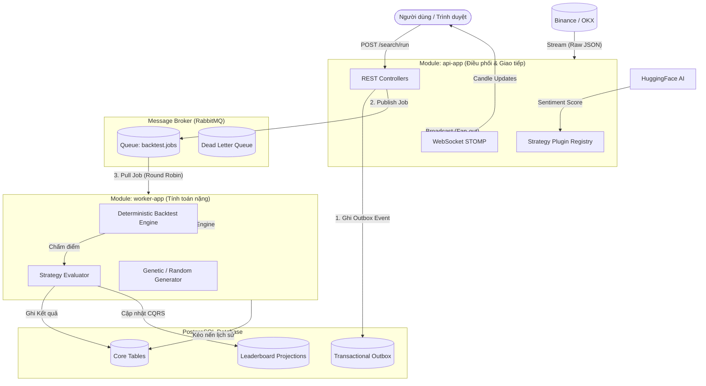
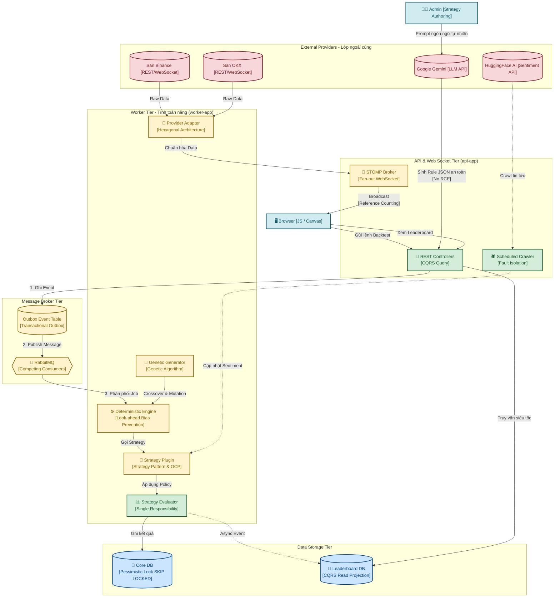

# BÍ KÍP VẤN ĐÁP KIẾN TRÚC PHẦN MỀM - TỔNG HỢP (V3)
*Tài liệu tra cứu nhanh dành cho buổi bảo vệ Đồ án - Kết hợp Sơ đồ Luồng, Ánh xạ Tiêu chí và Kịch bản Sự cố*

---

## 🗺️ PHẦN 1: BẢN ĐỒ KIẾN TRÚC TỔNG THỂ (BIRD'S-EYE VIEW)
*Khi thầy cô hỏi "Hệ thống của em hoạt động tổng thể ra sao?", hãy mở bản đồ này ra và chỉ theo luồng.*

---

## 🎯 PHẦN 2: CHI TIẾT KIẾN TRÚC TỪNG MODULE (ÁNH XẠ TIÊU CHÍ)

### 1. Module 1: Xử lý Tải Realtime 1000 Users (Tiêu chí 4 & 5, Nâng cao số 30)
- **Hỏi gì:** Nếu 1000 người cùng vào xem 1 cặp tiền, hệ thống của em có mở 1000 kết nối lên Binance không?
- **Ở đâu (Where):** 
  - [`MarketDataStreamService.java`](../core/src/main/java/com/cryptolab/marketdata/application/MarketDataStreamService.java)
  - [`MarketSubscriptionTracker.java`](../api-app/src/main/java/com/cryptolab/api/marketdata/MarketSubscriptionTracker.java)
- **Làm thế nào (How):** Sử dụng kiến trúc **Fan-out** kết hợp **Reference Counting**. 1000 người vào xem BTCUSDT 1m thì Server chỉ mở **ĐÚNG 1 KẾT NỐI** WebSocket duy nhất lên Binance. Server sau đó sẽ nhân bản (Broadcast) gói tin đó xuống 1000 người dùng thông qua STOMP Topic.
- **Tại sao (Why):** Bảo vệ Server khỏi việc cạn kiệt tài nguyên mạng (Socket Exhaustion) và bị sàn Binance khóa IP (Rate limit).
- 🔍 **Đọc sâu hơn:** [Sơ đồ Module 1 - Realtime Market Data](../../docs_old/VanDap_KienTruc.md#--module-1-realtime-market-data)

### 2. Module 4: Khả năng mở rộng Strategy (Plugin Architecture - Tiêu chí 1 & 26)
- **Hỏi gì:** Em thêm một chiến lược mới (ví dụ MACD) như thế nào? Có phải sửa UI không?
- **Ở đâu (Where):** 
  - [`StrategyFactory.java`](../core/src/main/java/com/cryptolab/strategy/port/StrategyFactory.java)
  - [`SpringStrategyRegistry.java`](../infrastructure/src/main/java/com/cryptolab/infrastructure/strategy/adapter/SpringStrategyRegistry.java)
  - [`MacdStrategy.java`](../core/src/main/java/com/cryptolab/strategy/domain/extension/MacdStrategy.java)
- **Làm thế nào (How):** Dùng **Strategy Pattern** và **Factory Pattern**. Tạo một class mới kế thừa Strategy và đăng ký dưới dạng Bean. Lúc khởi động, `SpringStrategyRegistry` sẽ tự quét các Bean này và trả về cho Frontend dưới dạng cấu trúc JSON Schema.
- **Tại sao (Why):** Tuân thủ tuyệt đối **Open-Closed Principle (OCP)**. Code cũ bị đóng (Closed for modification), chức năng mới được mở rộng (Open for extension).
- 🔍 **Đọc sâu hơn:** [Sơ đồ Module 4 - Strategy Plugin Architecture](../../docs_old/VanDap_KienTruc.md#module-4-strategy-plugin-architecture)

### 3. Tách biệt Backtester và Evaluator (Tiêu chí 11 & 12)
- **Hỏi gì:** Tại sao em lại tách việc Chấm điểm (Evaluator) ra khỏi việc Chạy giả lập (Backtester)?
- **Ở đâu (Where):** 
  - [`DeterministicBacktestEngine.java`](../core/src/main/java/com/cryptolab/backtest/engine/DeterministicBacktestEngine.java)
  - [`DefaultStrategyEvaluator.java`](../core/src/main/java/com/cryptolab/backtest/engine/DefaultStrategyEvaluator.java)
- **Làm thế nào (How):** Backtester chỉ chạy qua tập nến và sinh ra danh sách `Trades`. Sau đó, Evaluator mới duyệt qua mảng Trades và tính `Return, Win Rate, Drawdown`.
- **Tại sao (Why):** Tuân thủ **Single Responsibility (SRP)**. Tính toán tài chính là logic khác với logic khớp lệnh.
- 🔍 **Đọc sâu hơn:** [Sơ đồ Engine](../../docs_old/VanDap_KienTruc.md#module-3-strategy-engine)

### 4. Kiến trúc Modular Monolith & Giao tiếp (Tiêu chí 2 & 23)
- **Hỏi gì:** Tại sao em không chia nhỏ thành Microservices? Tại sao lại dùng Modular Monolith?
- **Ở đâu (Where):** Cấu trúc source code (`core/`, `infrastructure/`, `api-app/`, `worker-app/`)
- **Làm thế nào (How):** Lõi (`core`) hoàn toàn thuần Java. Ứng dụng chạy trên 2 tiến trình độc lập (`api-app` và `worker-app`).
- **Tại sao (Why):** Tránh được "Cơn ác mộng phân tán" nhưng vẫn đạt được mục đích quan trọng nhất của Microservices là **Scale độc lập** (Tách web ra khỏi tính toán nặng).

### 5. Hàng đợi Worker & Mở rộng Ngang (Tiêu chí 21 & 22)
- **Hỏi gì:** Nếu 1 lúc có 10.000 Backtest cần chạy, Server Web có bị sập không?
- **Ở đâu (Where):** RabbitMQ, file config `docker-compose.yml`.
- **Làm thế nào (How):** API chỉ đẩy Job vào Message Queue (RabbitMQ). Worker sẽ lấy Job ra chạy. Nhờ cơ chế **Competing Consumers** và khóa `SKIP LOCKED` của Postgres DB, ta có thể bật bao nhiêu Worker song song tùy thích.
- **Tại sao (Why):** **Tách rời (Decoupling)** quá trình phục vụ Web và tính toán. Nếu Worker sập, RabbitMQ tự động thu hồi Job.

### 6. Mô hình Ghi/Đọc Độc Lập - CQRS (Tiêu chí 24)
- **Hỏi gì:** Backtest lưu hàng triệu rows. Vậy sao xem Leaderboard vẫn mượt mà?
- **Ở đâu (Where):** [`LeaderboardProjection.java`](../core/src/main/java/com/cryptolab/leaderboard/projection/LeaderboardProjection.java)
- **Làm thế nào (How):** Tách biệt Command (ghi Backtest) và Query (đọc Leaderboard). Leaderboard cập nhật bất đồng bộ qua Outbox Event và được tính toán trước.
- **Tại sao (Why):** Tránh hiện tượng khóa bảng (Table lock) của hệ quản trị CSDL.

### 7. Module 5: Composite Strategy & Majority Vote
- **Hỏi gì:** Làm sao kết hợp nhiều chiến lược lại với nhau để ra 1 quyết định chung?
- **Ở đâu (Where):** 
  - [`CombinationPolicy.java`](../core/src/main/java/com/cryptolab/strategy/domain/CombinationPolicy.java)
  - [`MajorityVotePolicy.java`](../core/src/main/java/com/cryptolab/strategy/domain/policy/MajorityVotePolicy.java)
- **Làm thế nào (How):** Strategy con chỉ trả signal. `CombinationPolicy` (như MajorityVote, WeightedVote) làm nhiệm vụ phân xử (cộng điểm). 
- 🔍 **Đọc sâu hơn:** [Sơ đồ Module 5 - Composite Strategy](../../docs_old/VanDap_KienTruc.md#module-5-composite-strategy)

---

## 💥 PHẦN 3: MA TRẬN KỊCH BẢN SỰ CỐ & CÁCH "ĐỠ" (WHAT-IF SCENARIOS)
*Thầy cô sẽ giả định các tình huống tồi tệ nhất. Hãy kết hợp sơ đồ trên cùng và các kỹ thuật này để trả lời.*

### 💥 Kịch bản 1: Bùng nổ Dữ liệu & Người dùng (Traffic Spike)
> **Giám khảo hỏi:** *"Đang có tin nóng, 10.000 user ùa vào xem biểu đồ BTC 1m, cùng lúc 5.000 request yêu cầu chạy Backtest ập tới. Server cháy không?"*
- **Trả lời:** KHÔNG CHÁY.
- **Biểu đồ (Chart):** Em dùng kỹ thuật **Reference Counting & Fan-out**. Kết nối từ Server lên sàn Binance vẫn **chỉ là 1**. Dữ liệu lấy về 1 lần và Broadcast trong RAM xuống 10.000 STOMP Session. 
- **Backtest:** 5.000 request được đưa vào **Message Queue (RabbitMQ)**. Web API trả về 202 ngay lập tức. Ở phía sau, Worker Pool xử lý dần, không hề kéo sập Web.

### 💥 Kịch bản 2: Sự Cố Chết Đột Ngột (Crash / Mất Điện)
> **Giám khảo hỏi:** *"Đang chạy dở 1 backtest ngốn RAM quá, con Worker bị Crash. Dữ liệu mất luôn không?"*
- **Trả lời:** Em sử dụng kỹ thuật **Transactional Outbox** và **RabbitMQ Manual Acknowledgment (ACK)**.
- Khi Worker kéo Job từ Queue về, Job đó **chưa bị xóa**, chỉ bị "Tạm ẩn". Nếu Worker Crash, RabbitMQ tự động đưa Job đó hiện hình trở lại Queue để con Worker khác xử lý lại (Auto-recovery). Để chống 2 con giành nhau ghi dữ liệu, em dùng **Pessimistic Lock (FOR UPDATE SKIP LOCKED)**.

### 💥 Kịch bản 3: Sập API Bên Thứ 3 (3rd-party Failure)
> **Giám khảo hỏi:** *"API của Google Gemini rất hay bị Timeout/Sập. Nếu nó sập, sàn giao dịch có tê liệt theo không?"*
- **Trả lời:** Hoàn toàn không. Nhóm em thiết kế theo nguyên lý **Fault Isolation (Cô lập lỗi)**.
- Tiến trình Crawl và gọi LLM chạy trên một luồng nền độc lập (Background Scheduled Thread). Nếu Gemini Timeout, luồng Crawler sẽ Fail-fast. Core Engine và Market Data Stream không hề bị ảnh hưởng.

### 💥 Kịch bản 4: Thay đổi Yêu cầu Ngang Xương (Requirement Changes)
> **Giám khảo hỏi:** *"Giờ khách hàng không dùng sàn Binance nữa mà bắt đổi qua lấy nến từ sàn OKX. Sửa code mất bao lâu?"*
- **Trả lời:** Sửa code **0 phút**.
- Áp dụng **Hexagonal Architecture (Ports & Adapters)**. Em đã code sẵn cả Adapter cho Binance và OKX. Chỉ cần vào `.env` đổi biến `MARKET_PROVIDER=okx` rồi khởi động lại hệ thống. Spring Boot sẽ tự Inject OKX Adapter vào. Không một dòng Business Logic nào thay đổi.

---

## 🚀 PHẦN 4: SIÊU SƠ ĐỒ KỸ THUẬT TOÀN CẢNH (ULTIMATE TECH MAP)
*Sơ đồ này là vũ khí tối thượng ghim tất cả các kỹ thuật nâng cao lên một bức tranh duy nhất. Dùng sơ đồ này để trình bày luồng xử lý từ đầu đến cuối.*

