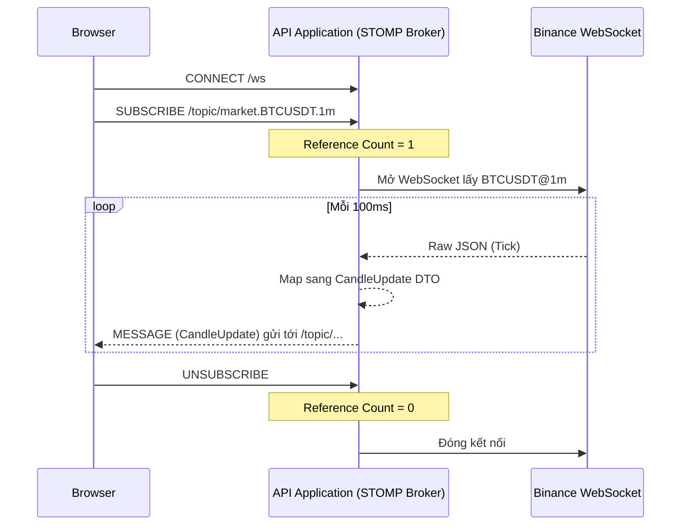

# WebSocket & STOMP Events (Realtime)

Hệ thống Crypto Strategy Lab sử dụng giao thức **STOMP (Simple Text Oriented Messaging Protocol) trên nền WebSocket** để phân phối dữ liệu biến động giá theo thời gian thực (Realtime) tới người dùng trình duyệt theo kiến trúc **Fan-out**.

## 1. Kết nối (Connection)
- **Endpoint:** `/ws`
- **Giao thức:** STOMP qua SockJS hoặc native WebSockets.
- Frontend cần sử dụng thư viện `@stomp/stompjs` để kết nối vào Endpoint này.

## 2. Các chủ đề lắng nghe (Subscribable Topics)

### Topic: Cập nhật giá nến (Market Data)
- **Destination:** `/topic/market.{symbol}.{timeframe}`
  - Ví dụ: `/topic/market.BTCUSDT.1m`
- **Mô tả:** Bất cứ khi nào sàn Binance/OKX trả về 1 thay đổi giá (Tick) của cây nến đang mở (Open Candle), Backend sẽ phát sóng sự kiện `CandleUpdate` vào Topic này.
- **Payload:**
  ```json
  {
    "symbol": "BTCUSDT",
    "timeframe": "1m",
    "timestamp": 1718223000000,
    "open": 64500.5,
    "high": 64600.0,
    "low": 64450.0,
    "close": 64550.2,
    "volume": 124.5,
    "isClosed": false
  }
  ```
- **Cơ chế Tracking:** Nhờ `MarketSubscriptionTracker`, Backend chỉ mở duy nhất 1 luồng WebSocket đến Binance cho dù có hàng ngàn user cùng Subscribe vào một Topic. Khi số người dùng (Reference Count) tụt về 0, Backend tự động đóng luồng Binance tương ứng.

### Topic: Trạng thái Xếp hạng (Leaderboard)
- **Destination:** `/topic/leaderboard`
- **Mô tả:** Trả về tín hiệu khi bảng xếp hạng (Leaderboard) vừa có một chiến lược mới chen chân vào Top 10. Frontend có thể lắng nghe để hiển thị thông báo "Bảng xếp hạng vừa cập nhật!".

## 3. Kiến trúc Luồng Dữ liệu (Data Flow)


