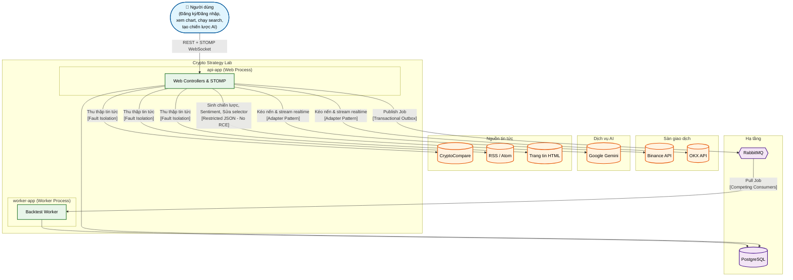

# C4 Level 1 – System Context & Bản đồ Kỹ thuật Toàn cảnh

## Sơ đồ 1: System Context (Ai giao tiếp với ai?)

### Bảng kỹ thuật cấp System Context

| Kỹ thuật | Áp dụng ở đâu | Vấn đề giải quyết |
|---|---|---|
| Hexagonal Architecture | Toàn bộ hệ thống (Core chỉ biết Port) | Đổi sàn/nguồn tin/model AI mà không sửa core |
| Adapter Pattern | Binance, OKX, CryptoCompare, RSS, Gemini | Cô lập format JSON/XML khác nhau |
| Modular Monolith | api-app + worker-app cùng chia sẻ `core` | Scale độc lập mà không cần Microservices |
| Fault Isolation | News/Sentiment/Gemini chạy luồng nền | Lỗi bên thứ 3 không kéo sập Market/Backtest |
| Transactional Outbox | api-app → RabbitMQ | Không mất message giữa DB commit và broker |
| Competing Consumers | RabbitMQ → Worker Pool | Scale ngang vô hạn bằng replica count |

---

## Sơ đồ 2: Bản đồ Module & Kỹ thuật Toàn cảnh (All Modules + All Techniques)

*Sơ đồ này ghim TẤT CẢ 11 module cùng các kỹ thuật ăn điểm lên một bức tranh duy nhất, thể hiện cách các module tương tác với nhau.*

```mermaid
flowchart TB
    classDef user fill:#e1f5fe,stroke:#01579b,stroke-width:2px,color:#000
    classDef browser fill:#fff8e1,stroke:#ff8f00,stroke-width:2px,color:#000
    classDef api fill:#e8f5e9,stroke:#2e7d32,stroke-width:2px,color:#000
    classDef mq fill:#fbe9e7,stroke:#d84315,stroke-width:2px,color:#000
    classDef worker fill:#ffebee,stroke:#c62828,stroke-width:2px,color:#000
    classDef core fill:#e0f7fa,stroke:#006064,stroke-width:2px,color:#000
    classDef infra fill:#f3e5f5,stroke:#4a148c,stroke-width:2px,color:#000
    classDef db fill:#efebe9,stroke:#4e342e,stroke-width:2px,color:#000
    classDef external fill:#fff3e0,stroke:#e65100,stroke-width:2px,color:#000

    User(["👤 Người dùng"]):::user

    subgraph BROWSER ["Module 2: Multi-timeframe Chart"]
        Chart["4 chartStates độc lập\n[Independent State]\n[openTime Upsert]\n[No Full Page Reload]"]:::browser
    end

    subgraph API ["api-app Process"]
        direction TB
        REST["REST Controllers\n[CQRS Query Side]"]:::api
        STOMP["STOMP Broker\n[Fan-out Broadcast]"]:::api
        Tracker["MarketSubscriptionTracker\n[Reference Counting]"]:::api
        AuthCtrl["AccountController\n[BCrypt + HTTP-only Session]"]:::api
        AuthorCtrl["StrategyAuthoringController\n[AI Strategy Creation]"]:::api
        CrawlerMon["CrawlerTemplateMonitor\n[Scheduled Background Thread]"]:::api
    end

    subgraph MQ ["Message Broker"]
        direction LR
        RMQ{{"RabbitMQ\n[Durable Queue]\n[Dead Letter Queue]\n[Publisher Confirms]"}}:::mq
        Outbox[("Outbox Events\n[Transactional Outbox]")]:::mq
    end

    subgraph WORKERS ["Worker Pool (Scale Ngang)"]
        direction TB
        Listener["RabbitBacktestJobListener\n[Manual ACK]\n[Poison → DLQ]"]:::worker
        WorkerSvc["BacktestWorkerService\n[Lease: FOR UPDATE SKIP LOCKED]\n[Bounded Retry: MAX=3]\n[Idempotent Completion]"]:::worker
    end

    subgraph CORE ["Core Domain (Pure Java - Không phụ thuộc Framework)"]
        direction TB

        subgraph MOD1 ["Module 1: Market Data"]
            MDSS["MarketDataStreamService\n[Exponential Backoff Reconnect]\n[Gap Recovery]\n[Generation Guard]"]:::core
        end

        subgraph MOD34 ["Module 3+4: Strategy & Plugin"]
            StrategyIF["Strategy Interface\n6 implementations:\nMA, RSI, Bollinger, S/R,\nMACD, NewsSentiment"]:::core
            FactoryIF["StrategyFactory Interface\n[Open-Closed Principle]\n[Auto-discovery Bean]"]:::core
            Registry["StrategyRegistry\n[Plugin Registry Pattern]"]:::core
        end

        subgraph MOD5 ["Module 5: Composite"]
            PolicyIF["CombinationPolicy Interface\n[MajorityVote, WeightedVote]"]:::core
        end

        subgraph MOD6 ["Module 6: Search Engine"]
            GeneratorIF["StrategyGenerator Interface\n[Random: Lazy Stream + Seed]\n[Genetic: Crossover + Mutation]"]:::core
            StopCond["StopConditionEvaluator\n[maxCandidates, duration,\nnoImprovement, exhausted]"]:::core
            Coordinator["SearchCoordinator\n[State Machine:\nRUNNING → EVALUATING →\nCOMPLETED / CANCELLED]"]:::core
        end

        subgraph MOD7 ["Module 7: Backtest Engine"]
            BacktestPort["BacktestPort Interface"]:::core
            Engine["DeterministicBacktestEngine\n[Look-ahead Bias Prevention:\nSignal N → Fill at Open N+1]\n[Long/Short, SL/TP/Trailing]"]:::core
        end

        subgraph MOD8 ["Module 8: Evaluator & Leaderboard"]
            EvalIF["ExperimentEvaluator Interface\n[Return, WinRate, MaxDrawdown,\nProfitFactor, Sharpe, Score]"]:::core
            Ranking["DefaultRankingService\n[Deterministic Multi-key Sort]"]:::core
            Leaderboard["LeaderboardProjection\n[CQRS Read Model]"]:::core
            Provenance["ExperimentProvenance\n[SHA-256 Hash + Checksum]"]:::core
        end

        subgraph MOD1011 ["Module 10+11: News & Sentiment"]
            NewsProvIF["NewsProvider Interface\n[CryptoCompare, RSS,\nComposite, HtmlCrawler]"]:::core
            Collector["NewsCollector\n[Deduplicate, Health Isolation]"]:::core
            SentimentIF["SentimentAnalyzer Interface\n[Keyword, Gemini]"]:::core
            Authoring["StrategyAuthoringService\n[Idea → Confirm → JSON →\nSmoke Test → Save]\n[Restricted JSON: No RCE]"]:::core
        end
    end

    subgraph INFRA ["Infrastructure Adapters"]
        direction LR
        BinanceA["BinanceMarketDataProvider\n+ BinancePayloadMapper"]:::infra
        OkxA["OkxMarketDataProvider\n+ OkxPayloadMapper"]:::infra
        JdbcA["JDBC Repositories\n[ON CONFLICT DO NOTHING]"]:::infra
        GeminiA["Gemini Adapters\n(Authoring + Sentiment + Repair)"]:::infra
        CrawlerRepair["GeminiCrawlerSelectorRepairModel\n[LLM Self-healing]"]:::infra
    end

    subgraph DB ["PostgreSQL"]
        direction LR
        CoreDB[("Core Tables\n(candles, trades,\nexperiments, accounts)")]:::db
        LeaderDB[("Leaderboard Projections\n[CQRS Read Side]")]:::db
        InboxDB[("processed_events\n[Idempotent Consumer]")]:::db
    end

    subgraph External ["Hệ thống bên ngoài"]
        direction LR
        BinanceAPI["Binance"]:::external
        OkxAPI["OKX"]:::external
        GeminiAPI["Google Gemini"]:::external
        NewsAPI["CryptoCompare / RSS / HTML"]:::external
    end

    %% ====== LUỒNG TƯƠNG TÁC CHÍNH XÁC TỚI TỪNG CLASS ======

    %% Người dùng → Browser → API
    User --> Chart
    Chart -- "REST + STOMP" --> REST
    Chart -- "Subscribe topics" --> Tracker

    %% Auth
    User -- "Register/Login" --> AuthCtrl

    %% AI Strategy Creation
    User -- "Prompt / URL bài báo" --> AuthorCtrl
    AuthorCtrl --> Authoring
    Authoring --> GeminiA
    GeminiA --> GeminiAPI

    %% Market Data Flow
    Tracker --> MDSS
    MDSS --> BinanceA
    BinanceA --> BinanceAPI
    MDSS --> OkxA
    OkxA --> OkxAPI
    MDSS --> STOMP
    STOMP --> Chart

    %% Search Flow
    REST -- "Start Search" --> Coordinator
    Coordinator --> GeneratorIF
    Coordinator --> StopCond
    Coordinator --> Outbox
    Outbox --> RMQ

    %% Worker Flow
    RMQ --> Listener
    Listener --> WorkerSvc
    WorkerSvc --> Engine
    Engine --> Registry
    Registry --> StrategyIF
    Engine --> PolicyIF
    Engine --> EvalIF
    EvalIF --> Ranking
    Ranking --> Leaderboard

    %% Provenance
    Leaderboard --> Provenance

    %% CQRS
    EvalIF -. "Async Event" .-> LeaderDB
    REST -- "Query Leaderboard" --> LeaderDB

    %% Worker → DB
    WorkerSvc --> JdbcA
    JdbcA --> CoreDB
    WorkerSvc --> InboxDB

    %% News Flow
    CrawlerMon --> Collector
    Collector --> NewsProvIF
    NewsProvIF --> NewsAPI
    Collector --> SentimentIF
    SentimentIF --> GeminiA
    CrawlerMon --> CrawlerRepair
    CrawlerRepair --> GeminiAPI
```

### Bảng Tổng hợp: Toàn bộ Kỹ thuật theo Module

| Module | Kỹ thuật chính | Kỹ thuật phụ |
|---|---|---|
| **1. Market Data** | Hexagonal (Ports & Adapters), Adapter Pattern, Fan-out WebSocket, Reference Counting | Exponential Backoff Reconnect, Gap Recovery, Generation Guard, Idempotent Write (`ON CONFLICT DO NOTHING`), Domain Invariant Validation |
| **2. Multi-timeframe Chart** | Independent State (4 chartStates), openTime Upsert | No Full Page Reload, Request Version Guard, Canvas tự vẽ (MA20, Bollinger, RSI) |
| **3. Strategy Engine** | Strategy Pattern (Interface + 6 implementations), Immutable Context | Signal Contract (BUY/SELL/HOLD), Strength `[-1,1]`, SRP (mỗi strategy 1 thuật toán) |
| **4. Plugin Architecture** | Factory Pattern, Plugin Registry (Auto-discovery Bean), Open-Closed Principle | JSON Schema Catalog (Frontend tự vẽ form), ArchUnit Architecture Test |
| **5. Composite Strategy** | Strategy Pattern (CombinationPolicy interface), Separation of Concerns | Majority Vote (cộng hướng), Weighted Vote (hướng × trọng số vs threshold) |
| **6. Search Engine** | Port/Interface (StrategyGenerator), Lazy Stream Generation, Deterministic Seed | Genetic Algorithm (Fitness → Crossover → Mutation), Multi-criteria Stop Condition, Batch Processing |
| **7. Backtest Engine** | Port/Interface (BacktestPort), Look-ahead Bias Prevention (Signal N → Fill Open N+1) | Deterministic Versioning, Portfolio Simulation (Long/Short, SL/TP/Trailing Stop, Position Sizing) |
| **8. Evaluator & Leaderboard** | SRP (Backtest ≠ Evaluator ≠ Ranking), CQRS Read Projection | SHA-256 Provenance (Candidate Hash + Dataset Checksum), Deterministic Multi-key Sort, Evaluator Versioning |
| **9. Queue & Worker** | Transactional Outbox, Competing Consumers, Manual ACK, Pessimistic Lock (SKIP LOCKED) | Dead Letter Queue, Idempotent Consumer (Inbox), State Machine, Bounded Retry (MAX=3), Cancellation at Batch Boundary |
| **10. News Crawler** | Port/Interface (NewsProvider), Composite Pattern, Fault Isolation | Deduplication by URL, Human-in-the-Loop (Selector Review), LLM Self-healing (Gemini sửa CSS Selector), Selector Versioning |
| **11. Sentiment & AI Authoring** | Port/Interface (SentimentAnalyzer), Model Versioning, Restricted JSON (No RCE) | Immutable Dataset Snapshot (chống future leakage), Idea Confirmation (Human-in-the-Loop), Smoke Test (250 nến), Bounded Retry (3 lần sửa JSON), Account Ownership |

### Tương tác giữa các Module

| Từ Module | Đến Module | Cơ chế tương tác |
|---|---|---|
| 1 (Market Data) → | 2 (Chart) | STOMP Broadcast (Fan-out) |
| 1 (Market Data) → | 7 (Backtest) | Cung cấp nến lịch sử qua `CandleStore` |
| 3+4 (Strategy + Plugin) → | 7 (Backtest) | Engine gọi `StrategyRegistry.createStrategy()` |
| 5 (Composite) → | 7 (Backtest) | Engine resolve `CombinationPolicy` |
| 6 (Search) → | 9 (Queue) | `SearchCoordinator` dispatch Job qua Outbox → RabbitMQ |
| 9 (Queue/Worker) → | 7 (Backtest) | Worker gọi `BacktestPort.run()` |
| 7 (Backtest) → | 8 (Evaluator) | Truyền `BacktestResult` cho `ExperimentEvaluator` |
| 8 (Evaluator) → | 8 (Leaderboard) | Async Event cập nhật `LeaderboardProjection` (CQRS) |
| 10 (News) → | 11 (Sentiment) | `NewsCollector` gọi `SentimentAnalyzer.analyze()` |
| 11 (Sentiment) → | 3 (Strategy) | `NewsSentimentStrategy` đọc `SentimentObservation` trong `StrategyContext` |
| 11 (AI Authoring) → | 4 (Plugin) | Chiến lược AI sinh ra được validate qua `StrategyRegistry` |
