# C3 Component – Chi tiết từng Module (Kèm giải thích luồng)

## Sơ đồ Tổng quan Container

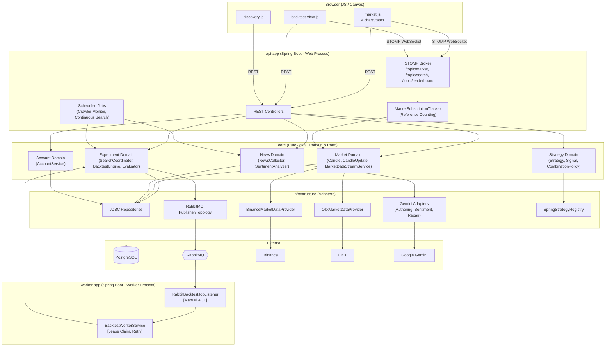

---

## Module 1: Realtime Market Data

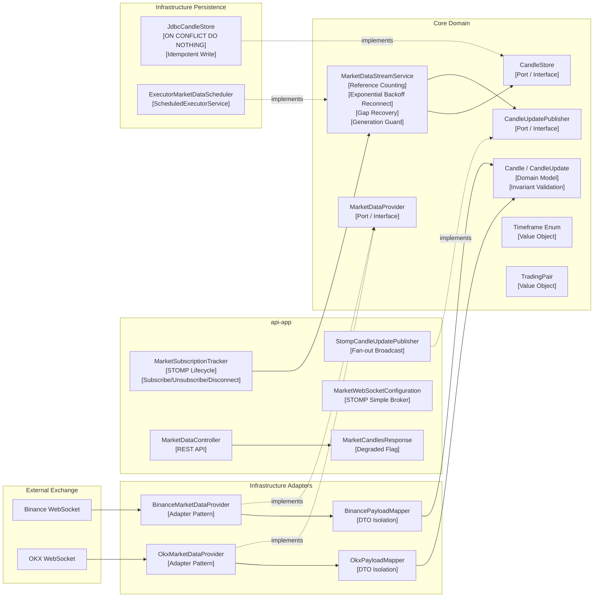

### Phân tích luồng hoạt động chi tiết Module 1

Module 1 chịu trách nhiệm kết nối, thu thập nến theo thời gian thực từ các sàn giao dịch và đẩy xuống trình duyệt người dùng cũng như lưu trữ. Luồng hoạt động và vai trò của từng thành phần trong sơ đồ trên diễn ra như sau:

**1. Tầng External Exchange (Sàn giao dịch ngoài):**
Dữ liệu nến (k-lines) theo thời gian thực được đẩy liên tục từ **Binance WebSocket** và **OKX WebSocket**.

**2. Tầng Infrastructure Adapters (Khối chuyển đổi hạ tầng):**
- Để giao tiếp với hai sàn khác nhau, hệ thống sử dụng **BinanceMarketDataProvider** và **OkxMarketDataProvider**. Cả hai đều áp dụng kỹ thuật **[Adapter Pattern]** để che giấu sự khác biệt về thư viện WebSocket của từng sàn.
- Khi nhận được dữ liệu thô, **BinancePayloadMapper** và **OkxPayloadMapper** sẽ làm nhiệm vụ chuyển đổi. Kỹ thuật **[DTO Isolation]** đảm bảo cấu trúc JSON đặc thù của sàn không bị rò rỉ vào Core Domain. Các Mapper này sẽ ánh xạ dữ liệu thành model chuẩn của hệ thống là **Candle** và **CandleUpdate**.

**3. Tầng Core Domain (Lõi nghiệp vụ trung tâm):**
- Các Adapter tầng trên không được truyền trực tiếp vào lõi mà phải thông qua một **[Port / Interface]** là **MarketDataProvider** (tuân thủ Hexagonal).
- Trái tim của module là **MarketDataStreamService**. Nó nhận dữ liệu và quản lý các cơ sở kết nối với hàng loạt kỹ thuật:
  - **[Reference Counting]**: Đếm số lượng người dùng đang theo dõi một cặp tiền. Nếu không ai theo dõi, tự động ngắt kết nối để tiết kiệm băng thông.
  - **[Exponential Backoff Reconnect]**: Tự động thử kết nối lại với thời gian chờ tăng dần nếu rớt mạng.
  - **[Gap Recovery]** & **[Generation Guard]**: Xử lý bù đắp phần nến bị thiếu hụt nếu WebSocket mất kết nối trong thời gian ngắn.
- Service này gọi ra ngoài qua hai **[Port / Interface]** là **CandleStore** (để lưu DB) và **CandleUpdatePublisher** (để bắn socket real-time xuống web).
- Dữ liệu luân chuyển trong lõi là các **[Domain Model]** (**Candle / CandleUpdate**). Bất kỳ model nào được tạo ra đều qua **[Invariant Validation]** (kiểm tra tính hợp lệ). Model chứa các **[Value Object]** đại diện cho giá trị bất biến như **Timeframe Enum** (Khung thời gian) và **TradingPair** (Cặp giao dịch).

**4. Tầng Infrastructure Persistence (Hạ tầng lưu trữ & thực thi):**
- Implementation của `CandleStore` là **JdbcCandleStore**. Lớp này chịu trách nhiệm lưu DB với lệnh đặc thù **[ON CONFLICT DO NOTHING]**, mang lại cơ chế **[Idempotent Write]** (Ghi lũy đẳng) - không bao giờ sợ lỗi Duplicate Key khi hệ thống nối lại dữ liệu bị đứt quãng.
- Các tác vụ Timer chạy nền trong Core Domain được thực thi qua **ExecutorMarketDataScheduler** bằng bộ pool **[ScheduledExecutorService]**.

**5. Tầng api-app (Ứng dụng Web):**
- Implementation của `CandleUpdatePublisher` là **StompCandleUpdatePublisher**, sử dụng cơ chế **[Fan-out Broadcast]** để phát sóng một chiều cùng một cây nến xuống mọi user đang cùng xem một biểu đồ.
- Nền tảng WebSocket được cấu hình ở **MarketWebSocketConfiguration** với tính năng **[STOMP Simple Broker]** tích hợp trong Spring.
- Vòng đời người dùng được theo dõi bởi **MarketSubscriptionTracker**. Nó hứng các sự kiện **[STOMP Lifecycle]** từ Spring như **[Subscribe/Unsubscribe/Disconnect]** và báo cho Core Domain để tăng/giảm đếm tham chiếu.
- Cuối cùng, với user mới vào trang cần tải lịch sử cũ, **MarketDataController** cung cấp **[REST API]**. Kết quả trả về là **MarketCandlesResponse** mang theo cờ **[Degraded Flag]** nhằm báo hiệu cho client nếu một trong các sàn phụ đang gặp lỗi.

**Kỹ thuật Module 1:**
| Kỹ thuật | Class | Mô tả |
|---|---|---|
| Hexagonal / Ports & Adapters | `MarketDataProvider` (Port), `Binance/OkxMarketDataProvider` (Adapter) | Đổi sàn bằng biến môi trường |
| Adapter Pattern | `BinancePayloadMapper`, `OkxPayloadMapper` | Cô lập JSON format của từng sàn |
| Reference Counting | `MarketDataStreamService` | 1000 user = 1 kết nối sàn |
| Fan-out Broadcast | `StompCandleUpdatePublisher` | Nhân bản data từ 1 stream ra N client |
| Exponential Backoff | `MarketDataStreamService.reconnect()` | Tránh flood reconnect khi sàn sập |
| Gap Recovery | `MarketDataStreamService.recoverGap()` | Bù nến thiếu sau disconnect |
| Generation Guard | `MarketDataStreamService.generation` | Chặn listener cũ gửi data sau reconnect |
| Idempotent Write | `JdbcCandleStore.saveIfAbsent()` | `ON CONFLICT DO NOTHING` chống duplicate nến |
| Domain Invariant | `Candle` constructor | Validate `high >= open,close; low <= open,close; volume >= 0` |
| Value Object | `Timeframe`, `TradingPair` | Chuẩn hóa symbol/timeframe dùng chung |

---

## Module 2: Multi-timeframe Chart

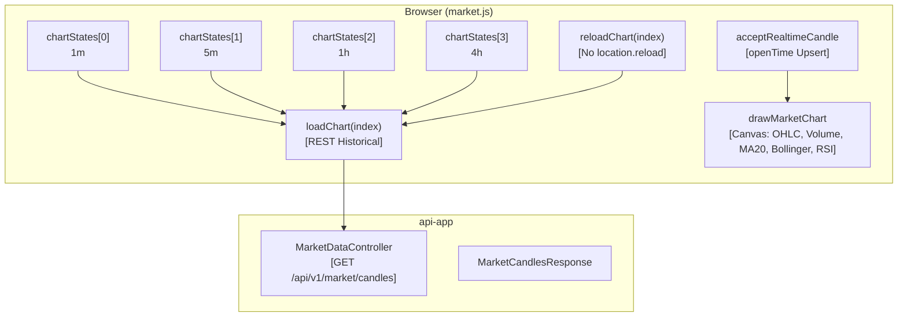

### Phân tích luồng hoạt động chi tiết Module 2

Module 2 phụ trách phần hiển thị biểu đồ đa khung thời gian trên giao diện người dùng, đảm bảo trải nghiệm mượt mà không cần tải lại trang.

**1. Tầng Browser (market.js):**
- Giao diện duy trì 4 trạng thái biểu đồ hoàn toàn độc lập thông qua **[Independent State]** (`chartStates[0]` đến `chartStates[3]`), tương ứng với 4 khung thời gian: **1m**, **5m**, **1h**, **4h**.
- Khi người dùng muốn xem hoặc đổi biểu đồ, hàm `loadChart(index)` được gọi, thực hiện một **[REST Historical]** request để lấy lịch sử nến cũ từ server.
- Để làm mới biểu đồ hiện tại mà không ảnh hưởng tới các biểu đồ khác, hàm `reloadChart(index)` được sử dụng (**[No location.reload]** - Không tải lại toàn trang).
- Khi có một cây nến mới theo thời gian thực được đẩy qua WebSocket, hàm `acceptRealtimeCandle` sẽ xử lý. Nó sử dụng cơ chế **[openTime Upsert]**: Dựa vào thời gian mở nến (openTime), nếu trùng thì ghi đè (replace), nếu mới thì thêm vào cuối (append).
- Hàm `drawMarketChart` chịu trách nhiệm vẽ giao diện bằng công nghệ **Canvas**, kết xuất các thông số kỹ thuật trực quan như nến **OHLC**, khối lượng (**Volume**), đường trung bình **MA20**, dải **Bollinger**, và chỉ số sức mạnh tương đối **RSI**.

**2. Tầng API (api-app):**
- **MarketDataController** phơi bày endpoint `GET /api/v1/market/candles` phục vụ việc tải lịch sử nến (đáp ứng lệnh `loadChart`).
- Controller này trả về **MarketCandlesResponse**, chứa dữ liệu nến đã chuẩn hóa.

**Kỹ thuật Module 2:**
| Kỹ thuật | Vị trí | Mô tả |
|---|---|---|
| Independent State | `chartStates[0..3]` | Mỗi chart có candle list, timeframe, subscription riêng |
| Request Version Guard | `state.requestVersion` | Chặn response cũ ghi đè response mới |
| Upsert by openTime | `acceptRealtimeCandle()` | Cùng openTime → replace; mới → append |
| No Full Page Reload | `reloadChart(index)` | Chỉ reload 1 chart, 3 chart còn lại không bị ảnh hưởng |

---

## Module 3 & 4: Strategy Engine & Plugin Architecture

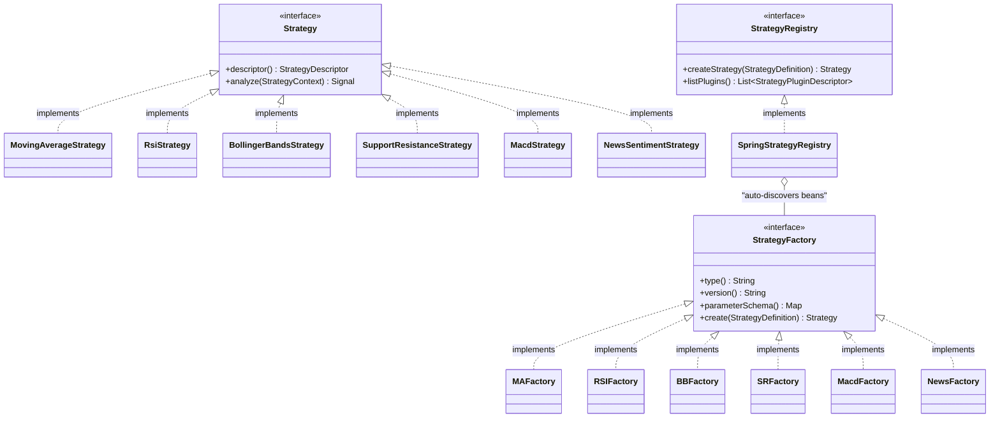

### Phân tích luồng hoạt động chi tiết Module 3 & 4

Module 3 và 4 kết hợp chặt chẽ tạo thành kiến trúc lõi của Engine Chiến lược, tuân thủ nguyên tắc mở/đóng (OCP) nhờ Pattern Plugin.

**1. Cốt lõi Strategy (Module 3):**
- **Strategy** là một `<<interface>>` định nghĩa hai phương thức quan trọng: `descriptor()` (mô tả chiến lược) và `analyze(StrategyContext)` (nhận bối cảnh thị trường và trả về **Signal**).
- Giao diện này có 6 implementations cụ thể: **MovingAverageStrategy**, **RsiStrategy**, **BollingerBandsStrategy**, **SupportResistanceStrategy**, **MacdStrategy**, và **NewsSentimentStrategy**. Nhờ **[Single Responsibility - SRP]**, mỗi class chỉ đảm nhận một thuật toán duy nhất. Bối cảnh được truyền vào là **[Immutable Context]** (bản sao của dữ liệu nến) để ngăn chiến lược sửa đổi dữ liệu gốc.

**2. Factory và Plugin (Module 4):**
- **StrategyFactory** cũng là một `<<interface>>` làm nhiệm vụ khởi tạo chiến lược. Nó chứa `type()`, `version()`, đặc biệt là `parameterSchema()` (cung cấp **[JSON Schema Catalog]** để Frontend tự động sinh giao diện nhập liệu) và hàm `create(StrategyDefinition)`.
- Có 6 Factory tương ứng `implements` interface này (từ **MAFactory** đến **NewsFactory**), tách bạch hoàn toàn logic khởi tạo khỏi logic tính toán thuật toán.
- **StrategyRegistry** là `<<interface>>` quản lý toàn bộ các Factory. Nó có thể liệt kê tất cả plugin hiện có qua `listPlugins()` và tạo chiến lược mới qua `createStrategy()`.
- Implementation của Registry là **SpringStrategyRegistry**. Nó vận hành dựa trên kỹ thuật **[Plugin Registry Pattern]** và **[Auto-discovery Bean]**, tự động quét và thu thập toàn bộ các `StrategyFactory` đang có trong hệ thống ("auto-discovers beans") mà không cần dùng chuỗi if/else rườm rà.
- Nhờ thiết kế này, hệ thống đạt được **[Open-Closed Principle (OCP)]**: Thêm một thuật toán mới (ví dụ MACD) chỉ cần tạo mới `MacdStrategy` và `MacdFactory` mà không cần sửa code cũ. Mọi sự phụ thuộc kiến trúc sai lệch đều bị chặn bởi **[Architecture Test (ArchUnit)]**.

**Kỹ thuật Module 3 & 4:**
| Kỹ thuật | Class | Mô tả |
|---|---|---|
| Strategy Pattern | `Strategy` interface + 6 implementations | Thuật toán phân tích có thể hoán đổi |
| Factory Pattern | `StrategyFactory` interface + 6 factories | Tách logic khởi tạo và validation |
| Open-Closed Principle (OCP) | `MacdStrategy` + `MacdStrategyFactory` | Thêm MACD không sửa Backtester/Controller/UI |
| Plugin Registry (Auto-discovery) | `SpringStrategyRegistry` | Quét Bean tự động, không cần if/else |
| Single Responsibility (SRP) | Mỗi Strategy chỉ 1 thuật toán (MA chỉ crossover, RSI chỉ ngưỡng) | Dễ test, dễ hiểu |
| Immutable Context | `StrategyContext.candles` copy list | Strategy không thể sửa dữ liệu bên ngoài |
| JSON Schema Catalog | `StrategyPluginDescriptor.parameterSchema()` | Frontend tự vẽ form từ schema |
| Architecture Test (ArchUnit) | `StrategyExtensionArchitectureTest` | Tự động chặn pipeline phụ thuộc concrete class |

---

## Module 5: Composite Strategy

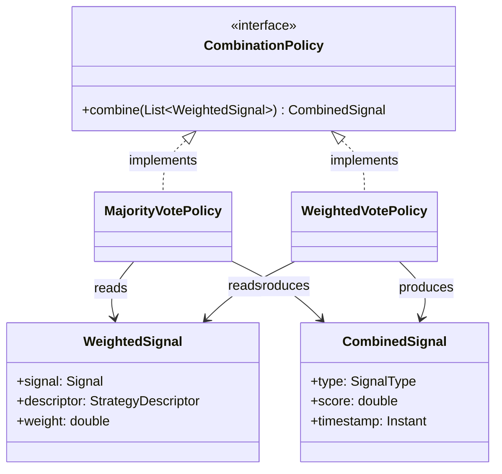

### Phân tích luồng hoạt động chi tiết Module 5

Module 5 tập trung vào việc gộp nhiều chiến lược đơn lẻ (ví dụ MA kết hợp RSI) thành một quyết định giao dịch duy nhất.

**1. Cốt lõi Composite:**
- Sơ đồ sử dụng lại Strategy Pattern thông qua interface **CombinationPolicy**, định nghĩa hàm `combine(List<WeightedSignal>)` để biến một danh sách tín hiệu thành một **CombinedSignal** cuối cùng.
- Việc tách biệt quá trình đánh giá (Strategy con) và quá trình tổng hợp (CombinationPolicy) chính là kỹ thuật **[Separation of Concerns]**.
- Có 2 implementation chính cho Policy này:
  - **MajorityVotePolicy**: Hoạt động dựa trên quy tắc đa số (**[Majority Vote]**). Mỗi tín hiệu BUY (+1) hoặc SELL (-1) được cộng dồn lại để ra kết quả.
  - **WeightedVotePolicy**: Hoạt động dựa trên trọng số (**[Weighted Vote]**). Hướng tín hiệu nhân với trọng số, nếu vượt quá một ngưỡng nhất định (threshold) thì mới ra quyết định.
  
**2. Cấu trúc Dữ liệu Signal:**
- **WeightedSignal** đóng vai trò là đầu vào (reads). Nó chứa một tín hiệu cơ bản (`Signal`), đi kèm với mô tả nguồn gốc chiến lược (`StrategyDescriptor`) và trọng số (`weight`).
- **CombinedSignal** là đầu ra (produces). Nó mang loại tín hiệu cuối cùng (`SignalType`), điểm số tự tin (`score`) và dấu thời gian thực thi (`timestamp`).

**Kỹ thuật Module 5:**
| Kỹ thuật | Class | Mô tả |
|---|---|---|
| Strategy Pattern (lần 2) | `CombinationPolicy` interface | Đổi cách voting mà không sửa Strategy con |
| Separation of Concerns | Strategy con ≠ CombinationPolicy | Phân tích signal và giải quyết xung đột là 2 trách nhiệm khác nhau |
| Majority Vote | `MajorityVotePolicy` | BUY=+1, SELL=-1, HOLD=0, cộng tổng |
| Weighted Vote | `WeightedVotePolicy` | direction × weight, so với threshold |

---

## Module 6: Strategy Search Engine

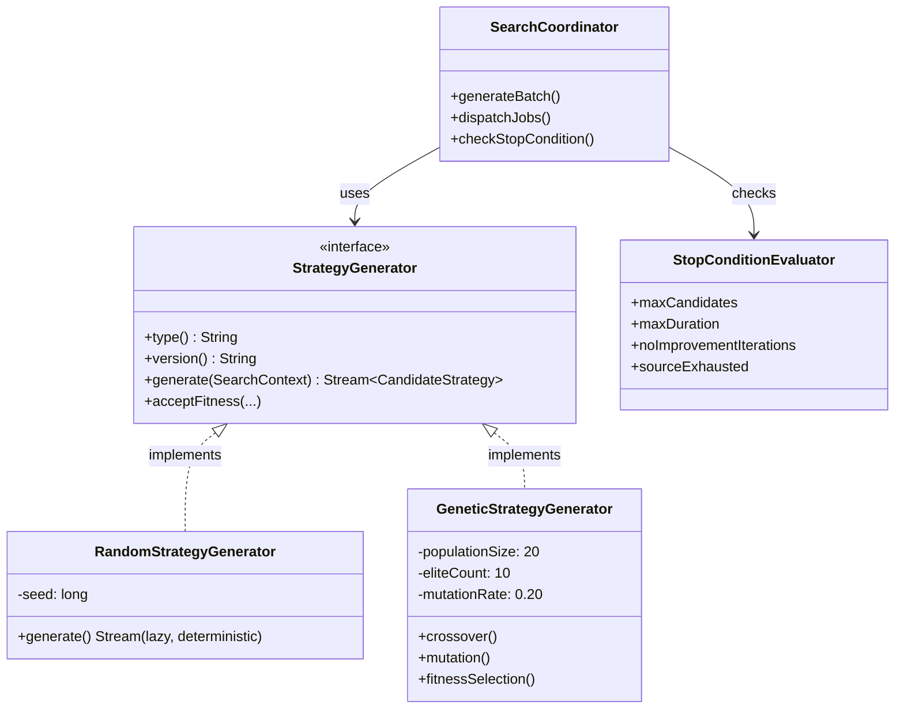

### Phân tích luồng hoạt động chi tiết Module 6

Module 6 là "cỗ máy tìm kiếm" AI, sinh ra hàng loạt chiến lược ngẫu nhiên hoặc lai tạo để tìm ra công thức tối ưu nhất.

**1. Strategy Generator (Bộ sinh chiến lược):**
- **StrategyGenerator** là một **[Port / Interface]** với các hàm sinh cơ bản như `generate(SearchContext)` để tạo ra một chuỗi `Stream<CandidateStrategy>`.
- Có 2 implementation:
  - **RandomStrategyGenerator**: Sinh chiến lược ngẫu nhiên. Nhờ lưu giữ biến `-seed` và sử dụng luồng lười (**[Lazy Stream Generation]**), nó đảm bảo tính xác định (**[Deterministic Seed]**) - sinh ra hàng triệu ứng viên mà không tốn RAM.
  - **GeneticStrategyGenerator**: Sử dụng **[Genetic Algorithm]** (Thuật toán di truyền). Chứa các tham số quần thể (`populationSize = 20`), số lượng tinh hoa (`eliteCount = 10`), và tỷ lệ đột biến (`mutationRate = 0.20`). Nó vòng lặp qua 3 bước: `fitnessSelection()` (Chọn lọc), `crossover()` (Lai ghép), và `mutation()` (Đột biến).

**2. Điều kiện dừng và Điều phối:**
- **StopConditionEvaluator** kiểm soát khi nào vòng tìm kiếm kết thúc (**[Multi-criteria Stop]**), dựa trên: số lượng tối đa (`maxCandidates`), thời gian tối đa (`maxDuration`), số vòng không cải thiện (`noImprovementIterations`), hoặc cạn kiệt nguồn sinh (`sourceExhausted`).
- **SearchCoordinator** là trái tim điều phối toàn bộ quá trình. Nó `uses` Generator để sinh ra ứng viên theo từng đợt lớn bằng phương thức `generateBatch()` (**[Batch Processing]**). Tiếp đó nó `dispatchJobs()` đẩy xuống Queue, và liên tục `checks` điều kiện dừng thông qua StopConditionEvaluator.

**Kỹ thuật Module 6:**
| Kỹ thuật | Class | Mô tả |
|---|---|---|
| Port / Interface | `StrategyGenerator` | Đổi Random sang Genetic không sửa Backtester |
| Lazy Stream Generation | `RandomStrategyGenerator.generate()` → `Stream<CandidateStrategy>` | Không materialize hàng triệu candidate |
| Deterministic Seed | `SearchContext.randomSeed` | Tái lập kết quả search |
| Genetic Algorithm | `GeneticStrategyGenerator` | Fitness Selection → Crossover → Mutation → next generation |
| Multi-criteria Stop | `StopConditionEvaluator` | Dừng theo số lượng, thời gian, không cải thiện, hết nguồn |
| Batch Processing | `SearchCoordinator.generateBatch()` | Sinh candidate theo batch, kiểm tra cancel ở boundary |

---

## Module 7: Backtesting Engine

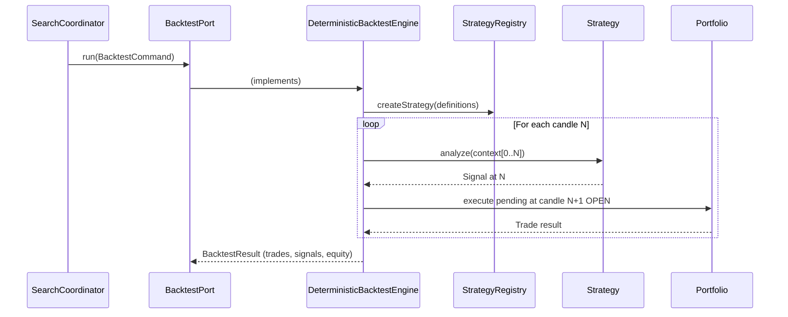

### Phân tích luồng hoạt động chi tiết Module 7

Module 7 phụ trách chạy Backtest (kiểm thử quá khứ). Đây là nơi có logic toán học tài chính phức tạp và yêu cầu độ chính xác tuyệt đối.

**1. Luồng Tương tác Sequence:**
- Mọi thứ bắt đầu khi **SearchCoordinator** gọi phương thức `run(BacktestCommand)` trên **BacktestPort**. Việc sử dụng **[Port / Interface]** tách biệt hoàn toàn contract với implementation.
- BacktestPort được implement bởi **DeterministicBacktestEngine**. Engine này ghi nhận **[Deterministic Versioning]** để tái tạo kết quả chính xác bất chấp thời gian.
- Engine lập tức yêu cầu **StrategyRegistry** tạo ra chiến lược dựa trên định nghĩa (`createStrategy`).

**2. Vòng lặp mô phỏng (Simulation Loop):**
- Với mỗi cây nến $N$ trong quá khứ, Engine truyền vào chiến lược một danh sách nến `context[0..N]` thông qua hàm `analyze()`. Kỹ thuật này là **[Look-ahead Bias Prevention]** (Chống thiên vị nhìn trước) - Chiến lược chỉ được thấy quá khứ, tuyệt đối không thấy tương lai.
- Strategy xử lý và trả về tín hiệu `Signal at N`.
- Nhận được tín hiệu, Engine giao cho **Portfolio** để thực thi lệnh chờ (pending) vào thời điểm MỞ CỬA của cây nến tiếp theo (**[Next-Candle-Open Fill]**: `execute pending at candle N+1 OPEN`). Đây là kỹ thuật mô phỏng sát thực tế độ trễ của thị trường nhất.
- Cuối cùng Portfolio tính toán và trả về kết quả giao dịch (Trade result). Nó áp dụng **[Portfolio Simulation]** cho phép cược lên (Long), cược xuống (Short), cắt lỗ (Stop Loss), chốt lời (Take Profit) và Trailing Stop.
- Khi vòng lặp kết thúc, Engine trả về **BacktestResult** bao gồm danh sách giao dịch (`trades`), các tín hiệu (`signals`), và biểu đồ tài sản (`equity`).

**Kỹ thuật Module 7:**
| Kỹ thuật | Class | Mô tả |
|---|---|---|
| Port / Interface | `BacktestPort` → `DeterministicBacktestEngine` | Tách contract khỏi implementation |
| Look-ahead Bias Prevention | Engine chỉ cấp `candles.subList(0, N+1)` | Strategy không nhìn được giá tương lai |
| Next-Candle-Open Fill | Signal ở N → Fill ở Open của N+1 | Mô phỏng sát thực tế nhất |
| Deterministic Versioning | `VERSION = deterministic-next-open-v5` | Lưu version engine để tái lập |
| Portfolio Simulation | Long/Short, Stop Loss, Take Profit, Trailing Stop, Position Sizing | Mô phỏng quản lý rủi ro thực tế |

---

## Module 8: Evaluator & Leaderboard

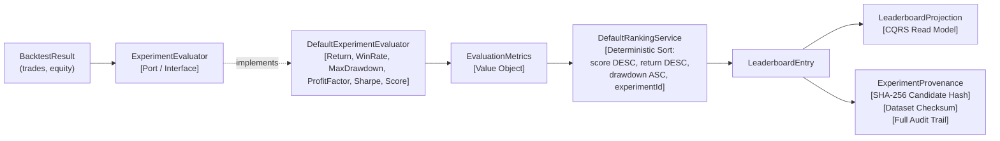

### Phân tích luồng hoạt động chi tiết Module 8

Module 8 nhận kết quả thô từ Backtest, tiến hành chấm điểm và xếp hạng lên Leaderboard một cách công khai, minh bạch.

**1. Đánh giá (Evaluator):**
- Từ **BacktestResult** (chứa thông tin giao dịch và tài sản), dữ liệu được đưa vào **[Port / Interface]** là **ExperimentEvaluator**.
- Việc tách biệt Engine và Evaluator thể hiện kỹ thuật **[Single Responsibility (SRP)]**.
- Implementation của nó là **DefaultExperimentEvaluator**. Lớp này áp dụng kỹ thuật **[Evaluator Versioning]** và tính toán hàng loạt chỉ số: Lợi nhuận (Return), Tỷ lệ thắng (WinRate), Mức sụt giảm tối đa (MaxDrawdown), Hệ số lợi nhuận (ProfitFactor), Tỷ lệ Sharpe và một Điểm tổng hợp (Score).
- Kết quả trả về là một **[Value Object]** có tên **EvaluationMetrics**.

**2. Xếp hạng và Bảng xếp hạng:**
- **DefaultRankingService** nhận `EvaluationMetrics`. Nó sử dụng cơ chế **[Deterministic Sort]** (Sắp xếp đa khóa: ưu tiên điểm số DESC, return DESC, drawdown ASC, và cuối cùng là experimentId). Điều này đảm bảo cùng số liệu sẽ luôn ra cùng thứ hạng.
- Kết quả xếp hạng tạo ra một **LeaderboardEntry**.
- Entry này được lưu vào **LeaderboardProjection**. Đây là một bảng đọc riêng biệt theo kiến trúc **[CQRS Read Model]**, giúp thao tác query bảng xếp hạng diễn ra cực nhanh mà không ảnh hưởng bảng write.
- Cuối cùng, hệ thống sinh ra một **ExperimentProvenance** (Giấy chứng nhận xuất xứ) đính kèm cho mỗi kết quả. Nhờ băm **[SHA-256 Candidate Hash]** và kiểm tra checksum bộ dữ liệu **[Dataset Checksum]**, mọi chiến lược đều được truy vết 100% (**[Full Audit Trail]**) và chống gian lận.

**Kỹ thuật Module 8:**
| Kỹ thuật | Class | Mô tả |
|---|---|---|
| Single Responsibility (SRP) | `BacktestEngine` ≠ `Evaluator` ≠ `RankingService` | Tách 3 bước: mô phỏng, chấm điểm, xếp hạng |
| CQRS Read Projection | `LeaderboardProjection` | Bảng đọc tách biệt, query siêu nhanh |
| Deterministic Ranking | `DefaultRankingService` multi-key sort | Cùng data → cùng thứ hạng |
| SHA-256 Provenance | `CandidateStrategy.hash`, `MarketDatasetChecksum` | Truy vết 100% xuất xứ kết quả |
| Evaluator Versioning | `return-minus-half-drawdown-v1` | Đổi công thức score mà không sửa engine |

---

## Module 9: Continuous Loop, Queue & Worker

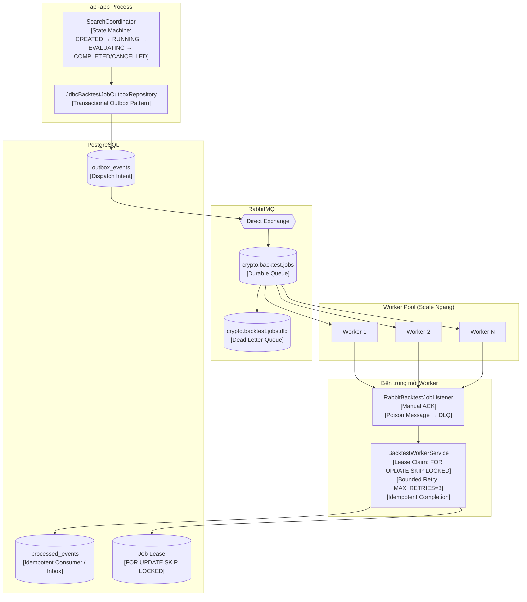

### Phân tích luồng hoạt động chi tiết Module 9

Module 9 là hệ thống hàng đợi và công nhân phân tán (Distributed Queue & Workers) đảm bảo hệ thống có thể scale ngang vô hạn để chạy hàng triệu backtest.

**1. api-app Process và RabbitMQ:**
- **SearchCoordinator** trong Web App quản lý quá trình tìm kiếm với **[State Machine]**: từ CREATED → RUNNING → EVALUATING → COMPLETED hoặc CANCELLED. Ở ranh giới mỗi lô (batch boundary), nó có khả năng **[Cancellation]** ngay lập tức nếu user hủy.
- Thay vì ném thẳng job vào RabbitMQ dễ gây mất dữ liệu nếu DB rollback, hệ thống ghi Job vào bảng **outbox_events** (lưu dispatch intent) qua **JdbcBacktestJobOutboxRepository** (**[Transactional Outbox Pattern]**).
- RabbitMQ nhận message thông qua một `Direct Exchange`. Job bình thường sẽ vào **[Durable Queue]** tên là `crypto.backtest.jobs`. Các Job bị lỗi nặng (Poison message) sẽ được hất sang **[Dead Letter Queue - DLQ]** là `crypto.backtest.jobs.dlq` để không block các job khác.

**2. Worker Pool và Database:**
- Hàng đợi phân phối Job đến N Workers (**W1, W2, W3...**) theo mô hình **[Competing Consumers]** (scale ngang bằng replica count).
- Bên trong mỗi Worker, **RabbitBacktestJobListener** lắng nghe và lấy Job. Nó sử dụng kỹ thuật **[Manual ACK]**, chỉ gửi tín hiệu xác nhận thành công (ACK) về RabbitMQ sau khi Worker xử lý xong hoàn toàn, nếu lỗi thì đẩy sang DLQ.
- Trái tim của Worker là **BacktestWorkerService**. Khi bắt đầu xử lý, nó ghi một lease (hợp đồng thuê) vào bảng Job Lease sử dụng lệnh DB **[FOR UPDATE SKIP LOCKED]** (**[Pessimistic Lock]**) nhằm chống 2 worker cùng làm 1 job.
- Nếu gặp lỗi mạng tạm thời, Worker áp dụng **[Bounded Retry]** (MAX_RETRIES = 3).
- Sau khi chạy backtest xong, kết quả được lưu vào bảng **processed_events** đóng vai trò là một **[Idempotent Consumer / Inbox]**, đảm bảo thông điệp dù có gửi đến 2 lần (At-least-once delivery) cũng không tạo duplicate dữ liệu.

**Kỹ thuật Module 9:**
| Kỹ thuật | Class | Mô tả |
|---|---|---|
| Transactional Outbox | `JdbcBacktestJobOutboxRepository` | DB commit + message dispatch trong 1 transaction |
| Competing Consumers | RabbitMQ + N Workers | Scale ngang bằng replica count |
| Manual ACK | `RabbitBacktestJobListener` | Chỉ ACK sau khi DB commit thành công |
| Pessimistic Lock (SKIP LOCKED) | `JdbcBacktestWorkerRepository` | Chống 2 worker xử lý cùng 1 job |
| Dead Letter Queue | `crypto.backtest.jobs.dlq` | Poison message không block queue chính |
| Idempotent Consumer (Inbox) | `processed_events` table | At-least-once delivery không tạo duplicate |
| State Machine | `SearchRunStateMachine` | Bảo vệ chuyển trạng thái hợp lệ |
| Bounded Retry | `MAX_RETRIES = 3` | Transient failure retry có giới hạn |
| Cancellation | `SearchCoordinator` kiểm tra cancel flag ở batch boundary | Dừng search ngay lập tức |

---

## Module 10: News Crawler

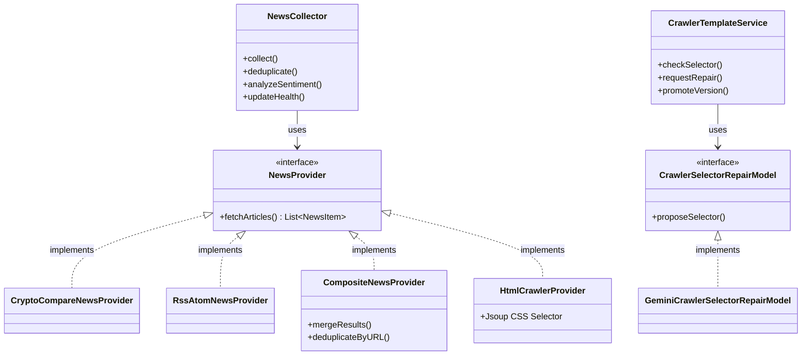

### Phân tích luồng hoạt động chi tiết Module 10

Module 10 là cánh tay vươn ra ngoài Internet để cào tin tức, được bọc lót kỹ càng để khi nguồn tin hỏng thì lõi hệ thống vẫn sống sót.

**1. Kiến trúc Cào tin:**
- **NewsProvider** là một `<<interface>>` định nghĩa việc lấy danh sách tin (`fetchArticles`). Việc cắm **[Port / Interface]** này giúp đổi nguồn tin mà Collector không bị ảnh hưởng.
- Các implementations bao gồm: **CryptoCompareNewsProvider**, **RssAtomNewsProvider**, và **HtmlCrawlerProvider** (dùng CSS Selector kết hợp thư viện Jsoup).
- **CompositeNewsProvider** vận dụng **[Composite Pattern]**, gộp chung CryptoCompare và RSS lại với nhau. Nếu 1 nguồn sập, nó vẫn gộp thành công kết quả từ các nguồn còn lại, thực hiện `deduplicateByURL()` để loại bỏ tin trùng lặp.

**2. Thu thập và Tự phục hồi:**
- **NewsCollector** làm nhiệm vụ gọi các Provider để `collect()` (thu thập), `deduplicate()` (chống trùng lặp một lần nữa ở tầng DB), và `analyzeSentiment()` (phân tích cảm xúc). Nó cũng cập nhật biến `health` qua `updateHealth()` (**[Fault Isolation]** - Bất kể lỗi gì cũng bị nhốt ở đây, không kéo sập hệ thống Backtest).
- **CrawlerTemplateService** quản lý các bản lưu CSS Selector (**[Selector Versioning]** để có thể rollback nếu cần). Nó liên tục `checkSelector()`, nếu phát hiện cấu trúc trang web bị thay đổi, nó sẽ gọi hàm `requestRepair()`.
- Việc sửa chữa được giao cho interface **CrawlerSelectorRepairModel**, với đại diện chính là **GeminiCrawlerSelectorRepairModel**. Gemini AI sẽ tự động phân tích DOM HTML mới và `proposeSelector()` (**[LLM Self-healing]**).
- Thay vì để AI tự do áp dụng (gây nguy hiểm), `CrawlerTemplateService` yêu cầu sự can thiệp của con người thông qua bước `promoteVersion()` (**[Human-in-the-Loop]**). Quản trị viên (hoặc User có quyền) sẽ phải review và xác nhận thì selector mới được lưu chính thức.

**Kỹ thuật Module 10:**
| Kỹ thuật | Class | Mô tả |
|---|---|---|
| Port / Interface | `NewsProvider` | Đổi nguồn tin mà không sửa Collector |
| Composite Pattern | `CompositeNewsProvider` | Gộp CryptoCompare + RSS, giữ kết quả tốt, bỏ nguồn lỗi |
| Deduplication | `NewsCollector` deduplicate by URL | Chống trùng bài viết |
| Fault Isolation | `NewsCollector.health` riêng biệt | News lỗi không kéo sập Market/Backtest |
| Human-in-the-Loop | `CrawlerTemplateService` → `NEEDS_REVIEW` | LLM đề xuất selector mới nhưng cần user xác nhận |
| LLM Self-healing | `GeminiCrawlerSelectorRepairModel` | AI tự sửa CSS selector bị hỏng |
| Selector Versioning | `CrawlerTemplateRepository` | Lưu lịch sử selector, rollback được |

---

## Module 11: Sentiment & AI Strategy Authoring

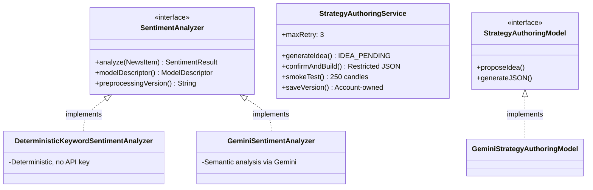

### Phân tích luồng hoạt động chi tiết Module 11

Module 11 kết nối với AI (Google Gemini) để phân tích cảm xúc tin tức và hỗ trợ người dùng sinh ra thuật toán bằng ngôn ngữ tự nhiên.

**1. Phân tích Cảm xúc (Sentiment Analyzer):**
- Sơ đồ sử dụng `<<interface>>` **SentimentAnalyzer** để định nghĩa hàm `analyze()`, cùng 2 hàm `modelDescriptor()` và `preprocessingVersion()`. Kỹ thuật **[Model Versioning]** này giúp hệ thống biết chính xác điểm số cảm xúc (SentimentResult) được chấm bởi model nào.
- Việc lưu trữ kết quả cảm xúc (SentimentObservation) vào MarketDataset áp dụng kỹ thuật **[Immutable Dataset Snapshot]** - chốt cứng dữ liệu trước lúc backtest để chống lộ lọt tương lai (future leakage).
- Có 2 phiên bản chấm điểm: **DeterministicKeywordSentimentAnalyzer** (Chấm bằng từ khóa, không tốn API) và **GeminiSentimentAnalyzer** (Phân tích ngữ nghĩa chuyên sâu bằng LLM). Lại một lần nữa **[Port / Interface]** phát huy sức mạnh đổi ruột không đổi vỏ.

**2. Sáng tạo Chiến lược bằng AI (Authoring):**
- Quá trình người dùng tạo chiến lược đi qua interface **StrategyAuthoringModel** (triển khai bởi **GeminiStrategyAuthoringModel**) với hàm `proposeIdea()` (đề xuất ý tưởng) và `generateJSON()` (chuyển ngôn ngữ tự nhiên thành JSON).
- Lớp **StrategyAuthoringService** là điều phối viên, thực hiện chuỗi quy trình bảo mật và chặt颠 chẽ nhất hệ thống:
  - Đầu tiên AI sinh ra ý tưởng ở trạng thái `IDEA_PENDING` (**[Idea Confirmation - Human-in-the-Loop]**).
  - Sau khi user `confirmAndBuild()`, AI được lệnh chỉ trả về chuỗi JSON cấu hình (**[Restricted JSON - No RCE]**). Tuyệt đối cấm AI sinh mã nguồn Java để chống các vụ tấn công Remote Code Execution.
  - Nếu AI sinh sai schema, hệ thống có cơ chế **[Bounded Retry]** gọi lại Gemini tối đa 3 lần (`maxRetry: 3`).
  - JSON sau khi tạo thành công sẽ được `smokeTest()` (chạy thử ngay lập tức trên 250 nến) để xác nhận thuật toán không quăng Exception.
  - Cuối cùng, hàm `saveVersion()` lưu kết quả xuống DB có gắn quyền sở hữu (**[Account Ownership]** - User nào tạo thì gắn vào account đó).

**Kỹ thuật Module 11:**
| Kỹ thuật | Class | Mô tả |
|---|---|---|
| Port / Interface | `SentimentAnalyzer` | Đổi model phân tích mà Collector không đổi |
| Model Versioning | `SentimentResult` lưu `model`, `inputVersion`, `preprocessingVersion` | Biết prediction do model nào tạo |
| Immutable Dataset Snapshot | `MarketDataset` chứa `SentimentObservation` | Sentiment được chụp trước backtest, chống future leakage |
| Restricted JSON (No RCE) | `StrategyAuthoringService` | AI chỉ sinh JSON cấu hình, KHÔNG sinh Java code |
| Idea Confirmation (Human-in-the-Loop) | `IDEA_PENDING_CONFIRMATION` → User confirm | Người dùng phải xác nhận trước khi build |
| Smoke Test | 250 nến cố định | Chạy thử chiến lược trước khi lưu |
| Bounded Retry | `maxRetry = 3` | AI sửa JSON tối đa 3 lần nếu sai schema |
| Account Ownership | `UserStrategyRepository` | Chiến lược thuộc về account, có version, xóa được |
