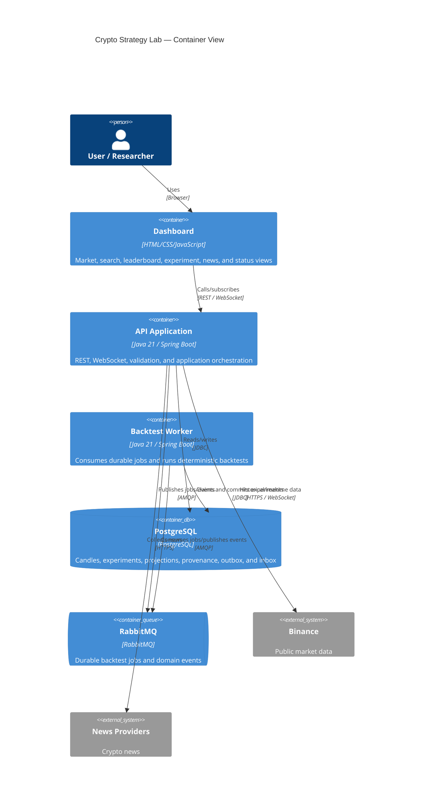
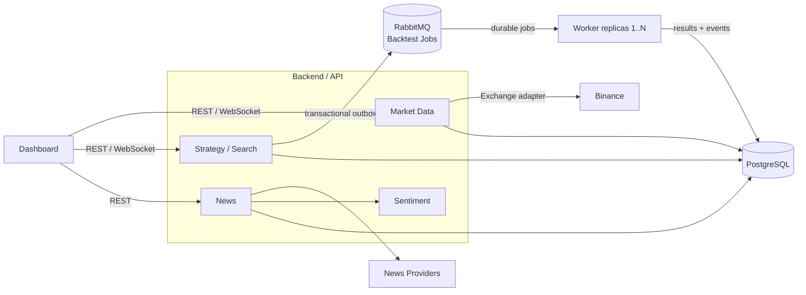

# C4 Container — Crypto Strategy Lab

The API container's feature ownership and required cross-container flows are
shown explicitly below. Arrows crossing from API to RabbitMQ/Worker are
asynchronous; browser REST calls and adapter calls to providers are synchronous,
while market and leaderboard updates return over WebSocket.

## Code-to-container mapping

| Container/component | Maven module | Dependency rule |
|---|---|---|
| Domain/application contracts | `core` | No Spring MVC, JPA, AMQP, provider, API, worker, or infrastructure dependency |
| Technical adapters | `infrastructure` | May depend on `core` |
| API Application | `api-app` | May depend on `core` and `infrastructure` |
| Backtest Worker | `worker-app` | May depend on `core` and `infrastructure` |
| Cross-container tests | `integration-tests` | Test-scope access to runnable applications |

## M7 implementation status

Implemented: M1–M3 behavior, the synchronous M4 Experiment path, deterministic
Random and Genetic generation, transactional RabbitMQ dispatch, the independent
Backtest Worker, asynchronous evaluation/ranking, cancellation, and realtime
search/leaderboard projection. Search
generation uses a local bounded executor; each candidate batch atomically creates
experiments, pending jobs, and outbox intents. A lease-based relay publishes
persistent RabbitMQ messages and records `QUEUED` only after publisher confirm.
Workers consume with manual acknowledgment, use an atomic database claim/lease,
and transactionally persist completion artifacts plus a `BacktestCompleted`
outbox event before ACK. Duplicate deliveries are idempotent by `experimentId`;
transient failures have three delayed retries and poison/exhausted jobs route to
the DLQ. Cancellation atomically removes non-started work from the required set
and tombstones unpublished outbox rows while allowing already-running work to
finish safely.
The API orchestrates ports in `core`; JDBC adapters persist immutable inputs,
signals, trades, metrics, lifecycle state, and leaderboard rows in PostgreSQL.
The API consumes idempotent progress/leaderboard events and publishes isolated
STOMP topics. The worker service has no fixed container identity or port, so the
same image and queue scale from one to three replicas through Compose
configuration. News collection is now a separately scheduled API capability:
the CryptoCompare adapter normalizes external payloads to `NewsItem`, the local
keyword analyzer emits versioned `SentimentResult`, and the JDBC store persists
both independently. Separate ports, executor, health components, retry bounds,
and failure metrics prevent news/model availability from participating in the
market, search, worker, evaluation, or leaderboard execution paths.

The dashboard exposes every specified panel and calls only API contracts. Before
search it materializes the displayed backend candles into an immutable
checksummed dataset. Random and Genetic generators are registered together and
selected per run. The status endpoint composes database/outbox and broker
queue/consumer state without making broker failure cascade into other modules.
Micrometer covers search, candidate, queue, worker outcome/duration/duplicate,
outbox, market recovery, and News/Sentiment signals. Structured asynchronous
logs include applicable correlation, search-run, job, experiment, and event
identifiers. M7 also adds production `MACD@1.0` exclusively through the existing
strategy/factory extension point; downstream experiment components and database
tables remain unchanged.
