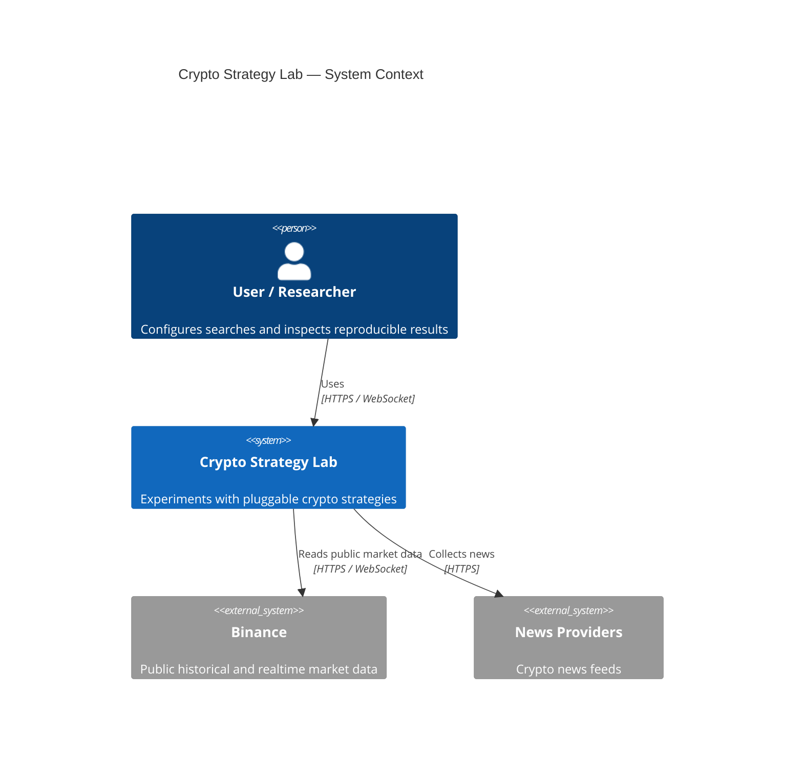

# C4 Context — Crypto Strategy Lab

## Scope

Crypto Strategy Lab is an educational research platform for collecting market
data, generating strategy candidates, backtesting them, ranking experiments,
and preserving reproducibility evidence. It never places real orders and does
not manage wallets or exchange secrets.

PostgreSQL, RabbitMQ, Spring, and Java are intentionally absent from this
context view because they are implementation details, not external systems.

## Delivery evidence

The M7 dashboard exercises this system boundary end to end using backend data:
Binance market snapshots/realtime candles, pluggable strategy search, durable
worker execution, ranked experiments with provenance, and isolated public News
and Sentiment. `NewsFailureIsolationTest` proves the News external system can be
unavailable without changing Market, Search, Backtest, or Leaderboard behavior.
