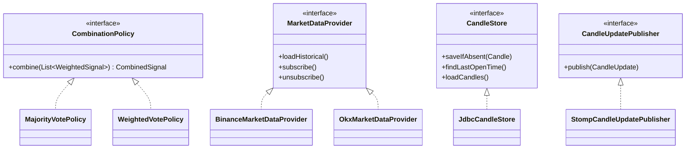

# Sơ đồ Phân cấp Class & Tất cả Extension Points

Sơ đồ này tổng hợp TOÀN BỘ các Interface (Port) và Implementation (Adapter) trong hệ thống, thể hiện rõ tính đa hình (Polymorphism), kế thừa (Inheritance), và các điểm mở rộng (Extension Points).

---

## Sơ đồ Tổng hợp Toàn bộ Interface → Implementation

```mermaid
classDiagram
    %% === STRATEGY DOMAIN ===
    class Strategy {
        <<interface>>
        +descriptor() StrategyDescriptor
        +analyze(StrategyContext) Signal
    }
    class MovingAverageStrategy
    class RsiStrategy
    class BollingerBandsStrategy
    class SupportResistanceStrategy
    class MacdStrategy
    class NewsSentimentStrategy

    Strategy <|.. MovingAverageStrategy
    Strategy <|.. RsiStrategy
    Strategy <|.. BollingerBandsStrategy
    Strategy <|.. SupportResistanceStrategy
    Strategy <|.. MacdStrategy
    Strategy <|.. NewsSentimentStrategy

    %% === STRATEGY FACTORY ===
    class StrategyFactory {
        <<interface>>
        +type() String
        +version() String
        +parameterSchema() Map
        +create(StrategyDefinition) Strategy
    }
    class MAFactory["MovingAverageStrategyFactory"]
    class RSIFactory["RsiStrategyFactory"]
    class BBFactory["BollingerBandsStrategyFactory"]
    class SRFactory["SupportResistanceStrategyFactory"]
    class MacdFactory["MacdStrategyFactory"]
    class NewsFactory["NewsSentimentStrategyFactory"]

    StrategyFactory <|.. MAFactory
    StrategyFactory <|.. RSIFactory
    StrategyFactory <|.. BBFactory
    StrategyFactory <|.. SRFactory
    StrategyFactory <|.. MacdFactory
    StrategyFactory <|.. NewsFactory
```

```mermaid
classDiagram
    %% === STRATEGY GENERATOR ===
    class StrategyGenerator {
        <<interface>>
        +type() String
        +version() String
        +generate(SearchContext) Stream
        +acceptFitness()
    }
    class RandomStrategyGenerator
    class GeneticStrategyGenerator

    StrategyGenerator <|.. RandomStrategyGenerator
    StrategyGenerator <|.. GeneticStrategyGenerator

    %% === BACKTEST PORT ===
    class BacktestPort {
        <<interface>>
        +run(BacktestCommand) BacktestResult
    }
    class DeterministicBacktestEngine

    BacktestPort <|.. DeterministicBacktestEngine

    %% === EVALUATOR ===
    class ExperimentEvaluator {
        <<interface>>
        +evaluate(BacktestResult) Evaluation
    }
    class DefaultExperimentEvaluator

    ExperimentEvaluator <|.. DefaultExperimentEvaluator

    %% === NEWS PROVIDER ===
    class NewsProvider {
        <<interface>>
        +fetchArticles() List
    }
    class CryptoCompareNewsProvider
    class RssAtomNewsProvider
    class CompositeNewsProvider
    class HtmlCrawlerProvider

    NewsProvider <|.. CryptoCompareNewsProvider
    NewsProvider <|.. RssAtomNewsProvider
    NewsProvider <|.. CompositeNewsProvider
    NewsProvider <|.. HtmlCrawlerProvider

    %% === SENTIMENT ANALYZER ===
    class SentimentAnalyzer {
        <<interface>>
        +analyze(NewsItem) SentimentResult
        +modelDescriptor() ModelDescriptor
    }
    class DeterministicKeywordSentimentAnalyzer
    class GeminiSentimentAnalyzer

    SentimentAnalyzer <|.. DeterministicKeywordSentimentAnalyzer
    SentimentAnalyzer <|.. GeminiSentimentAnalyzer
```

---

## Tổng kết Extension Points

| # | Port (Interface) | Implementation hiện có | Cách mở rộng |
|---|---|---|---|
| 1 | `Strategy` | MA, RSI, Bollinger, S/R, MACD, NewsSentiment (6 con) | Tạo class mới implement `Strategy` |
| 2 | `StrategyFactory` | 6 Factory tương ứng | Tạo Factory mới đăng ký Spring Bean |
| 3 | `CombinationPolicy` | MajorityVote, WeightedVote | Tạo Policy mới (ví dụ Veto, Consensus) |
| 4 | `MarketDataProvider` | Binance, OKX | Tạo Adapter mới (ví dụ Bybit, Coinbase) |
| 5 | `StrategyGenerator` | Random, Genetic | Tạo Generator mới (ví dụ Bayesian, RL) |
| 6 | `BacktestPort` | DeterministicBacktestEngine | Thay engine khác (ví dụ Monte Carlo) |
| 7 | `ExperimentEvaluator` | DefaultExperimentEvaluator | Đổi công thức score |
| 8 | `NewsProvider` | CryptoCompare, RSS/Atom, Composite, HtmlCrawler | Thêm nguồn tin mới |
| 9 | `SentimentAnalyzer` | Keyword, Gemini | Đổi model phân tích cảm xúc |
| 10 | `CandleStore` | JdbcCandleStore | Đổi database (ví dụ MongoDB, ClickHouse) |
| 11 | `CandleUpdatePublisher` | StompCandleUpdatePublisher | Đổi kênh phát (ví dụ Kafka, SSE) |
| 12 | `CrawlerSelectorRepairModel` | GeminiCrawlerSelectorRepairModel | Đổi LLM sửa selector |
| 13 | `StrategyAuthoringModel` | GeminiStrategyAuthoringModel | Đổi LLM sinh chiến lược |
| 14 | `MarketDataScheduler` | ExecutorMarketDataScheduler | Đổi cơ chế hẹn giờ reconnect |
| 15 | `SearchProgressPublisher` | StompSearchProgressPublisher | Đổi kênh phát tiến độ search |

**Tổng cộng: 15 Extension Points, 30+ Implementation classes.**

Mỗi Extension Point đều tuân thủ nguyên tắc **Dependency Inversion**: Core chỉ biết Interface (Port), Implementation cụ thể nằm ở tầng Infrastructure hoặc api-app. Khi cần thay đổi hoặc mở rộng, chỉ cần thêm class mới implement Interface, KHÔNG CẦN sửa code cũ (**Open-Closed Principle**).
