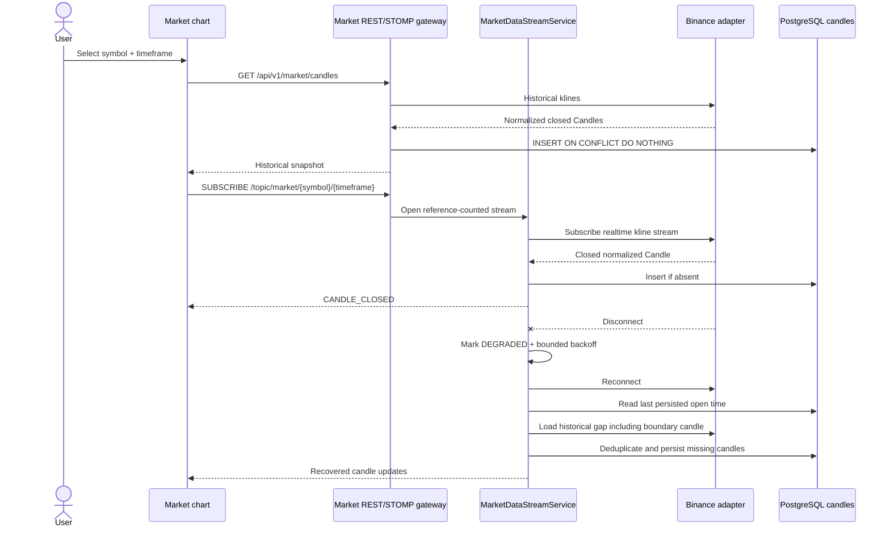
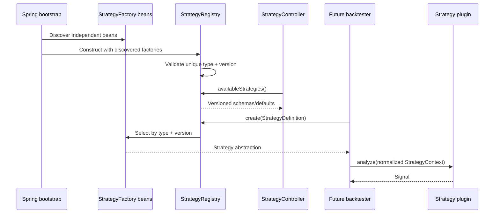
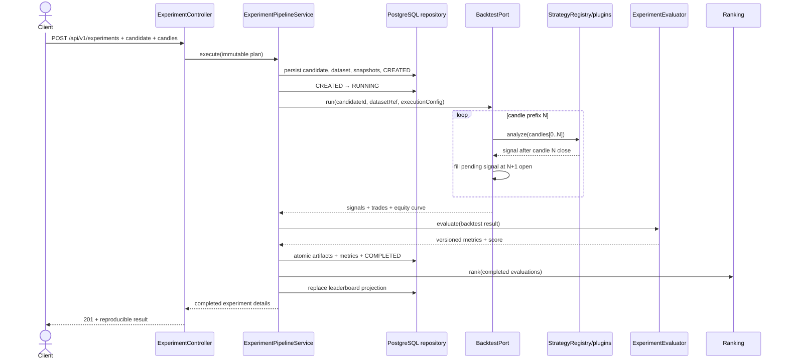
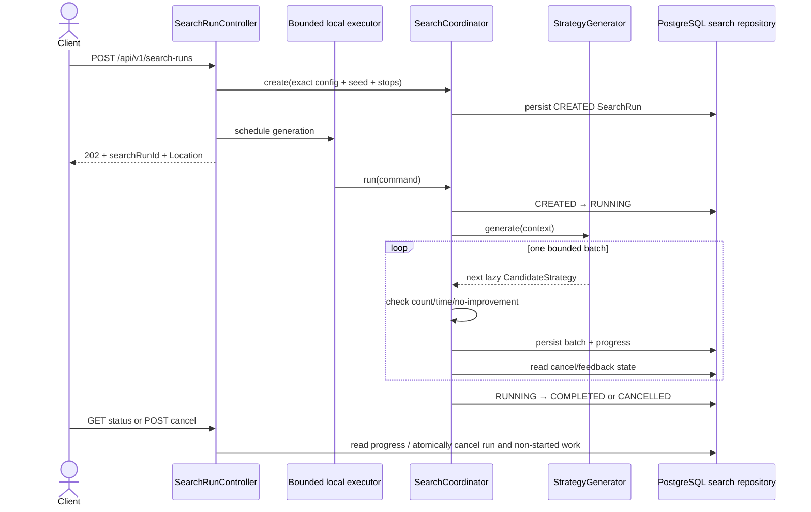
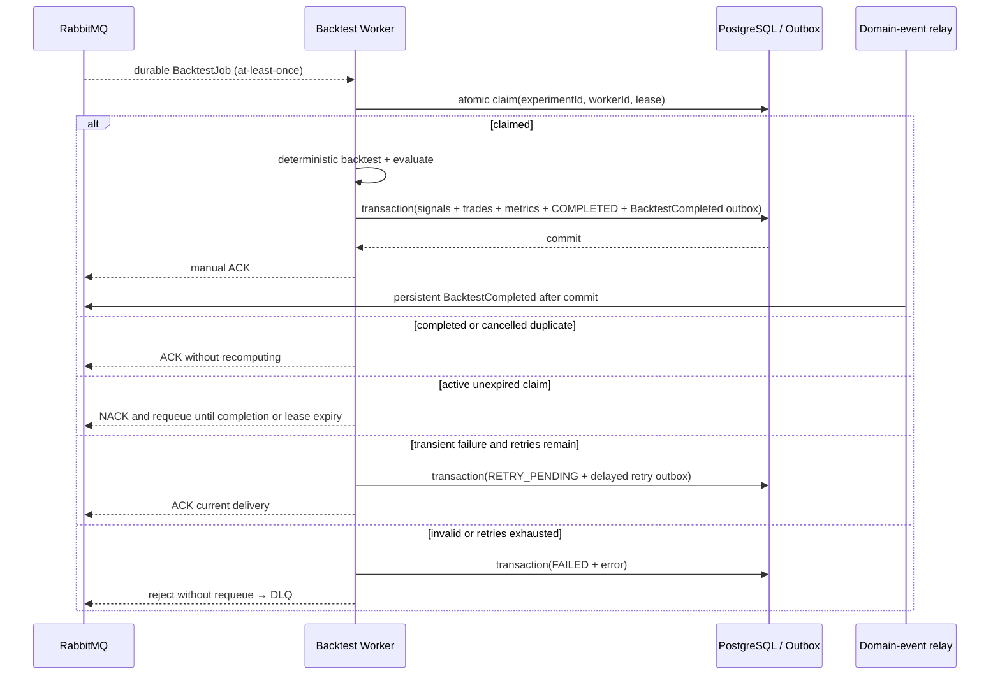
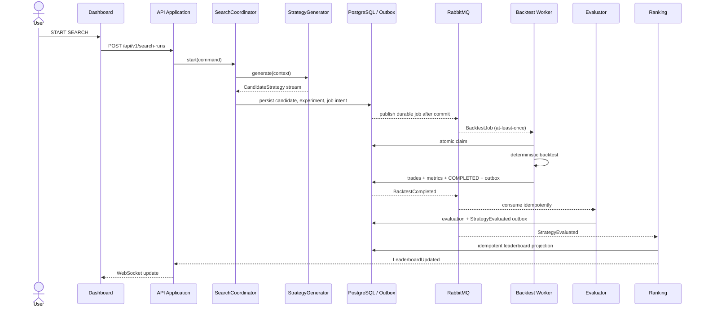
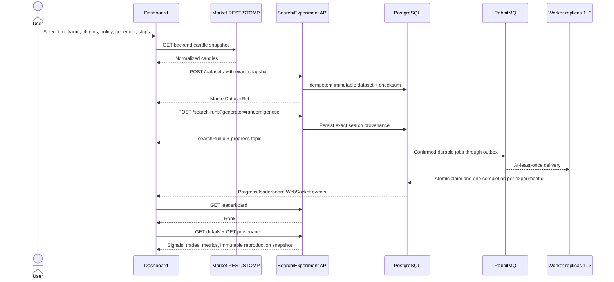

# Dynamic Views

## M2 — Market candle and reconnect recovery



The stream listener is generation-scoped, so callbacks from a replaced Binance
connection are ignored. Recovery deliberately includes the last persisted
boundary candle; the database key and store contract make its repeat harmless.

## M3 — Strategy plugin discovery and execution boundary



The consumer and API depend on registry/strategy abstractions only. A new plugin
adds one implementation and factory bean; Backtester, Evaluator, Ranking,
controllers, and the JSONB-based schema remain unchanged.

## M4 — Synchronous single-candidate experiment



M4 deliberately runs one supplied candidate in-process. Candidate generation,
durable job dispatch, RabbitMQ, worker claiming, and event publication belong to
M5 and are not implied by this sequence.

## M5.1 — Bounded Random candidate generation



The local executor remains the bounded generation mechanism and does not execute
backtests. M5.2 extends its persistence boundary with durable dispatch; M5.3
executes confirmed jobs only in the independent worker application.

## M5.2 — Transactional backtest-job dispatch

```mermaid
sequenceDiagram
    participant Search as SearchCoordinator
    participant DB as PostgreSQL
    participant Relay as Outbox publisher
    participant Queue as RabbitMQ

    Search->>DB: transaction(candidate + CREATED experiment + PENDING_DISPATCH job + outbox)
    Relay->>DB: claim unpublished rows with lease
    Relay->>Queue: persistent BacktestJob
    alt broker ACK and routable
        Queue-->>Relay: publisher confirm ACK
        Relay->>DB: transaction(outbox published + job QUEUED + experiment QUEUED)
    else NACK, timeout, or returned
        Queue-->>Relay: failure
        Relay->>DB: attempts + error + next retry; keep PENDING_DISPATCH
    end
```

Publisher confirm establishes the reporting boundary. Merely persisting or
sending a job never makes it `QUEUED`. A crash after broker ACK but before the
confirmation transaction can produce a duplicate publish on retry; later worker
idempotency uses `experimentId` as required by the specification.

## M5.3 — Idempotent Backtest Worker



The claim update is safe across worker replicas and an expired lease can be
reclaimed after a crash. A delivery that races ahead of the dispatch-confirm
transaction is requeued rather than incorrectly acknowledged. Retry count and
last error are durable job state; the retry outbox prevents the current message
from being ACKed before the replacement delivery intent is committed.

## M5.4/M5.5 — async ranking and realtime updates

This sequence is implemented with transactional outboxes, consumer-specific
inbox identities, and separate search/leaderboard STOMP topics.



## M5.5 — cancellation and replica scaling

```mermaid
sequenceDiagram
    actor User
    participant API as API Application
    participant DB as PostgreSQL / Outbox
    participant Queue as RabbitMQ
    participant W1 as Worker replica 1
    participant W3 as Worker replicas 2–3

    User->>API: POST /search-runs/{id}/cancel
    API->>DB: transaction(CANCELLED + cancel non-started jobs/experiments + tombstone outbox)
    alt message was already published
        Queue-->>W1: BacktestJob
        W1->>DB: conditional claim sees CANCELLED
        W1-->>Queue: ACK without artifacts
    else job is already RUNNING
        W1->>DB: complete safely and commit
    end
    Note over W1,W3: replica count changes from 1 to 3; same image and queue
    Queue-->>W1: shared workload
    Queue-->>W3: shared workload
    W1->>DB: atomic claim by experimentId
    W3->>DB: atomic claim by experimentId
```

## Boundaries and latency path

- Synchronous: browser → API validation; worker → local backtest engine.
- Asynchronous: job dispatch, completion, evaluation, ranking, and UI updates.
- Primary latency path: candidate persistence → broker → worker → evaluator →
  ranking → WebSocket.
- Backpressure: generation must stream/batch and cap in-flight jobs.
- Ordering is local to an ordering key; consumers never assume global order.

## M7 — Dashboard search and Top #1 provenance



Changing the Market timeframe only replaces its REST request and STOMP
subscription. Strategy catalog, search, leaderboard, News, and status modules
retain their state and do not reload.

## M6 — isolated News and Sentiment collection

```mermaid
sequenceDiagram
    participant Schedule as Dedicated news executor
    participant Collector as NewsCollector
    participant Provider as NewsProvider adapter
    participant DB as PostgreSQL NewsStore
    participant Model as SentimentAnalyzer adapter
    participant API as News REST/health

    Schedule->>Collector: collect()
    Collector->>Provider: fetch(since)
    alt provider available
        Provider-->>Collector: normalized NewsItem list
        Collector->>DB: upsert news first
        loop prediction not already stored for exact versions
            Collector->>Model: analyze(NewsItem)
            alt inference succeeds
                Model-->>Collector: versioned SentimentResult
                Collector->>DB: insert idempotently
            else bounded attempts fail
                Collector->>Collector: mark Sentiment DEGRADED/DOWN + metric
            end
        end
    else provider unavailable
        Collector->>Collector: mark News DOWN + metric; do not throw to caller
    end
    API->>DB: read already stored news and sentiment
```

Provider failure does not invoke or alter Market Data, Search, Backtest,
Evaluation, or Leaderboard components. Model failure occurs after the normalized
news upsert, so headlines remain available and failed inference can be retried on
the next collection without fabricating metadata.

## Failure points

- Broker unavailable: persisted dispatch intent stays pending; API must not call
  it durably queued before publisher confirmation.
- Worker crash: unacknowledged job is redelivered; atomic claim/idempotency
  prevents duplicate completion.
- Commit/event gap: transactional outbox retries event publication.
- Duplicate event: consumer inbox prevents duplicate projection updates.
- Cancel: generation stops; queued work is skipped safely where practical.
- News provider/model failure: local health degrades and stored news remains
  readable; unrelated schedulers and application paths continue independently.
