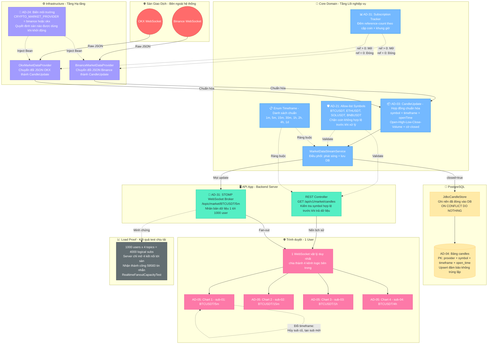
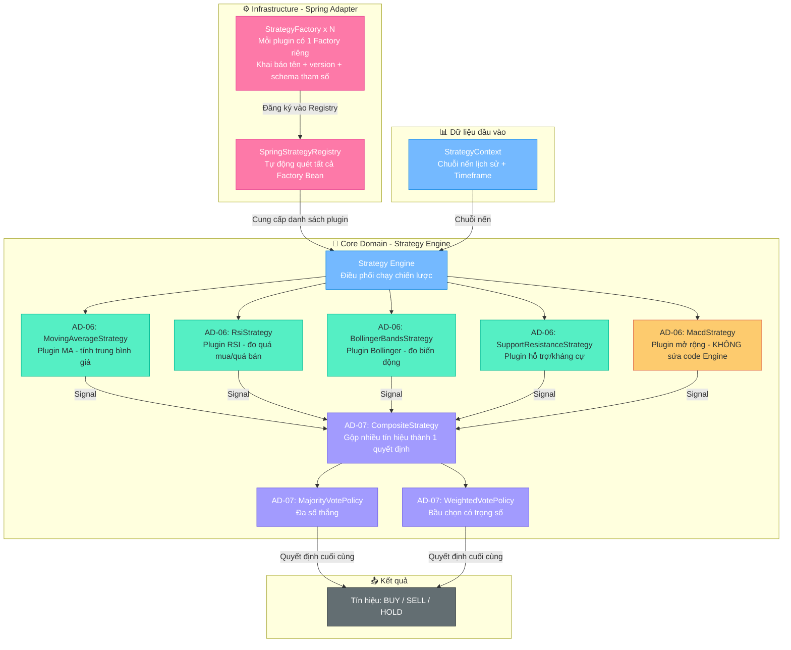
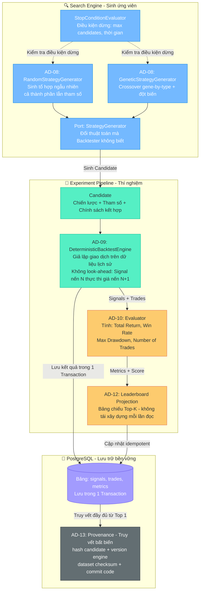
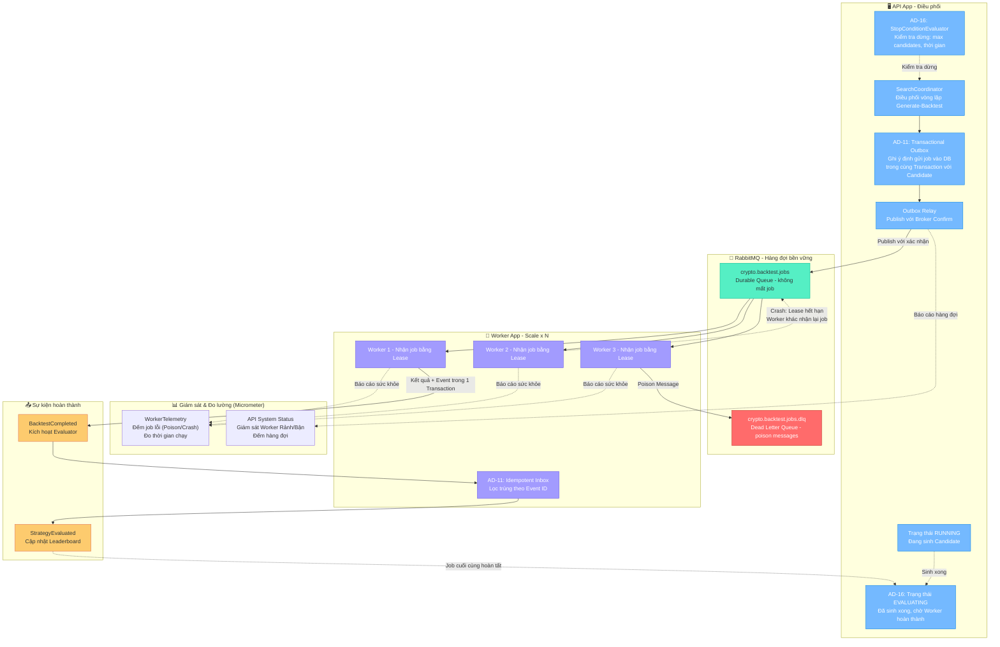
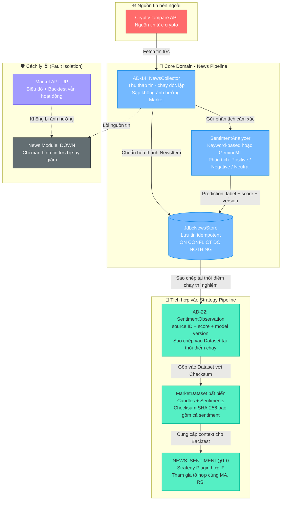

# Kiến trúc phần mềm - Crypto Strategy Lab

> **Hệ thống Tài liệu Tham chiếu (Cần xem kết hợp để bảo vệ đồ án):**
> 
> *Các tài liệu gốc của dự án (Tiếng Anh & Đề bài):*
> - [**Crypto Strategy Lab – Đồ án cuối kỳ.md**](file:///d:/Kiến trúc phần mềm/Project_cuoi_ky_Moi/crypto-strategy-lab/docs/requirements/Crypto%20Strategy%20Lab%20–%20Đồ%20án%20cuối%20kỳ.md): Đề tài gốc chứa các yêu cầu nghiệp vụ do giảng viên cung cấp.
> - [**ARCHITECTURE.md**](file:///d:/Kiến trúc phần mềm/Project_cuoi_ky_Moi/crypto-strategy-lab/docs/ARCHITECTURE.md): Tài liệu kiến trúc chuẩn quốc tế (Tiếng Anh) chứa mọi biểu đồ C4 và ADRs chi tiết của hệ thống.
> - [**REQUIREMENTS_TRACEABILITY.md**](file:///d:/Kiến trúc phần mềm/Project_cuoi_ky_Moi/crypto-strategy-lab/docs/REQUIREMENTS_TRACEABILITY.md): Ma trận truy vết, dùng để đối chiếu xem dòng code nào giải quyết yêu cầu nào trong đề bài.
> - [**IMPLEMENTATION_PLAN.md**](file:///d:/Kiến trúc phần mềm/Project_cuoi_ky_Moi/crypto-strategy-lab/docs/IMPLEMENTATION_PLAN.md): Kế hoạch và các bước triển khai dự án ban đầu.
> 
> 
> **Cấu trúc tiêu chuẩn cho từng Yêu cầu (Mô-đun) bên dưới:**
> 1. **Mục tiêu**: Trích xuất bài toán cốt lõi từ Đề bài.
> 2. **Sơ đồ luồng (C4 Level 3 - Mermaid)**: Mô phỏng cách dữ liệu chảy qua các component.
> 3. **Các Quyết định Kiến trúc (ADRs)**: Trình bày bối cảnh, quyết định thiết kế và hệ quả.
> 4. 📍 **Code tham chiếu**: Link đường dẫn tuyệt đối/tương đối chỉ thẳng vào file code gốc trong source, chứng minh code thật khớp với lý thuyết.

---

## Yêu cầu 1: Dữ liệu Thị trường Thời gian thực (Realtime Market Data) & Đa khung thời gian (Multi-Timeframe Chart)

### Kiến thức nền tảng (Dùng cho Vấn đáp)
> **Dành cho bảo vệ đồ án:** Đây là các khái niệm cốt lõi về bản chất của thị trường tài chính và cách dữ liệu được hình thành, giúp trả lời các câu hỏi vấn đáp mang tính bản chất.

**1. Cây nến (Candlestick) chứa thông tin gì và đại diện cho điều gì?**
- **Cấu trúc:** Một cây nến lưu lại 8 thông tin: Tên cặp giao dịch (`symbol`), Khung thời gian (`timeframe`), Thời điểm bắt đầu (`openTime`), Giá mở cửa (`open`), Giá cao nhất (`high`), Giá thấp nhất (`low`), Giá đóng cửa/hiện tại (`close`) và Khối lượng giao dịch (`volume`).
- **Bản chất toàn cầu:** Cây nến không hiển thị dữ liệu cá nhân. Nó là **bức tranh toàn cảnh của thị trường toàn cầu**. Bất kỳ ai trên thế giới mở biểu đồ (ví dụ: BTC/USDT khung 5 phút) cùng lúc đều nhìn thấy một cây nến nhảy múa giống hệt nhau, vì nó tổng hợp tất cả giao dịch mua bán đang diễn ra trên toàn mạng lưới của sàn đó.

**2. Giá (Price) trên màn hình được quyết định như thế nào? Tại sao nó nhảy lên/xuống?**
- **Giá hiện tại (`close`):** Chính là mức giá của **giao dịch vừa mới được khớp thành công gần nhất**. Nó không do sàn quyết định, mà do sự **đồng thuận** giữa người Mua và người Bán.
- **Cơ chế nhảy giá (Matching Engine & Order Book):** Sàn sử dụng "Sổ lệnh" (Order Book) để mai mối người mua và người bán.
  - **Giá nhảy LÊN:** Khi lực Mua (Cầu) quá mạnh, nhiều người bấm "Mua bằng mọi giá" (Market Buy). Sàn sẽ lấy sạch Bitcoin của những người bán giá rẻ, tiếp tục lấy của những người bán giá cao hơn. Giao dịch cuối cùng chốt ở mức giá cao hơn → Giá hiển thị nhảy lên.
  - **Giá nhảy XUỐNG:** Khi lực Bán (Cung) hoảng loạn, nhiều người bấm "Bán bằng mọi giá". Sàn sẽ tống Bitcoin của họ cho những người đang chờ mua ở mức giá rẻ. Giao dịch cuối cùng chốt ở mức giá thấp hơn → Giá hiển thị lao dốc.

**3. Bản chất của số lượng BTC trên sàn và Giới hạn mua (Thanh khoản - Liquidity)**
- **Nguồn gốc coin:** Bản thân sàn không tự tạo ra Bitcoin. Tổng số BTC trên sàn (Ví dụ: 500,000 BTC) thực chất là tài sản của hàng triệu người dùng nạp vào ví của sàn để chờ giao dịch. Sàn chỉ đóng vai trò "cái chợ" thu phí giao dịch.
- **Có thể mua tối đa bao nhiêu?** Bị giới hạn bởi 2 thứ: (1) Số tiền trong tài khoản của bạn, và (2) **Tính thanh khoản (Liquidity)** - tức là tổng số BTC đang được *Phe Bán rao bán trên Order Book* lúc đó. Bạn không thể mua được số lượng lớn hơn số lượng đang có người muốn bán, dù bạn có bao nhiêu tiền đi chăng nữa. Tương tự, nếu bạn vung tiền mua sạch lượng hàng đang rao, giá sẽ bị đẩy vọt lên tận mây xanh (Trượt giá - Slippage).


### Mục tiêu yêu cầu
- Nhận dữ liệu thị trường từ sàn (Binance hoặc OKX) mà không để Frontend phụ thuộc trực tiếp vào API của sàn.
- Cập nhật biểu đồ nến (candlestick) liên tục (realtime) với độ trễ thấp, hỗ trợ tối đa 4 biểu đồ với các khung thời gian (timeframe) khác nhau trên cùng một màn hình.
- Đáp ứng khả năng chịu tải lớn (ví dụ: 1000 người dùng kết nối đồng thời).
- Xử lý mượt mà vòng đời của một cây nến (từ lúc đang mở đến lúc đóng) mà không làm hỏng dữ liệu lịch sử.

### Các Quyết Định Kiến Trúc (ADRs) Giải Quyết Yêu Cầu Này

Dưới đây là các quyết định thiết kế đã được áp dụng để đáp ứng và tối ưu hóa yêu cầu trên:

#### 1. Chuẩn hóa hợp đồng dữ liệu nến (AD-03: Normalized candle and news contracts)
- **Bối cảnh:** Frontend và các chiến lược giao dịch không được phép làm việc trực tiếp với định dạng JSON riêng của Binance.
- **Quyết định:** Các Adapter (cổng giao tiếp) chịu trách nhiệm nhận dữ liệu từ sàn và chuyển đổi (map) thành các đối tượng chuẩn của domain như `Candle` và `CandleUpdate` trước khi đưa vào các dịch vụ ứng dụng (application services).
- **Hệ quả:** Nếu sau này đổi sàn giao dịch, không cần sửa đổi Frontend. Tất cả các consumer đều làm việc với một định dạng dữ liệu duy nhất và ổn định.
- 📍 **Code tham chiếu:** Các Adapter [`BinanceMarketDataProvider`](../crypto-strategy-lab/infrastructure/src/main/java/com/cryptolab/infrastructure/marketdata/adapter/binance/BinanceMarketDataProvider.java) và [`OkxMarketDataProvider`](../crypto-strategy-lab/infrastructure/src/main/java/com/cryptolab/infrastructure/marketdata/adapter/okx/OkxMarketDataProvider.java) nằm trong thư mục `infrastructure/src/main/java/.../marketdata/adapter`. Các đối tượng dữ liệu chuẩn như [`CandleUpdate`](../crypto-strategy-lab/core/src/main/java/com/cryptolab/marketdata/domain/CandleUpdate.java) nằm tại `core/src/main/java/.../marketdata/domain/CandleUpdate.java`. Việc cách ly các DTO riêng của từng sàn được bảo vệ bởi luật ArchUnit.

#### 2. Vòng đời nến Realtime sử dụng cơ chế ghi đè và Tự động phục hồi (AD-04: Realtime candle lifecycle uses upsert semantics & Gap Recovery)
- **Bối cảnh:** Một cây nến realtime thay đổi rất nhiều lần trước khi đóng cửa. Cây nến đã đóng phải được lưu trữ bền vững, không trùng lặp. Đặc biệt, nếu rớt mạng WebSocket với sàn, hệ thống không được để biểu đồ bị "lủng lỗ" (thiếu nến) khi có mạng trở lại.
- **Quyết định & Cơ chế phục hồi:** 
  - **Ghi đè (Upsert):** Backend chỉ lưu vào DB lần đầu tiên cây nến báo đóng (`closed = true`). Ở Frontend, biểu đồ ghi đè dựa trên `openTime`.
  - **Tự động kết nối lại (Exponential Backoff):** Khi rớt mạng, hệ thống không cố kết nối lại liên tục gây treo máy mà sẽ chờ một khoảng thời gian tăng dần gấp đôi (từ `initialReconnectDelay` đến `maximumReconnectDelay`).
  - **Vá nến khuyết (Gap Recovery):** Ngay khi kết nối lại thành công, hệ thống hỏi DB xem "Cây nến cuối cùng được ghi nhận là lúc mấy giờ?". Sau đó, nó gọi REST API lịch sử của sàn để kéo một mạch toàn bộ các cây nến bị thiếu từ thời điểm rớt mạng đến hiện tại, ghi đè (Upsert) an toàn vào DB và phát sóng bù qua STOMP cho Frontend.
- **Hệ quả:** Dữ liệu luôn liền mạch. Giao diện có thể vẽ nến nhảy múa liên tục và tự động vẽ bù nến sau khi đứt mạng mà không cần user tải lại trang (F5). Khóa `openTime` đảm bảo tính lũy đẳng (không bị ghi trùng).
- 📍 **Code tham chiếu:** Cơ chế Reconnect và Gap Recovery nằm trọn vẹn trong class [`MarketDataStreamService`](file:///d:/Kiến trúc phần mềm/Project_cuoi_ky_Moi/crypto-strategy-lab/core/src/main/java/com/cryptolab/marketdata/application/MarketDataStreamService.java) (`core/.../application/MarketDataStreamService.java` - hàm `recoverGap()` và `disconnected()`). Logic chống trùng lặp dữ liệu vào PostgreSQL (`ON CONFLICT DO NOTHING`) được thể hiện rõ trong bài test [`CandleStoreIT`](file:///d:/Kiến trúc phần mềm/Project_cuoi_ky_Moi/crypto-strategy-lab/integration-tests/src/test/java/com/cryptolab/persistence/CandleStoreIT.java) (`integration-tests/.../persistence/CandleStoreIT.java`).

#### 3. Mỗi biểu đồ tự quản lý đăng ký và trạng thái riêng (AD-05: Each chart owns its subscription and state)
- **Bối cảnh:** Giao diện cần hiện 4 khung thời gian. Đổi khung thời gian của 1 biểu đồ không được làm tải lại trang hay ảnh hưởng 3 biểu đồ kia.
- **Quyết định:** Trình duyệt lưu giữ 4 `chartStates` độc lập. Mỗi state tự quản lý khung thời gian, danh sách nến, canvas vẽ và một ID đăng ký (subscription ID) STOMP riêng. Backend chỉ cung cấp 1 luồng WebSocket duy nhất cho mỗi user, nhưng mở 4 "kênh" (logical subscriptions) bên trong đó.
- **Hệ quả:** Đáp ứng đúng yêu cầu UI. Việc chia sẻ cùng một danh sách chuẩn khung thời gian (`Timeframe` enum: 1m, 5m, 1h, 1d, v.v.) đảm bảo tính nhất quán từ Frontend, REST, DB đến Binance adapter.
- 📍 **Code tham chiếu:** Khung thời gian hợp lệ được định nghĩa tại Enum [`Timeframe`](../crypto-strategy-lab/core/src/main/java/com/cryptolab/marketdata/domain/Timeframe.java) (`core/.../marketdata/domain/Timeframe.java`). Frontend phân tách 4 state hiển thị độc lập. Việc các kênh độc lập không can thiệp chéo nhau đã được kiểm chứng thông qua các bài test giao diện như [`ReferenceDashboardTest`](../crypto-strategy-lab/api-app/src/test/java/com/cryptolab/api/ReferenceDashboardTest.java) (`api-app/src/test/java/.../ReferenceDashboardTest.java`) và [`MarketDashboardIsolationTest`](../crypto-strategy-lab/api-app/src/test/java/com/cryptolab/api/marketdata/MarketDashboardIsolationTest.java) (`api-app/src/test/java/.../marketdata/MarketDashboardIsolationTest.java`).

#### 4. Chỉ chọn 1 sàn giao dịch khi khởi động (AD-24: One market provider is selected at application startup)
- **Bối cảnh:** Mở rộng hỗ trợ OKX bên cạnh Binance mà không sửa Frontend.
- **Quyết định:** Cả `BinanceMarketDataProvider` và `OkxMarketDataProvider` đều implement chung một cổng (port) cốt lõi. Biến môi trường `CRYPTO_MARKET_PROVIDER=binance|okx` sẽ quyết định sàn nào được dùng khi API khởi động.
- **Hệ quả:** Logic của Controller và Frontend không thay đổi. Tuy nhiên, đây là cơ chế thay thế tĩnh (cần khởi động lại API để đổi sàn), không phải cơ chế tự động chuyển đổi qua lại (failover) lúc đang chạy.
- 📍 **Code tham chiếu:** Nằm ở cơ chế cấu hình khởi tạo (Bootstrapping) của Spring Boot. Quá trình Inject Bean `MarketDataProvider` sẽ dựa vào biến môi trường để quyết định chọn Binance hay OKX. Điều này đảm bảo HTTP endpoint `/api/v1/market/candles` trên Controller không cần đổi dù một dòng code.

#### 5. Danh sách các cặp giao dịch được kiểm soát (AD-21: Supported market pairs are an application allow-list)
- **Bối cảnh:** Hỗ trợ nhiều loại coin khác nhau (Multi-coin).
- **Quyết định:** Sử dụng biến môi trường `CRYPTO_MARKET_SUPPORTED_SYMBOLS` để cấp phép (allow-list) các cặp hợp lệ (như BTCUSDT, ETHUSDT).
- **Hệ quả:** Ngăn chặn việc proxy các cặp tiền ảo tùy ý từ bên ngoài. Kiểm tra tính hợp lệ diễn ra ở Application Service, nằm ngoài logic của Binance hay Frontend.
- 📍 **Code tham chiếu:** Nằm trong Core Domain, thông qua class cấu hình cho phép kiểm tra cặp giao dịch (Ví dụ: `StrategyContext` sẽ validate các cặp hợp lệ). Dashboard UI cũng sẽ đọc danh sách này (BTC/ETH/SOL/BNB) để hiển thị.

#### 6. Tách biệt kết nối của Trình duyệt và Sàn để mở rộng khả năng chịu tải (AD-31: Realtime capacity separates browser fanout from provider streams)
- **Bối cảnh:** Nếu 1000 người dùng mở 4 biểu đồ, việc tạo 4000 kết nối WebSocket trực tiếp tới Binance sẽ gây quá tải hoặc bị sàn chặn (Rate limit).
- **Quyết định:** Trình theo dõi (Subscription tracker) sử dụng cơ chế đếm tham chiếu (reference-counting) dựa trên "Cặp coin + Khung thời gian". Backend sẽ chỉ mở **1 luồng kết nối tới sàn** cho mỗi cặp/khung thời gian, sau đó tự nhân bản (fanout) dữ liệu ra cho tất cả các user đang subscribe chủ đề đó.
- **Hệ quả:** Trong thực tế test (load proof), 1000 kết nối WebSockets yêu cầu 4 chủ đề nhận được đầy đủ dữ liệu (59,583 tin nhắn) mà chỉ dùng rất ít luồng kết nối thực tế ra Internet, tránh bị sàn block.
- 📍 **Code tham chiếu:** Sự thành công của chiến lược đếm tham chiếu (Reference-counted streams) được chứng minh bằng tài liệu chạy tải thông qua script test (K6 test run) được lưu lại kết quả trong [`RealtimeFanoutCapacityTest`](file:///d:/Kiến trúc phần mềm/Project_cuoi_ky_Moi/crypto-strategy-lab/core/src/test/java/com/cryptolab/marketdata/application/RealtimeFanoutCapacityTest.java) (`core/src/test/java/.../marketdata/application/RealtimeFanoutCapacityTest.java`), xác nhận 1000 người dùng vẫn nhận mượt mà nến mới chưa tới 5 giây. Đã có cả metric `Micrometer` để liên tục đo lường độ trễ mạng.

### Sơ đồ tổng hợp chi tiết Yêu cầu 1 (Consolidated Detail Diagram)

Sơ đồ dưới đây gộp lại **toàn bộ các quyết định kiến trúc (AD-03 → AD-31)** của Yêu cầu 1 vào một bức tranh duy nhất, giúp nhìn thấy mối liên hệ giữa các component và dữ liệu chảy xuyên suốt hệ thống.



> **Hướng dẫn đọc sơ đồ (phân biệt theo màu sắc + khung tầng):**
> | Màu | Khung tầng | Ý nghĩa |
> |---|---|---|
> | 🔴 Đỏ | Exchange | Nguồn dữ liệu bên ngoài (Binance, OKX) |
> | 🟣 Tím | Infrastructure | Adapter chuyển đổi + Biến cấu hình (AD-24) |
> | 🔵 Xanh dương | Core Domain | Nghiệp vụ lõi: CandleUpdate (AD-03), Tracker (AD-31), Allow-list (AD-21), Timeframe |
> | 🟢 Xanh lá | API App | REST Controller + STOMP Broker phát sóng (AD-31 Fan-out) |
> | 🟡 Vàng | Database | PostgreSQL lưu nến (AD-04 Upsert) |
> | 🩷 Hồng | Browser | 1 WebSocket vật lý + 4 biểu đồ độc lập (AD-05) |
> | ⬛ Xám | Load Proof | Kết quả test chịu tải thực tế: 59,583 tin nhắn |
> 
> - **Đường nét liền (→):** Luồng dữ liệu thực tế chảy qua.
> - **Đường nét đứt (⇢):** Ràng buộc, kiểm tra, hoặc cơ chế điều khiển.

---

## Yêu cầu 2: Strategy Engine & Kiến trúc Plugin (Module 3 & 4)

### Mục tiêu yêu cầu
- **Strategy Engine:** Nhận đầu vào là chuỗi nến (Market Data), xuất đầu ra là tín hiệu giao dịch (`BUY`, `SELL`, `HOLD`). Hỗ trợ các chiến lược cơ bản: MA, RSI, Bollinger Bands, Support/Resistance.
- **Kiến trúc Plugin (Extensibility):** Bắt buộc phải thiết kế hệ thống sao cho việc cắm thêm một chiến lược mới (như MACD) diễn ra dễ dàng, độc lập, không làm thay đổi hay ảnh hưởng đến code của Engine, Backtester hay UI.
- **Chiến lược phức hợp (Composite):** Có khả năng chạy song song nhiều chiến lược và kết hợp kết quả lại dựa trên luật (Ví dụ: Đa số thắng - Majority Vote, hoặc Bầu chọn có trọng số - Weighted Vote).

### Các Quyết Định Kiến Trúc (ADRs) Giải Quyết Yêu Cầu Này

#### 1. Sử dụng hợp đồng Registry và Factory cho Strategy Plugin (AD-06: strategy plugins use registry and factory contracts)
- **Bối cảnh:** Việc thêm chiến lược mới tuyệt đối không được phép tạo ra các câu lệnh `switch-case` hay `if-else` khổng lồ trong Controller hay Engine.
- **Quyết định:** Mỗi chiến lược có một Factory sinh ra nó, được gắn phiên bản (version) rõ ràng. Cổng giao tiếp `StrategyRegistry` chịu trách nhiệm tự động quét và khám phá các Factory này, đồng thời cung cấp cấu trúc tham số (schema) ra ngoài API.
- **Hệ quả:** Việc tạo và kiểm tra tính hợp lệ của tham số thuộc về chính Plugin đó. Khi muốn cắm thêm một Plugin Java mới, lập trình viên chỉ cần tạo file Strategy và Factory bean tương ứng mà không phải thêm bất kỳ một cột Database nào hay sửa nhánh code rẽ nhánh.
- 📍 **Code tham chiếu:** Giao diện cổng [`StrategyRegistry`](../crypto-strategy-lab/core/src/main/java/com/cryptolab/strategy/port/StrategyRegistry.java) và [`StrategyFactory`](../crypto-strategy-lab/core/src/main/java/com/cryptolab/strategy/port/StrategyFactory.java) nằm ở Core. Lớp hiện thực tự động quét Spring Bean [`SpringStrategyRegistry`](../crypto-strategy-lab/infrastructure/src/main/java/com/cryptolab/infrastructure/strategy/adapter/SpringStrategyRegistry.java) nằm ở thư mục Adapter Infrastructure. Minh chứng rõ nhất cho việc mở rộng dễ dàng (Extensibility isolation) là class [`MacdStrategy`](../crypto-strategy-lab/core/src/main/java/com/cryptolab/strategy/domain/extension/MacdStrategy.java) được thêm vào mà không phá vỡ kiến trúc.

#### 2. Tách biệt chính sách kết hợp tín hiệu khỏi logic phân tích (AD-07: combination policy is separate from strategy analysis)
- **Bối cảnh:** Các chiến lược độc lập như MA, RSI, Bollinger Bands có thể cho ra các tín hiệu trái ngược nhau (RSI bảo mua, MA bảo bán).
- **Quyết định:** Các chiến lược chỉ xuất ra tín hiệu `BUY`, `SELL`, `HOLD`. Việc giải quyết xung đột sẽ được giao cho các chính sách phân xử riêng biệt như `MajorityVotePolicy` (Bầu chọn đa số) và `WeightedVotePolicy` (Bầu chọn có trọng số).
- **Hệ quả & Khả năng mở rộng (Extensibility):** Logic tính toán kỹ thuật và logic giải quyết xung đột có lý do thay đổi khác nhau. Việc tách biệt tuân thủ Single Responsibility (Nguyên lý Đơn trách nhiệm). Đặc biệt, tất cả các chính sách phân xử đều cùng thực thi (implements) chung một giao diện (Interface) là `CombinationPolicy` (áp dụng mẫu thiết kế Strategy Pattern). Điều này cho phép mở rộng không giới hạn: Nếu sau này cần thêm một cách phân xử mới (ví dụ: AI Vote), lập trình viên chỉ cần tạo class mới kế thừa `CombinationPolicy` mà không phải sửa đổi bất kỳ dòng code cốt lõi nào hiện tại, tuân thủ nguyên lý OCP (Open-Closed Principle).
- 📍 **Code tham chiếu:** Các chiến lược cơ sở như [`MovingAverageStrategy`](../crypto-strategy-lab/core/src/main/java/com/cryptolab/strategy/domain/baseline/MovingAverageStrategy.java) nằm tách biệt hoàn toàn với logic chính sách phân xử như [`MajorityVotePolicy`](../crypto-strategy-lab/core/src/main/java/com/cryptolab/strategy/domain/policy/MajorityVotePolicy.java). Cả `MajorityVotePolicy` và `WeightedVotePolicy` đều dùng chung interface gốc là [`CombinationPolicy`](../crypto-strategy-lab/core/src/main/java/com/cryptolab/strategy/domain/CombinationPolicy.java).

### Sơ đồ tổng hợp chi tiết Yêu cầu 2



> **Chú thích màu YC2:**
> | Màu | Ý nghĩa |
> |---|---|
> | 🔵 Xanh dương | Core Engine + Context đầu vào |
> | 🟢 Xanh lá | Các Strategy Plugin có sẵn (AD-06) |
> | 🟡 Vàng | Plugin mở rộng (MACD) - minh chứng Extensibility |
> | 🟣 Tím | Composite + Policy giải quyết xung đột (AD-07) |
> | 🩷 Hồng | Infrastructure: Registry + Factory tự động quét |
> | ⬛ Xám | Kết quả đầu ra: BUY/SELL/HOLD |

---

## Yêu cầu 3: Search Engine, Backtesting, Leaderboard & Truy vết (Module 6, 7, 8)

### Mục tiêu yêu cầu
- **Strategy Search Engine:** Tự động sinh ra hàng nghìn tổ hợp chiến lược (bao gồm thay đổi cả thành phần lẫn tham số). Hỗ trợ tối thiểu Random Search, nâng cao là Genetic Algorithm. Phải có thể thay thế thuật toán search mà Backtester không hề hay biết (Replaceability).
- **Backtesting Engine:** Giả lập giao dịch trên dữ liệu lịch sử một cách chính xác. Tuyệt đối không có lỗi **Look-ahead bias** (nhìn trộm tương lai). Tín hiệu ở nến N chỉ được thực thi ở giá mở cửa nến N+1.
- **Evaluator & Leaderboard:** Tính toán các chỉ số (Return, Win Rate, Max Drawdown, Số lệnh), xếp hạng Top-K chiến lược tốt nhất.
- **Provenance (Truy vết):** Nhìn vào bất kỳ kết quả nào trên Leaderboard đều phải truy ngược lại được chính xác: chiến lược gì, tham số bao nhiêu, tập dữ liệu nào, phiên bản Engine/Evaluator nào, hash commit code nào.

### Các Quyết Định Kiến Trúc (ADRs) Giải Quyết Yêu Cầu Này

#### 1. Search Engine biến đổi cả thành phần chiến lược lẫn tham số (AD-08: search varies membership as well as parameters)
- **Bối cảnh (Vấn đề):** Câu hỏi cốt lõi của thí nghiệm là làm sao tự động khám phá và so sánh các tổ hợp chiến lược (ví dụ: `MA + RSI` so với `Bollinger + S/R`). Nếu công cụ tìm kiếm chỉ biết thay đổi tham số (ví dụ: đổi MA chu kỳ 10 thành MA chu kỳ 20) mà giữ nguyên cấu trúc cố định, hệ thống sẽ thất bại trong việc đánh giá hiệu quả của việc lai tạo. Hơn nữa, việc tìm kiếm không được phép dùng vòng lặp vét cạn (Brute-force) vì không gian tổ hợp của tất cả các chiến lược và tham số có thể lên tới hàng tỷ trường hợp, gây treo hệ thống.
- **Quyết định (Cách thức thực hiện):** Hệ thống thiết kế các Trình sinh chiến lược (Strategy Generator) có khả năng can thiệp vào cả **cấu trúc (thành phần tham gia)** lẫn **tham số**. 
  - `RandomStrategyGenerator`: Mô hình hóa mỗi họ chiến lược dưới dạng một nút bật/tắt (tham gia hoặc loại trừ khỏi tổ hợp). Nó sinh ngẫu nhiên và chỉ từ chối trường hợp duy nhất là tất cả các chiến lược đều bị "loại trừ".
  - `GeneticStrategyGenerator`: Sử dụng Thuật toán Di truyền (Genetic Algorithm) để tìm kiếm thông minh. Quá trình Lai ghép (Crossover) kiểu gene-by-type và Đột biến (Mutation) có quyền loại bỏ một chiến lược đang có hoặc thêm vào một chiến lược mới.
- **Hệ quả & Khả năng mở rộng (Tính ưu việt của Kiến trúc):**
  - **Mở rộng thuật toán (Plug & Play Generator):** Lõi của Backtester hoàn toàn không biết nó đang chạy thuật toán tìm kiếm nào. Tất cả các bộ sinh (Random, Genetic) đều phải `implements` chung một Giao diện (Interface) là `StrategyGenerator`. Nhờ đó, việc cắm thêm một thuật toán tìm kiếm mới (ví dụ: `BayesianOptimizationGenerator`) là vô cùng dễ dàng mà không làm vỡ kiến trúc cũ (chứng minh qua test `GeneratorReplacementArchitectureTest`).
  - **Quyền lựa chọn của người dùng (Search Space):** Trước khi chạy, người dùng có quyền thiết lập không gian tìm kiếm: Chọn cụ thể những chiến lược nào được phép lai tạo, giới hạn vùng tham số (ví dụ: MA chỉ chạy từ 10 đến 50), chọn Cặp tiền (BTCUSDT), Khung thời gian (15m) và số Vốn ban đầu.
  
  - **Tính Lưu trữ Cá nhân (Tenant Isolation):** Đây là điểm nhấn kiến trúc. Mỗi một phiên chạy và kết quả Backtest đều được lưu vào Database gắn chặt với `account_id` (Khóa ngoại của người dùng). Điều này đảm bảo thuật toán, ý tưởng và kết quả thí nghiệm của User A hoàn toàn bảo mật, User B không thể nhìn thấy hay can thiệp.
- 📍 **Code tham chiếu:** [`RandomStrategyGenerator`](../crypto-strategy-lab/core/src/main/java/com/cryptolab/experiment/application/RandomStrategyGenerator.java) (`core/.../experiment/application/RandomStrategyGenerator.java`) và [`GeneticStrategyGenerator`](../crypto-strategy-lab/core/src/main/java/com/cryptolab/experiment/application/GeneticStrategyGenerator.java) (`core/.../experiment/application/GeneticStrategyGenerator.java`). Cả hai đều implement giao diện cổng [`StrategyGenerator`](../crypto-strategy-lab/core/src/main/java/com/cryptolab/experiment/port/StrategyGenerator.java) (`core/.../experiment/port/StrategyGenerator.java`). Việc đổi thuật toán được chứng minh tại bài test [`GeneratorReplacementArchitectureTest`](../crypto-strategy-lab/integration-tests/src/test/java/com/cryptolab/architecture/GeneratorReplacementArchitectureTest.java) (`integration-tests/.../architecture/GeneratorReplacementArchitectureTest.java`).

#### 2. Backtest, Đánh giá, và Xếp hạng là các giai đoạn tách biệt (AD-09: deterministic backtest, evaluation, and ranking are separate stages)
- **Bối cảnh:** Logic chiến lược, mô phỏng giao dịch, tính toán chỉ số, và xếp hạng cần test và phiên bản độc lập với nhau. Hơn nữa, việc mô phỏng mua bán cần thiết kế an toàn, tránh cạn kiệt vốn do các chiến lược chưa tối ưu spam tín hiệu liên tục.
- **Quyết định (Cơ chế hoạt động cốt lõi):**
  - **Tách biệt Pipeline & Chống Look-ahead:** Pipeline được chia thành: Candidate → Backtest → Evaluate → Rank. Tín hiệu sinh ra ở nến thứ N sẽ chỉ được thực thi ở giá mở cửa của nến N+1 (tuyệt đối không nhìn trộm tương lai).
  - **Định nghĩa Lệnh (Trade) & Single Position:** 
    - *Lệnh (Trade) là gì?* Trong hệ thống này, 1 "Lệnh" không phải là một cú click chuột đơn lẻ, mà là một **chu kỳ giao dịch khép kín (Round-trip)** bao gồm: 1 điểm MỞ vị thế (Entry) và 1 điểm ĐÓNG vị thế (Exit). Ví dụ: Mua vào lúc sáng và Bán ra lúc chiều được gộp chung thành 1 Lệnh, cho ra 1 kết quả lời/lỗ (PnL) duy nhất.
    - *Cơ chế 1 vị thế:* Engine thiết kế theo mô hình Stop-and-Reverse kinh điển (chỉ giữ 1 vị thế tại 1 thời điểm). Khi đang ôm một lệnh Mua (LONG), mọi tín hiệu BUY tiếp theo sẽ bị bỏ qua hoàn toàn. Nó chỉ thực hiện bước ĐÓNG lệnh khi xuất hiện tín hiệu đảo chiều (SELL).
  - **Defense in Depth (Bảo vệ 2 lớp):** Lớp 1: Strategy viết đúng chuẩn sẽ sinh tín hiệu `HOLD` (Giữ) thay vì spam `BUY` ở các nến tiếp theo. Lớp 2: Lõi `Portfolio` của Engine chặn cứng việc mua thêm nếu `position != null`.
- **Hệ quả:** Hệ thống chống được lỗi "Hết tiền" (Insufficient Funds). PnL của từng lệnh được hạch toán rạch ròi, dễ truy vết. Hơn thế, việc mở rộng DCA hay quản lý vốn phức tạp đã được dọn đường sẵn thông qua biến `engineVersion` (Ví dụ `POSITION_SIZE_VERSION`), thể hiện tư duy kiến trúc mở rộng tuyệt vời.
- 📍 **Code tham chiếu:** [`DeterministicBacktestEngine`](../crypto-strategy-lab/core/src/main/java/com/cryptolab/experiment/application/DeterministicBacktestEngine.java) chứa logic hàm `Portfolio.execute()` thể hiện rõ rào chắn `position == null`. Luồng điều phối nằm tại [`ExperimentPipelineService`](../crypto-strategy-lab/core/src/main/java/com/cryptolab/experiment/application/ExperimentPipelineService.java).

#### 3. Win Rate là chỉ số được lưu trữ (AD-10: win rate is a stored evaluation metric)
- **Bối cảnh:** MVP yêu cầu 4 chỉ số: Total Return, Win Rate, Max Drawdown, Number of Trades.
- **Quyết định:** Win Rate = (Số lệnh có lãi `pnl > 0` / Tổng số lệnh đã đóng) × 100. Không có lệnh nào thì trả về 0. Lệnh hòa vốn (breakeven) không tính là thắng. Flyway V9 lưu giá trị này vào bảng evaluation và leaderboard.
- **Hệ quả:** Không cần tính lại Win Rate mỗi lần đọc Leaderboard. Nếu sau này đổi công thức tính thì phải tăng version của Evaluator.
- 📍 **Code tham chiếu:** Logic tính toán và kiểm chứng nằm tại [`EvaluationRankingStateTest`](../crypto-strategy-lab/core/src/test/java/com/cryptolab/experiment/EvaluationRankingStateTest.java) (`core/.../experiment/EvaluationRankingStateTest.java`). Kiểm chứng tích hợp PostgreSQL tại [`AsyncEvaluationRankingIT`](../crypto-strategy-lab/integration-tests/src/test/java/com/cryptolab/persistence/AsyncEvaluationRankingIT.java) (`integration-tests/.../persistence/AsyncEvaluationRankingIT.java`).

#### 4. Leaderboard là bảng chiếu (Query Projection) — không tái xây dựng mỗi lần đọc (AD-12: leaderboard is a query projection)
- **Bối cảnh:** Đọc bảng xếp hạng là thao tác thường xuyên. Hệ thống không được phép tính toán lại thứ hạng hay đọc lại toàn bộ kết quả thí nghiệm của hàng ngàn chiến lược mỗi lần có người xem. Ngoài ra, bảng xếp hạng phải được phân tách theo từng phiên thí nghiệm (Search Run) để có thể xem lại lịch sử.
- **Quyết định (Cơ chế cập nhật & Chấm điểm):**
  - **Cập nhật bằng Sự kiện (Event-Driven):** Khi một thí nghiệm hoàn tất, sự kiện `BacktestCompleted` kích hoạt Evaluator → sinh ra `StrategyEvaluated` kích hoạt ghi thứ hạng mới vào bảng chiếu Leaderboard. Bảng chiếu này được khoanh vùng bởi khóa `search_run_id`.
  - **Thuật toán Sắp xếp 4 lớp (Deterministic Ranking):** Để chốt vị trí Top 1, hệ thống so sánh tuần tự 4 tiêu chí: 
    - (1) **Score (Điểm tổng hợp)**: Tính bằng công thức `Score = Total Return (%) - (0.5 * |Max Drawdown %|)`. Công thức này (phát triển trong `DefaultExperimentEvaluator`) phạt nặng các chiến lược có rủi ro sụt giảm vốn cao. Sắp xếp giảm dần.
    - (2) **Total Return % (Tổng lợi nhuận)**: Sắp xếp giảm dần.
    - (3) **Max Drawdown % (Sụt giảm tối đa)**: Xếp theo trị tuyệt đối tăng dần, tức là mức sụt giảm càng nhỏ thì hạng càng cao.
    - (4) **Experiment ID (Tie-breaker)**: Phá vỡ thế hòa bằng chuỗi UUID để bảng xếp hạng luôn bất biến, không bị nhảy múa đảo vị trí khi F5 tải lại trang.
- **Hệ quả:** REST API đọc trực tiếp từ bảng chiếu này với tốc độ bàn thờ (O(1)). Người dùng có thể quay ngược thời gian, mở lại Lịch sử để xem trọn vẹn Leaderboard của bất kỳ phiên Backtest (Search Run) cũ nào. Consumer chỉ cần đảm bảo xử lý sự kiện trùng lặp (idempotent).
- 📍 **Code tham chiếu:** Thuật toán xếp hạng 4 ưu tiên nằm gọn trong [`DefaultRankingService`](../crypto-strategy-lab/core/src/main/java/com/cryptolab/experiment/application/DefaultRankingService.java). Lưu trữ kết quả và truy vấn Leaderboard lịch sử (theo `search_run_id`) nằm tại [`JdbcExperimentRepository`](../crypto-strategy-lab/infrastructure/src/main/java/com/cryptolab/infrastructure/experiment/adapter/JdbcExperimentRepository.java).

#### 5. Truy vết bất biến (Provenance) là một phần của kết quả (AD-13: immutable provenance is part of the result)
- **Bối cảnh:** Một kết quả xếp hạng cao sẽ vô nghĩa nếu không ai biết nó được tạo ra từ chiến lược gì, tập dữ liệu nào, engine phiên bản mấy.
- **Quyết định:** Mỗi Experiment lưu trữ đầy đủ: hash Candidate, phiên bản và tham số từng chiến lược, loại chính sách kết hợp, checksum tập dữ liệu và phạm vi thời gian, cấu hình chạy, ảnh chụp (snapshot) Generator, phiên bản Evaluator, commit code, phiên bản build, toàn bộ tín hiệu (signals), lệnh giao dịch (trades), và các chỉ số (metrics).
- **Hệ quả:** Kết quả cũ vẫn có thể diễn giải được ngay cả khi Plugin hoặc công thức tính đã thay đổi ở phiên bản mới hơn. Dữ liệu chiếm nhiều dung lượng hơn nhưng đổi lại tính tái lập hoàn toàn.
- 📍 **Code tham chiếu:** Bài kiểm tra toàn diện nhất cho truy vết nằm tại [`ExperimentPipelineIT`](../crypto-strategy-lab/integration-tests/src/test/java/com/cryptolab/persistence/ExperimentPipelineIT.java) (`integration-tests/.../persistence/ExperimentPipelineIT.java`): đi từ Top 1 Leaderboard → `experimentId` → truy ngược ra candidate, dataset, checksum, tham số, version engine/evaluator, commit code, signals, trades, metrics và xác minh JSON không hề thay đổi.

#### 6. Vị "Nhạc trưởng" điều phối vòng lặp tìm kiếm (SearchCoordinator)
- **Bối cảnh:** Thuật toán tạo chiến lược (Generator) chỉ biết sinh ra cấu trúc, còn Cỗ máy Backtest chỉ biết giả lập trên 1 chiến lược. Cần một thành phần đứng giữa để quản lý vòng lặp đẻ-test liên tục, phân phối việc làm và biết khi nào nên dừng quá trình tìm kiếm.
- **Quyết định:** Chức năng điều phối được giao cho `SearchCoordinator`. Thành phần này nắm giữ Điều kiện dừng (Stop Conditions: `maxCandidates`, `maxDuration`, `noImprovementIterations`). Nó ra lệnh cho Generator sinh ra một lô (batch) chiến lược, ném các chiến lược này vào Hàng đợi (Message Queue) để các Worker chạy Backtest, sau đó kiểm tra điều kiện dừng. Nếu chưa thỏa mãn, nó tiếp tục gọi Generator đẻ lô tiếp theo.
- **Hệ quả:** Phân tách hoàn toàn trách nhiệm (Separation of Concerns). Generator và Backtest Engine không bị rối rắm với logic đếm số lượng hay bấm giờ. Vòng lặp Search được thực thi an toàn, không sợ chạy vô hạn, đồng thời tối ưu hóa khả năng chạy phân tán (Distributed Processing).
- 📍 **Code tham chiếu:** Toàn bộ logic điều phối và kiểm tra điều kiện dừng (Stop Condition) nằm gọn trong [`SearchCoordinator`](../crypto-strategy-lab/core/src/main/java/com/cryptolab/experiment/application/SearchCoordinator.java) (`core/.../experiment/application/SearchCoordinator.java`).

### Sơ đồ tổng hợp chi tiết Yêu cầu 3



> **Chú thích màu YC3:**
> | Màu | Ý nghĩa |
> |---|---|
> | 🔵 Xanh dương | Search Engine: Generator + Stop Condition (AD-08) |
> | 🟢 Xanh lá | Pipeline: Candidate + Backtest chống look-ahead (AD-09) |
> | 🟡 Vàng | Evaluator + Leaderboard Projection (AD-10, AD-12) |
> | 🟣 Tím | PostgreSQL lưu trữ bền vững |
> | ⬛ Xám | Provenance truy vết bất biến (AD-13) |

---

## Yêu cầu 4: Vòng lặp Liên tục ngầm, Hàng đợi & Worker (Module 9)

### Mục tiêu yêu cầu
- **Bất đồng bộ (Async):** Vòng lặp Generate → Backtest → Evaluate → Rank phải chạy ngầm bằng Job Queue + Worker. Tuyệt đối không được chặn (block) API chính.
- **Chịu tải (Scalability):** Tăng từ 100 lên 100,000 backtests bằng cách tăng lượng Worker, không cần sửa code. Worker phải scale bằng replica count.
- **Đáng tin cậy (Reliability):** Nếu Worker crash giữa chừng, job không được mất. Nếu RabbitMQ gửi lại message trùng, hệ thống không được chạy trùng.
- **Quan sát được (Observability):** Biết được số job lỗi, vòng lặp đang chạy hay dừng, Worker nào rảnh/bận. Có điều kiện dừng rõ ràng.
- **Trạng thái Search Run:** Phân biệt rõ giữa giai đoạn "đang sinh Candidate" (RUNNING) và "đang chờ Worker hoàn thành" (EVALUATING). Hỗ trợ hủy (cancel) an toàn.

### Các Quyết Định Kiến Trúc (ADRs) Giải Quyết Yêu Cầu Này

#### 1. Hàng đợi bền vững với Transactional Outbox và Inbox lũy đẳng (AD-11: durable queue with transactional outbox and idempotent inbox)
- **Bối cảnh:** Backtest có thể kéo dài hơn một HTTP request. RabbitMQ gửi tin nhắn ít nhất một lần (at-least-once), và Worker có thể crash hoặc scale ngang bất kỳ lúc nào.
- **Quyết định:** PostgreSQL ghi lại ý định gửi job (dispatch intent) và sự kiện domain (domain events) vào bảng Outbox. Relay sẽ publish với xác nhận từ broker (publisher confirm). Worker nhận job bằng cơ chế thuê (lease), ghi kết quả hoàn thành và sự kiện vào DB trong cùng một Transaction, và Consumer sẽ lọc trùng theo Event ID (Inbox deduplication).
- **Hệ quả:** Hệ thống có thêm trạng thái retry, lease, outbox, inbox. Đổi lại, mã nguồn **không cần sửa gì** khi tăng số lượng Worker replica. Không bao giờ mất job, không bao giờ chạy trùng kết quả.
- 📍 **Code tham chiếu:**
  - Outbox ghi và relay: [`JdbcBacktestJobOutboxRepository`](../crypto-strategy-lab/infrastructure/src/main/java/com/cryptolab/infrastructure/experiment/messaging/JdbcBacktestJobOutboxRepository.java) (`infrastructure/.../experiment/messaging/JdbcBacktestJobOutboxRepository.java`).
  - Worker nhận job, thuê lease, ghi kết quả: [`JdbcBacktestWorkerRepository`](../crypto-strategy-lab/infrastructure/src/main/java/com/cryptolab/infrastructure/experiment/adapter/JdbcBacktestWorkerRepository.java) (`infrastructure/.../experiment/adapter/JdbcBacktestWorkerRepository.java`).
  - Kiểm chứng Outbox bền vững: [`BacktestJobOutboxIT`](../crypto-strategy-lab/integration-tests/src/test/java/com/cryptolab/messaging/BacktestJobOutboxIT.java) (`integration-tests/.../messaging/BacktestJobOutboxIT.java`).
  - Kiểm chứng Worker scale 1→3: [`BacktestWorkerIT`](../crypto-strategy-lab/integration-tests/src/test/java/com/cryptolab/worker/BacktestWorkerIT.java) (`integration-tests/.../worker/BacktestWorkerIT.java`).

#### 2. Phân tách trạng thái "đang sinh" và "đang chờ hoàn thành" của Search Run (AD-16: generation and run completion are separate states)
- **Bối cảnh:** Việc sinh Candidate có thể dừng trước khi tất cả các job đã dispatch hoàn thành. Nếu gọi Search Run là "COMPLETED" ngay lúc đó, sẽ che giấu công việc đang chạy và vô hiệu hóa nút hủy sớm.
- **Quyết định:** Khi sinh xong Candidate, Search Run chuyển từ `RUNNING` sang `EVALUATING` (trạng thái trung gian). Transaction cuối cùng của Worker (khi job cuối cùng hoàn tất, thất bại, hoặc bị hủy) sẽ kiểm tra xem tất cả job đã terminal chưa — nếu có, chuyển sang `COMPLETED`.
- **Hệ quả:** `EVALUATING` là trạng thái nonterminal và vẫn có thể hủy được (cancellable). Không cần migration DB vì status lưu dạng text. Mọi đường dẫn terminal của Worker đều phải chạy cùng một logic kiểm tra hoàn thành.
- 📍 **Code tham chiếu:** [`SearchCoordinator`](../crypto-strategy-lab/core/src/main/java/com/cryptolab/experiment/application/SearchCoordinator.java) (`core/.../experiment/application/SearchCoordinator.java`) điều phối trạng thái. Bài test trạng thái và hủy: [`SearchControlPoliciesTest`](../crypto-strategy-lab/core/src/test/java/com/cryptolab/experiment/SearchControlPoliciesTest.java) (`core/.../experiment/SearchControlPoliciesTest.java`). Điều kiện dừng: [`StopConditionEvaluator`](../crypto-strategy-lab/core/src/main/java/com/cryptolab/experiment/domain/StopConditionEvaluator.java) (`core/.../experiment/domain/StopConditionEvaluator.java`).

#### 3. Quan sát được (Observability) bằng Telemetry và System Status
- **Bối cảnh:** Vòng lặp ngầm phân tán ra hàng chục Worker và hàng nghìn Job. Người quản trị cần biết vòng lặp chạy đến đâu, số lượng Job lỗi, trạng thái rảnh/bận của Worker và đảm bảo vòng lặp không biến thành `while(true)` treo cứng Server.
- **Quyết định:** Tích hợp thư viện `Micrometer` để thu thập số liệu (Metrics) toàn diện. `SearchCoordinator` được kiểm soát gắt gao bởi `StopConditionEvaluator` (chặn theo số lượng, thời gian, và độ hiệu quả không tăng). Worker sử dụng `WorkerTelemetry` báo cáo kết quả từng Job (thành công, lỗi hạ tầng, hay dính `PoisonMessage`). Hàm `OperationalStatusProvider` liên tục đếm `runningJobs` và `pendingOutbox`.
- **Hệ quả:** Hệ thống chạy ngầm trở nên minh bạch (Transparent), sẵn sàng kết nối với Grafana / Prometheus để vẽ biểu đồ Real-time, giải quyết triệt để yêu cầu kiểm soát vòng lặp của Đề bài.
- 📍 **Code tham chiếu:** 
  - Báo cáo Worker: [`WorkerTelemetry`](../crypto-strategy-lab/worker-app/src/main/java/com/cryptolab/worker/WorkerTelemetry.java).
  - API giám sát Hàng đợi: [`SystemStatusResource`](../crypto-strategy-lab/api-app/src/main/java/com/cryptolab/api/shared/SystemStatusResource.java).

### Sơ đồ tổng hợp chi tiết Yêu cầu 4



> **Chú thích màu YC4:**
> | Màu | Ý nghĩa |
> |---|---|
> | 🔵 Xanh dương | API App: Coordinator + Outbox + Trạng thái (AD-11, AD-16) |
> | 🟢 Xanh lá | RabbitMQ: Hàng đợi bền vững |
> | 🔴 Đỏ | Dead Letter Queue - tin nhắn lỗi |
> | 🟣 Tím | Worker App: Scale ngang + Inbox lọc trùng (AD-11) |
> | 🟡 Vàng | Sự kiện hoàn thành: BacktestCompleted → StrategyEvaluated |

---

## Yêu cầu 5: News Crawler & Phân tích Cảm xúc (Module 10 & 11)

### Mục tiêu yêu cầu
- **News Crawler:** Thu thập tin tức crypto từ nguồn bên ngoài, chuẩn hóa thành `NewsItem`. Crawler phải chạy độc lập — nếu Crawler sập, biểu đồ và Backtesting vẫn hoạt động bình thường (Fault Isolation).
- **Sentiment Analysis:** Dùng mô hình ML để phân tích đoạn tin thành Positive/Negative/Neutral. Kết quả cảm xúc phải được bọc thành một `NewsSentimentStrategy` hợp lệ để tham gia tổ hợp (Combination) cùng MA, RSI.
- **Immutable Dataset:** Dữ liệu Sentiment phải được sao chép vào tập dữ liệu thí nghiệm (Experiment Dataset) tại thời điểm chạy, không được đọc trực tiếp từ DB tin tức trong lúc Backtest (tránh kết quả thay đổi theo thời gian).

### Các Quyết Định Kiến Trúc (ADRs) Giải Quyết Yêu Cầu Này

#### 1. News và Sentiment có lỗi độc lập (AD-14: news and sentiment fail independently)
- **Bối cảnh:** Nguồn tin tức và mô hình AI có thể lỗi vì lý do không liên quan gì đến luồng dữ liệu thị trường.
- **Quyết định:** `NewsCollector` chỉ phụ thuộc vào các cổng riêng biệt: `NewsProvider`, `SentimentAnalyzer`, `NewsStore`, và `NewsTelemetry`. Bộ lập lịch (scheduler), trạng thái sức khỏe (health), lỗi, và timeout của News không hề kiểm soát các dịch vụ Market.
- **Hệ quả:** Khi nguồn tin bị sập, chỉ có màn hình News bị suy giảm (degraded). Tin đã lưu vẫn đọc được bình thường. Health endpoint có thể hiển thị `Market: UP, News: DOWN` cùng lúc.
- 📍 **Code tham chiếu:**
  - Logic thu thập: [`NewsCollector`](../crypto-strategy-lab/core/src/main/java/com/cryptolab/news/application/NewsCollector.java) (`core/.../news/application/NewsCollector.java`).
  - Adapter nguồn tin: [`CryptoCompareNewsProvider`](../crypto-strategy-lab/infrastructure/src/main/java/com/cryptolab/infrastructure/news/adapter/cryptocompare/CryptoCompareNewsProvider.java) (`infrastructure/.../news/adapter/cryptocompare/CryptoCompareNewsProvider.java`).
  - Mô hình phân tích: [`DeterministicKeywordSentimentAnalyzer`](../crypto-strategy-lab/infrastructure/src/main/java/com/cryptolab/infrastructure/news/adapter/DeterministicKeywordSentimentAnalyzer.java) (`infrastructure/.../news/adapter/DeterministicKeywordSentimentAnalyzer.java`).
  - Lưu trữ idempotent: [`JdbcNewsStore`](../crypto-strategy-lab/infrastructure/src/main/java/com/cryptolab/infrastructure/news/adapter/persistence/JdbcNewsStore.java) (`infrastructure/.../news/adapter/persistence/JdbcNewsStore.java`).
  - Bài test cách ly lỗi: [`NewsFailureIsolationTest`](../crypto-strategy-lab/api-app/src/test/java/com/cryptolab/api/marketdata/NewsFailureIsolationTest.java) (`api-app/.../marketdata/NewsFailureIsolationTest.java`).
  - Bài test tích hợp chống trùng: [`NewsSentimentIT`](../crypto-strategy-lab/integration-tests/src/test/java/com/cryptolab/persistence/NewsSentimentIT.java) (`integration-tests/.../persistence/NewsSentimentIT.java`).

#### 2. Dữ liệu Sentiment được sao chép vào Dataset bất biến (AD-22: Sentiment is copied into the immutable experiment dataset)
- **Bối cảnh:** `NewsSentimentStrategy` muốn tham gia tổ hợp search, nhưng nếu đọc DB tin tức hiện tại trong lúc chạy Backtest lịch sử thì sẽ cho kết quả khác nhau mỗi lần chạy, và dễ rò rỉ tin tức tương lai vào nến quá khứ.
- **Quyết định:** `SentimentObservation` (chứa source ID, thời điểm quan sát, điểm score, model identity, input version, preprocessing version) được **sao chép vào Dataset** tại thời điểm bắt đầu thí nghiệm. Checksum SHA-256 của Dataset bao gồm cả sentiment. Backtester chỉ cung cấp cho `StrategyContext` những observation đã xuất bản trước thời điểm đóng cây nến hiện tại.
- **Hệ quả:** Dataset chỉ có nến (không có sentiment) sẽ giữ nguyên checksum cũ. Dataset có sentiment sẽ có checksum khác. Plugin `NEWS_SENTIMENT@1.0` tính trung bình observation trong cửa sổ thời gian cấu hình được, trả về BUY/SELL/HOLD dựa trên ngưỡng cấu hình.
- 📍 **Code tham chiếu:**
  - Domain model: [`SentimentObservation`](../crypto-strategy-lab/core/src/main/java/com/cryptolab/shared/domain/SentimentObservation.java) (`core/.../shared/domain/SentimentObservation.java`).
  - Strategy plugin: [`NewsSentimentStrategy`](../crypto-strategy-lab/core/src/main/java/com/cryptolab/strategy/domain/extension/NewsSentimentStrategy.java) (`core/.../strategy/domain/extension/NewsSentimentStrategy.java`).
  - Factory đăng ký: [`NewsSentimentStrategyFactory`](../crypto-strategy-lab/infrastructure/src/main/java/com/cryptolab/infrastructure/strategy/adapter/NewsSentimentStrategyFactory.java) (`infrastructure/.../strategy/adapter/NewsSentimentStrategyFactory.java`).

### Sơ đồ tổng hợp chi tiết Yêu cầu 5



> **Chú thích màu YC5:**
> | Màu | Ý nghĩa |
> |---|---|
> | 🔴 Đỏ | Nguồn tin bên ngoài (CryptoCompare) |
> | 🔵 Xanh dương | Core: NewsCollector + Analyzer + Store (AD-14) |
> | 🟢 Xanh lá | Tích hợp: Observation + Dataset bất biến + Plugin (AD-22) |
> | 🟣 Tím | Market API vẫn UP khi News sập |
> | ⬛ Xám | Module News bị DOWN - không ảnh hưởng hệ thống |

---

## Yêu cầu 6: Các tính năng Bổ sung (Auth, Financial LLM, Crawler Repair, Continuous Discovery)

### Mục tiêu yêu cầu
- **Đăng nhập / Đăng ký (Auth):** Hệ thống phải có session hợp lệ, bảo vệ tài nguyên riêng của mỗi user.
- **LLM Tài chính Chuyên dụng:** Dùng API của mô hình ngôn ngữ chuyên biệt cho tài chính (Financial LLM / FinBERT) để sinh cấu hình chiến lược dạng JSON từ văn bản tự do hoặc link bài báo. Tuyệt đối không sinh code thực thi để tránh rủi ro an ninh.
- **Crawler Repair:** Dùng LLM để đề xuất tự động sửa lỗi (Self-healing) HTML selector khi website tin tức thay đổi cấu trúc. Kết quả sửa phải qua bước xác nhận của người dùng (Human-in-the-loop) trước khi áp dụng.
- **Continuous Discovery:** Vòng lặp Genetic Search chạy liên tục 24h, sống sót qua restart, có nút Start/Stop cho từng user.

### Các Quyết Định Kiến Trúc (ADRs) Giải Quyết Yêu Cầu Này

#### 1. Tài khoản dùng Server-side Session và BCrypt (AD-25: Accounts use server-side sessions and BCrypt credentials)
- **Bối cảnh:** Chiến lược do user tạo và lịch khám phá liên tục (Continuous Discovery Schedule) cần chủ sở hữu. Browser và API cùng origin nên dùng bearer token sẽ thêm việc quản lý token phía client mà không giải quyết thêm yêu cầu nào.
- **Quyết định:** Username chuẩn hóa không phân biệt hoa thường + mật khẩu hash BCrypt cost 12. Đăng nhập thành công tạo cookie HTTP-only, SameSite Strict. Session chỉ lưu account ID và username. API Market và Leaderboard công khai vẫn public, các API thuộc tài khoản yêu cầu session guard.
- **Hệ quả:** Browser không bao giờ đọc được credential hay token. Login sai trả về message chung chung, không tiết lộ username có tồn tại hay không. Session sống trong bộ nhớ API — nếu muốn scale API ngang thì cần sticky session hoặc shared session store.
- 📍 **Code tham chiếu:** 
  - Băm mật khẩu (Cost 12): [`BCryptPasswordHasher`](../crypto-strategy-lab/infrastructure/src/main/java/com/cryptolab/infrastructure/account/adapter/BCryptPasswordHasher.java).
  - Cấu hình Cookie HTTP-only, SameSite Strict: File cấu hình [`application.yml`](../crypto-strategy-lab/api-app/src/main/resources/application.yml) của module `api-app`.
  - Logic xác thực và tạo Session: [`AccountService`](../crypto-strategy-lab/core/src/main/java/com/cryptolab/account/application/AccountService.java) và [`AccountResource`](../crypto-strategy-lab/api-app/src/main/java/com/cryptolab/api/account/AccountResource.java).

#### 2. Gemini chỉ viết JSON chiến lược có giới hạn, không bao giờ sinh code thực thi (AD-26: Gemini writes restricted strategy JSON, never executable code)
- **Bối cảnh:** User cần mô tả chiến lược bằng ngôn ngữ tự nhiên rồi hệ thống tự tạo. Nhưng nếu cho Gemini sinh code Java thì sẽ mở cửa cho truy cập file, process, network ngay bên trong API.
- **Quyết định:** Gemini trước tiên trả về ý tưởng dạng text. Chỉ khi user xác nhận, Gemini mới trả về JSON. JSON chỉ được chứa: tên, mô tả, các strategy definitions (từ registry đã đăng ký), và combination policy. Ứng dụng decode JSON, tạo mọi plugin và policy thông qua Registry hiện có, rồi chạy thử (smoke test) với 250 nến cố định. Nếu lỗi, yêu cầu Gemini sửa lại, tối đa 3 lần. Kết quả lưu theo account với version number.
- **Hệ quả:** User tạo được tổ hợp mới nhưng không thể phát minh thuật toán indicator mới ngoài tập plugin đã đăng ký. `GEMINI_API_KEY` mặc định trống — API vẫn khởi động được nhưng báo authoring không khả dụng.
- 📍 **Code tham chiếu:** [`StrategyAuthoringService`](../crypto-strategy-lab/core/src/main/java/com/cryptolab/strategy/application/StrategyAuthoringService.java) (`core/.../strategy/application/StrategyAuthoringService.java`). Bài test: [`StrategyAuthoringServiceTest`](../crypto-strategy-lab/core/src/test/java/com/cryptolab/strategy/StrategyAuthoringServiceTest.java) (`core/.../strategy/StrategyAuthoringServiceTest.java`). Flyway V15 tạo bảng `user_strategies`.

#### 3. Sửa lỗi Crawler Selector yêu cầu con người xác nhận (AD-30: Crawler selector repair requires human promotion)
- **Bối cảnh:** Website tin tức thay đổi cấu trúc HTML thường xuyên. Nếu áp dụng selector do AI đề xuất mà không kiểm tra, có thể thu thập sai nội dung.
- **Quyết định:** Mỗi account lưu một Crawler Template và các phiên bản selector bất biến. Gemini đề xuất bộ selector mới với trạng thái `NEEDS_REVIEW`. Chỉ khi user gọi API xác nhận, phiên bản đó mới chuyển sang `ACTIVE`, các phiên bản cũ thành `HISTORICAL`.
- **Hệ quả:** Ứng dụng lưu cấu hình, không lưu code crawler do AI tạo. Sửa selector cần mẫu HTML tối đa 50,000 ký tự. Nếu `GEMINI_API_KEY` trống, Gemini không gọi được nhưng việc tạo template và quản lý version thủ công vẫn hoạt động.
- 📍 **Code tham chiếu:** Bài test tích hợp: [`CrawlerTemplateRepositoryIT`](../crypto-strategy-lab/integration-tests/src/test/java/com/cryptolab/persistence/CrawlerTemplateRepositoryIT.java) (`integration-tests/.../persistence/CrawlerTemplateRepositoryIT.java`). Flyway V19 tạo bảng `crawler_templates` và `crawler_selector_versions`.

#### 4. Khám phá liên tục (Continuous Discovery) dùng lịch trình bền vững thuộc tài khoản (AD-27: Continuous discovery uses persisted account-owned schedules)
- **Bối cảnh:** Genetic Discovery phải chạy lặp đi lặp lại 24h, sống sót qua restart API, cho phép user Start/Stop, và không bao giờ chạy trùng hai lần cho cùng một schedule.
- **Quyết định:** Bảng `discovery_schedules` lưu: cặp coin, timeframe, lookback, vốn, giới hạn candidate, khoảng cách giữa các lần chạy, trạng thái, thời gian chạy tiếp theo, UUID search đang hoạt động, số lần hoàn thành, lỗi gần nhất. Cơ chế compare-and-set trong DB đặt chỗ (claim) schedule trước khi tạo Genetic Search Run. Polling kiểm tra trạng thái search hiện tại và chỉ giải phóng claim khi search kết thúc. Khi khởi động lại, hệ thống xóa các claim cũ (do API cũ để lại) và cho schedule chạy lại.
- **Hệ quả:** Khoảng cách mặc định là 24h nhưng API chấp nhận bất kỳ khoảng cách nào ≥ 1 phút. Dừng schedule sẽ hủy luôn search đang chạy. Restart recovery có thể để lại row `search_runs` cũ để chẩn đoán, rồi tạo run mới với UUID mới.
- 📍 **Code tham chiếu:** [`ContinuousDiscoveryService`](../crypto-strategy-lab/core/src/main/java/com/cryptolab/experiment/application/ContinuousDiscoveryService.java) (`core/.../experiment/application/ContinuousDiscoveryService.java`). Bài test: [`ContinuousDiscoveryServiceTest`](../crypto-strategy-lab/core/src/test/java/com/cryptolab/experiment/ContinuousDiscoveryServiceTest.java) (`core/.../experiment/ContinuousDiscoveryServiceTest.java`). Bài test tích hợp DB: [`DiscoveryScheduleRepositoryIT`](../crypto-strategy-lab/integration-tests/src/test/java/com/cryptolab/persistence/DiscoveryScheduleRepositoryIT.java) (`integration-tests/.../persistence/DiscoveryScheduleRepositoryIT.java`). Flyway V16.

### Sơ đồ tổng hợp chi tiết Yêu cầu 6

```mermaid
flowchart TD
    subgraph Auth ["🔐 Xác thực - Authentication"]
        Register["Đăng ký tài khoản\nUsername chuẩn hóa + BCrypt cost 12"]
        Login["Đăng nhập\nSai thì trả message chung, không lộ username"]
        Session["AD-25: HTTP-Only Session\nSameSite Strict, lưu account ID\nBrowser không đọc được credential"]
    end

    subgraph Gemini ["🤖 Gemini LLM - Sinh chiến lược"]
        Prompt["User mô tả chiến lược\nbằng văn bản hoặc link bài báo"]
        Idea["AD-26: Gemini trả về Ý tưởng\ndạng Plain text"]
        Confirm["User xác nhận ý tưởng"]
        JSON["AD-26: Gemini trả về JSON\nChỉ dùng plugin đã đăng ký trong Registry\nKHÔNG BAO GIỜ sinh code Java"]
        Smoke["Smoke Test\nChạy thử với 250 nến cố định\nLỗi thì yêu cầu Gemini sửa, tối đa 3 lần"]
        Save["Lưu Strategy\ntheo Account + Version number"]
    end

    subgraph Repair ["🔧 Crawler Selector Repair"]
        Template["AD-30: Crawler Template\nMỗi account có template riêng"]
        RepairAI["Gemini đề xuất Selector mới\nTrạng thái: NEEDS_REVIEW"]
        Promote["AD-30: User xác nhận\nNEEDS_REVIEW thành ACTIVE\nPhiên bản cũ thành HISTORICAL"]
    end

    subgraph Discovery ["🔄 Continuous Discovery"]
        Schedule["AD-27: discovery_schedules\nLưu bền vững trong DB, thuộc Account\nSống sót qua restart"]
        Loop["Genetic Search Loop\nCompare-and-Set claim chống chạy trùng\nNút Start/Stop cho từng user"]
    end

    Register --> Session
    Login --> Session
    Prompt --> Idea
    Idea --> Confirm
    Confirm --> JSON
    JSON --> Smoke
    Smoke --> Save
    Template --> RepairAI
    RepairAI --> Promote
    Schedule -- "Compare-and-Set claim" --> Loop
    Loop -. "Restart recovery:\nXóa claim cũ, tạo run mới" .-> Schedule

    style Register fill:#74b9ff,stroke:#0984e3,color:#fff
    style Login fill:#74b9ff,stroke:#0984e3,color:#fff
    style Session fill:#74b9ff,stroke:#0984e3,color:#fff
    style Prompt fill:#55efc4,stroke:#00b894,color:#2d3436
    style Idea fill:#55efc4,stroke:#00b894,color:#2d3436
    style Confirm fill:#55efc4,stroke:#00b894,color:#2d3436
    style JSON fill:#55efc4,stroke:#00b894,color:#2d3436
    style Smoke fill:#55efc4,stroke:#00b894,color:#2d3436
    style Save fill:#55efc4,stroke:#00b894,color:#2d3436
    style Template fill:#a29bfe,stroke:#6c5ce7,color:#fff
    style RepairAI fill:#a29bfe,stroke:#6c5ce7,color:#fff
    style Promote fill:#a29bfe,stroke:#6c5ce7,color:#fff
    style Schedule fill:#fdcb6e,stroke:#e17055,color:#2d3436
    style Loop fill:#fdcb6e,stroke:#e17055,color:#2d3436
```



> **Chú thích màu YC6:**
> | Màu | Ý nghĩa |
> |---|---|
> | 🔵 Xanh dương | Auth: Đăng ký + Đăng nhập + Session (AD-25) |
> | 🟢 Xanh lá | Gemini LLM: Sinh chiến lược JSON có giới hạn (AD-26) |
> | 🟣 Tím | Crawler Repair: Sửa selector cần xác nhận (AD-30) |
> | 🟡 Vàng | Continuous Discovery: Lịch trình bền vững (AD-27) |

---

## Tổng kết

File này đã bao quát toàn bộ **6 nhóm yêu cầu** của đồ án, tương ứng với **31 ADR** trong `ARCHITECTURE.md` và toàn bộ bằng chứng trong `REQUIREMENTS_TRACEABILITY.md`:

| Yêu cầu | Chủ đề | ADRs |
|---|---|---|
| YC1 | Market Data & Multi-Timeframe Chart | AD-03, 04, 05, 21, 24, 31 |
| YC2 | Strategy Engine & Plugin Architecture | AD-06, 07 |
| YC3 | Search Engine, Backtesting, Leaderboard & Provenance | AD-08, 09, 10, 12, 13 |
| YC4 | Continuous Loop, Message Queue & Worker | AD-11, 16 |
| YC5 | News Crawler & Sentiment Analysis | AD-14, 22 |
| YC6 | Auth, Gemini LLM, Crawler Repair, Continuous Discovery | AD-25, 26, 27, 28, 29, 30 |

> **Lưu ý:** Các ADR mở rộng (AD-17 đến AD-20: Long/Short, Position Sizing, Stop Loss, Trailing Stop) thuộc về phần nâng cao của Backtesting Engine. Chúng bổ sung cho AD-09 trong YC3 và được ghi nhận trong mục Post-MVP extension evidence của `REQUIREMENTS_TRACEABILITY.md`.

---

## Bức Tranh Toàn Cảnh Hệ Thống (Master Architecture Diagram)

Sơ đồ dưới đây là bản đồ hoàn chỉnh nhất của toàn bộ hệ thống Crypto Strategy Lab. Nó kết hợp toàn bộ 6 nhóm yêu cầu và minh họa cách các thành phần lõi (Core Domain), bộ chuyển tiếp (Adapters), hạ tầng (Infrastructure) và ứng dụng điều phối (API/Worker) giao tiếp với nhau trong một thể thống nhất.

```mermaid
flowchart TB
    %% 1. EXTERNAL SYSTEMS
    subgraph External ["🌐 Nguồn Dữ Liệu & AI Bên Ngoài"]
        direction LR
        Binance(("Sàn Binance\n(WebSocket)"))
        OKX(("Sàn OKX\n(WebSocket)"))
        CryptoCompare(("CryptoCompare\n(REST API)"))
        GeminiAPI(("Google Gemini\n(LLM API)"))
    end

    %% 2. CLIENT / FRONTEND
    subgraph Client ["🖥️ Trình Duyệt / Giao Diện Người Dùng"]
        AuthUI["👤 Đăng nhập/Đăng ký\n(HTTP-Only Session)"]
        BrowserChart["📊 4 Biểu đồ Realtime\n(TradingView / Canvas)"]
        UserDashboard["🎛️ Bảng Điều Khiển\n(Thiết lập Strategy, Khung giờ)"]
        LeaderboardUI["🏆 Leaderboard\n(Xem thứ hạng, Phân tích)"]
        CrawlerRepairUI["🔧 Crawler Repair UI\n(Human-in-the-loop)"]
    end

    %% 3. API APP (GATEWAY & COORDINATOR)
    subgraph API ["🟩 API Application (Spring Boot - Bề mặt hệ thống)"]
        direction TB
        RESTController["REST Endpoints\n(Xác thực, Fetch Lịch sử, Submit Job)"]
        StompBroker["📡 STOMP Broker\n(Quản lý 1000+ kết nối WebSocket)"]
        Coordinator["SearchCoordinator\n(Điều phối vòng lặp Generate-Backtest)"]
        StopCond["StopConditionEvaluator\n(Giới hạn thời gian, số lượng)"]
        SystemStatus["SystemStatusAPI\n(Giám sát Metric, Hàng đợi)"]
    end

    %% 4. CORE DOMAIN (TRÁI TIM HỆ THỐNG)
    subgraph Core ["🟦 Core Domain (Nghiệp vụ cốt lõi - Tách biệt hoàn toàn DB)"]
        direction TB
        
        subgraph MarketData ["📈 Module Market Data (AD-03, 04, 31)"]
            Tracker["Subscription Tracker\n(Reference Counting)"]
            StreamService["MarketDataStreamService\n(Upsert & Gap Recovery)"]
        end
        
        subgraph StrategyEngine ["🧠 Module Strategy Engine (AD-06, 07)"]
            Authoring["StrategyAuthoringService\n(Dịch Text → JSON qua LLM)"]
            Engine["Strategy Engine\n(Điều phối các Plugin)"]
            Plugins["Plugins: MA, RSI, BB, MACD, Sentiment...\n(SpringStrategyRegistry)"]
            Composite["CompositeStrategy & Policy\n(Majority/Weighted Vote)"]
        end
        
        subgraph Experiment ["🔍 Module Search & Experiment (AD-08, 16)"]
            Generators["StrategyGenerators\n(Random, Genetic Algorithm)"]
        end
        
        subgraph NewsDomain ["📰 Module News & Sentiment (AD-14)"]
            NewsCollector["NewsCollector\n(Chạy độc lập, không sập Market)"]
            SentimentAnalyzer["SentimentAnalyzer\n(Phân loại Positive/Negative)"]
        end
    end

    %% 5. WORKER APP (XỬ LÝ PHÂN TÁN)
    subgraph Workers ["👷 Worker Applications (Scale x N)"]
        direction TB
        WorkerInbox["Idempotent Inbox\n(Lọc trùng Job)"]
        BacktestEngine["DeterministicBacktestEngine\n(Không Look-ahead, Giả lập)"]
        Evaluator["Metrics Evaluator\n(Win Rate, PnL, Drawdown)"]
        WorkerTelemetry["WorkerTelemetry\n(Báo cáo sức khỏe)"]
    end

    %% 6. INFRASTRUCTURE & STORAGE
    subgraph Infra ["🟪 Infrastructure & Storage (Hạ tầng lưu trữ)"]
        direction LR
        RabbitMQ[("🐇 RabbitMQ\n(crypto.backtest.jobs + DLQ)") ]
        PostgreSQL[("🐘 PostgreSQL\n(1 Transaction / Bảng chiếu / Truy vết)")]
    end

    %% --- ĐƯỜNG KẾT NỐI (EDGES) ---
    
    %% Tương tác người dùng
    Client --> RESTController
    UserDashboard -. "Mô tả chiến lược" .-> Authoring
    CrawlerRepairUI -. "Duyệt Selector mới" .-> PostgreSQL

    %% Nhận dữ liệu thị trường
    Binance & OKX -- "Adapter" --> StreamService
    StreamService -- "Cây nến đã đóng" --> PostgreSQL
    StreamService -- "Cây nến mở (Tick)" --> StompBroker
    StompBroker -- "Fanout" --> BrowserChart
    BrowserChart -. "Yêu cầu kết nối" .-> Tracker
    Tracker -. "Mở/Đóng luồng" .-> Binance & OKX

    %% Nhận tin tức
    CryptoCompare --> NewsCollector
    NewsCollector --> SentimentAnalyzer
    NewsCollector -- "Lưu NewsItem" --> PostgreSQL
    SentimentAnalyzer -- "Dùng mô hình LLM/Keyword" --> GeminiAPI
    SentimentAnalyzer -- "Lưu SentimentObservation" --> PostgreSQL

    %% Vòng lặp Authoring
    Authoring <--> |"Prompt / JSON"| GeminiAPI
    Authoring --> |"Kiểm tra Plugin"| Plugins
    Plugins --> Composite
    Composite --> Engine

    %% Vòng lặp Search & Backtest
    RESTController --> Coordinator
    Coordinator --> |"Hỏi đ/k dừng"| StopCond
    Coordinator --> |"Sinh ứng viên"| Generators
    Generators --> Plugins
    Coordinator -- "Ghi Job (Outbox)" --> PostgreSQL
    PostgreSQL -- "Outbox Relay" --> RabbitMQ
    
    %% Worker xử lý
    RabbitMQ -- "Lấy Job" --> WorkerInbox
    WorkerInbox --> BacktestEngine
    BacktestEngine -- "Đọc MarketDataset + Checksum" --> PostgreSQL
    BacktestEngine --> Evaluator
    BacktestEngine -- "Gửi báo cáo lỗi" --> WorkerTelemetry
    Evaluator -- "Ghi kết quả Trade + Metric" --> PostgreSQL
    
    %% Leaderboard & Giám sát
    PostgreSQL -- "Truy vấn Bảng chiếu Top-K" --> RESTController
    RESTController --> LeaderboardUI
    WorkerTelemetry -. "Báo cáo cho" .-> SystemStatus

    %% CSS Styling
    style External fill:#ff6b6b,stroke:#c0392b,color:#fff
    style Client fill:#a29bfe,stroke:#6c5ce7,color:#fff
    style API fill:#55efc4,stroke:#00b894,color:#2d3436
    style Core fill:#74b9ff,stroke:#0984e3,color:#fff
    style Workers fill:#fd79a8,stroke:#e84393,color:#fff
    style Infra fill:#ffeaa7,stroke:#fdcb6e,color:#2d3436
```
