# VẤN ĐÁP KIẾN TRÚC 

## Quy trình chuẩn bị từng module

Khi phân tích một module, luôn thực hiện theo thứ tự sau:

1. Đọc phần tương ứng trong `TomTat_De.md` để xác định phạm vi tổng quát.
2. Đọc kỹ phần tương ứng trong file đề gốc `Crypto Strategy Lab – Đồ án cuối kỳ.md` để không bỏ sót yêu cầu chi tiết.
3. Đọc `new_add_requirement.txt` để kiểm tra các yêu cầu bổ sung bắt buộc.
4. Tham khảo phần tương ứng trong `KienTruc_TiengViet.md` để tìm ADR, luồng thiết kế và thuật ngữ giải thích.
5. Đối chiếu với code thật trước khi ghi kết luận vào tài liệu vấn đáp.

Với mỗi yêu cầu của module, chỉ trình bày:

- các class/thành phần liên quan;
- bản chất, thông số và trách nhiệm của từng class;
- file code tham chiếu;
- cách các class phối hợp;
- sơ đồ gọi nhau hoặc sơ đồ interface/implementation;
- câu trả lời ngắn dùng khi vấn đáp và giới hạn thực tế nếu có.

Quy ước bảng class: **cột 1 là tên class/thành phần, cột 2 là bản chất và thông số, cột 3 là link file**.

---

## - MODULE 1 Realtime Market Data

### Phạm vi yêu cầu

Theo `TomTat_De.md` và đề bài gốc, Module 1 phải giải quyết:

1. Frontend không gọi trực tiếp Binance/OKX.
2. Dữ liệu từ sàn được chuẩn hóa thành dữ liệu nội bộ.
3. Cây nến cuối cập nhật realtime, cây nến đã đóng được lưu ổn định.
4. WebSocket mất kết nối phải reconnect và bù dữ liệu thiếu.
5. Nhiều người dùng có thể cùng xem mà không tạo hàng nghìn kết nối đến sàn.

---

## Yêu cầu 1: Frontend không phụ thuộc trực tiếp vào sàn

### Class và file

| Thành phần | Bản chất, thông số và trách nhiệm | File |
|---|---|---|
| `market.js` | Frontend; chỉ gọi REST của backend và subscribe STOMP topic của backend. | [market.js](../crypto-strategy-lab/api-app/src/main/resources/static/market.js) |
| `MarketDataController` | REST adapter; nhận request lịch sử nến từ browser. | [MarketDataController.java](../crypto-strategy-lab/api-app/src/main/java/com/cryptolab/api/marketdata/MarketDataController.java) |
| `MarketDataService` | Application service; validate symbol/timeframe, gọi provider và fallback cache. | [MarketDataService.java](../crypto-strategy-lab/core/src/main/java/com/cryptolab/marketdata/application/MarketDataService.java) |
| `MarketDataProvider` | Port/interface; hợp đồng chung cho mọi sàn. | [MarketDataProvider.java](../crypto-strategy-lab/core/src/main/java/com/cryptolab/marketdata/port/MarketDataProvider.java) |
| `BinanceMarketDataProvider` | Adapter gọi Binance REST/WebSocket. | [BinanceMarketDataProvider.java](../crypto-strategy-lab/infrastructure/src/main/java/com/cryptolab/infrastructure/marketdata/adapter/binance/BinanceMarketDataProvider.java) |
| `OkxMarketDataProvider` | Adapter gọi OKX REST/WebSocket. | [OkxMarketDataProvider.java](../crypto-strategy-lab/infrastructure/src/main/java/com/cryptolab/infrastructure/marketdata/adapter/okx/OkxMarketDataProvider.java) |

### Cách phối hợp

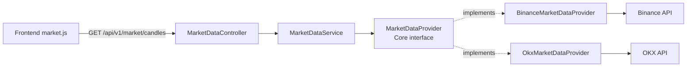

### Bản chất kiến trúc

- Đây là **Ports and Adapters / Hexagonal Architecture**.
- `core` chỉ biết `MarketDataProvider`, không biết URL, JSON hay protocol của sàn.
- Binance và OKX cùng implement một interface nên có **polymorphism**.
- Đổi provider không cần sửa Frontend, Controller hay `MarketDataService`.
- Cấu hình hiện tại chọn một provider lúc API khởi động bằng `CRYPTO_MARKET_PROVIDER=binance|okx`.
- Đây là **provider replacement**, chưa phải chạy đồng thời nhiều sàn hoặc automatic failover.

### Câu trả lời vấn đáp

> Frontend chỉ nói chuyện với API của hệ thống qua REST/WebSocket. `MarketDataService` phụ thuộc vào port `MarketDataProvider`; Binance và OKX là hai adapter ở tầng infrastructure. Vì vậy dữ liệu và chi tiết API của sàn bị chặn ở biên hệ thống, Frontend không bị phụ thuộc vào Binance JSON.

---

## Yêu cầu 2: Chuẩn hóa dữ liệu từ sàn

### Class và file

| Thành phần | Bản chất, thông số và trách nhiệm | File |
|---|---|---|
| `Candle` | Domain contract chuẩn gồm `symbol`, `timeframe`, `openTime`, `open`, `high`, `low`, `close`, `volume`. | [Candle.java](../crypto-strategy-lab/core/src/main/java/com/cryptolab/marketdata/domain/Candle.java) |
| `CandleUpdate` | Bọc `Candle` và cờ `closed`; phân biệt nến đang mở và nến đã đóng. | [CandleUpdate.java](../crypto-strategy-lab/core/src/main/java/com/cryptolab/marketdata/domain/CandleUpdate.java) |
| `Timeframe` | Enum timeframe chuẩn: 1m, 5m, 15m, 30m, 1h, 2h, 4h, 1d. | [Timeframe.java](../crypto-strategy-lab/core/src/main/java/com/cryptolab/marketdata/domain/Timeframe.java) |
| `TradingPair` | Chuẩn hóa symbol, ví dụ `BTCUSDT`. | [TradingPair.java](../crypto-strategy-lab/core/src/main/java/com/cryptolab/marketdata/domain/TradingPair.java) |
| `BinancePayloadMapper` | Map Binance JSON thành `Candle`/`CandleUpdate`. | [BinancePayloadMapper.java](../crypto-strategy-lab/infrastructure/src/main/java/com/cryptolab/infrastructure/marketdata/adapter/binance/BinancePayloadMapper.java) |
| `OkxPayloadMapper` | Map OKX JSON thành cùng contract chuẩn. | [OkxPayloadMapper.java](../crypto-strategy-lab/infrastructure/src/main/java/com/cryptolab/infrastructure/marketdata/adapter/okx/OkxPayloadMapper.java) |

### Cách phối hợp

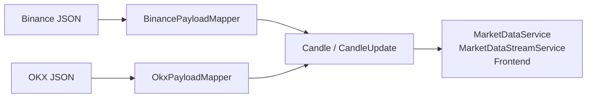

### Bản chất và invariant
- Provider phía trên sẽ gọi API lấy JSON sau đó gọi xuống Mapper để parse về dạng chuẩn Candle
- `Candle` là **normalized domain model**, không phải DTO của Binance/OKX.
- `Candle` kiểm tra:
  - symbol không rỗng;
  - OHLC không null;
  - `high >= open, low, close`;
  - `low <= open, high, close`;
  - volume không âm.
- Adapter chịu trách nhiệm chuyển đổi khác biệt về field, symbol và timeframe.
- Consumer phía sau chỉ làm việc với một vocabulary: `Candle`, `CandleUpdate`, `Timeframe`.

### Câu trả lời vấn đáp

> Adapter là lớp phiên dịch. Binance và OKX có format khác nhau nhưng đều được map về `Candle` chuẩn. Nếu thêm Bybit, chỉ cần thêm `BybitMarketDataProvider` và mapper implement contract; các module phía sau không cần biết format Bybit.

---

## Yêu cầu 3: Vòng đời cây nến realtime

### Class và file

| Thành phần | Bản chất, thông số và trách nhiệm | File |
|---|---|---|
| `CandleUpdate` | `closed=false` là nến đang chạy; `closed=true` là nến đã chốt. | [CandleUpdate.java](../crypto-strategy-lab/core/src/main/java/com/cryptolab/marketdata/domain/CandleUpdate.java) |
| `MarketDataStreamService` | Điều phối stream, persistence, publish, reference count và reconnect. | [MarketDataStreamService.java](../crypto-strategy-lab/core/src/main/java/com/cryptolab/marketdata/application/MarketDataStreamService.java) |
| `CandleStore` | Port lưu và đọc nến. | [CandleStore.java](../crypto-strategy-lab/core/src/main/java/com/cryptolab/marketdata/port/CandleStore.java) |
| `JdbcCandleStore` | Lưu candle đã đóng vào PostgreSQL, chống duplicate. | [JdbcCandleStore.java](../crypto-strategy-lab/infrastructure/src/main/java/com/cryptolab/infrastructure/marketdata/adapter/persistence/JdbcCandleStore.java) |
| `CandleUpdatePublisher` | Port phát update ra bên ngoài. | [CandleUpdatePublisher.java](../crypto-strategy-lab/core/src/main/java/com/cryptolab/marketdata/port/CandleUpdatePublisher.java) |
| `StompCandleUpdatePublisher` | Publish đến `/topic/market/{symbol}/{timeframe}`. | [StompCandleUpdatePublisher.java](../crypto-strategy-lab/api-app/src/main/java/com/cryptolab/api/marketdata/StompCandleUpdatePublisher.java) |
| `market.js` | Upsert candle trên browser theo `openTime`. | [market.js](../crypto-strategy-lab/api-app/src/main/resources/static/market.js) |

### Cách phối hợp

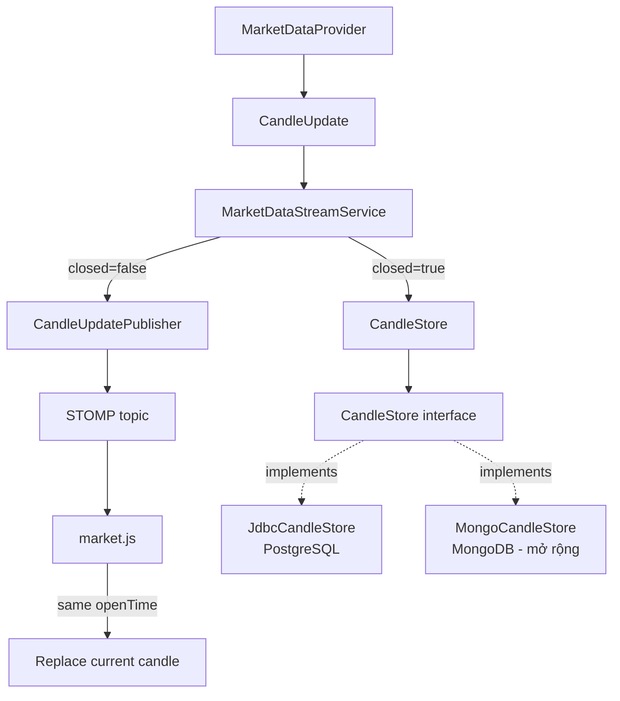

Trong sơ đồ này, `JdbcCandleStore` là implementation đang có trong code; `MongoCandleStore` là implementation minh họa nếu đổi sang MongoDB, hiện chưa phải class đã triển khai. Cả hai cùng implement `CandleStore`, nên `MarketDataStreamService` chỉ gọi `CandleStore` và không cần biết database cụ thể.

### Quy tắc xử lý

```text
Nến đang mở (closed=false):
	broadcast ngay
	không ghi từng tick vào database

Nến đã đóng (closed=true):
	saveIfAbsent(candle)
	broadcast sau khi lưu thành công
```

Frontend dùng `openTime` làm khóa logic:

```text
đã có openTime -> cập nhật cây nến hiện tại
chưa có openTime -> thêm cây nến mới
```

### Câu trả lời vấn đáp

> Nến cuối không tĩnh. Trong thời gian chưa đóng, backend gửi nhiều `CandleUpdate` với `closed=false`, Frontend ghi đè cùng cây nến dựa trên `openTime`. Khi nến đóng, backend lưu một lần bằng `saveIfAbsent`, nên lịch sử ổn định và không bị phình bởi các tick tạm thời.

### Client nhận tín hiệu chốt nến như thế nào?

- Có: client nhận trường `closed` trong JSON `CANDLE_UPDATE` gửi qua STOMP.
- Khi cây nến cuối đóng, event cuối của chính cây nến đó có `closed=true`.
- `openTime` không đổi khi chốt; client vẫn cập nhật đúng cây nến hiện tại theo `openTime`.
- Khi xuất hiện nến tiếp theo, event đó có `openTime` mới; client append thành cây nến mới và tiếp tục coi nó là nến đang chạy.
- Backend là nơi quyết định trạng thái đóng từ dữ liệu Binance (`kline.x`), còn client chỉ hiển thị/cập nhật theo cờ `closed`.

Luồng chính xác:

```text
Binance kline.x=false
	-> BinancePayloadMapper
	-> CandleUpdate.closed=false
	-> STOMP client: cập nhật nến hiện tại

Binance kline.x=true
	-> BinancePayloadMapper
	-> CandleUpdate.closed=true
	-> StompCandleUpdatePublisher gửi closed=true
	-> client cập nhật lần cuối cùng cho cùng openTime
	-> backend lưu candle đã đóng vào database
```

Code tham chiếu: [MarketCandleEvent.java](../crypto-strategy-lab/api-app/src/main/java/com/cryptolab/api/marketdata/MarketCandleEvent.java), [BinancePayloadMapper.java](../crypto-strategy-lab/infrastructure/src/main/java/com/cryptolab/infrastructure/marketdata/adapter/binance/BinancePayloadMapper.java), [market.js](../crypto-strategy-lab/api-app/src/main/resources/static/market.js).

---

## Yêu cầu 4: Reconnect và gap recovery

### Class và file

| Thành phần | Bản chất, thông số và trách nhiệm | File |
|---|---|---|
| `MarketDataStreamService` | Có `initialReconnectDelay`, `maximumReconnectDelay`, generation chống listener cũ và `recoverGap()`. | [MarketDataStreamService.java](../crypto-strategy-lab/core/src/main/java/com/cryptolab/marketdata/application/MarketDataStreamService.java) |
| `MarketDataScheduler` | Port lập lịch reconnect. | [MarketDataScheduler.java](../crypto-strategy-lab/core/src/main/java/com/cryptolab/marketdata/port/MarketDataScheduler.java) |
| `ExecutorMarketDataScheduler` | Implementation dùng executor. | [ExecutorMarketDataScheduler.java](../crypto-strategy-lab/infrastructure/src/main/java/com/cryptolab/infrastructure/marketdata/adapter/ExecutorMarketDataScheduler.java) |
| `CandleStore.findLastOpenTime` | Tìm candle cuối đã lưu. | [CandleStore.java](../crypto-strategy-lab/core/src/main/java/com/cryptolab/marketdata/port/CandleStore.java) |
| `MarketDataProvider.loadHistorical` | Tải lại khoảng dữ liệu bị thiếu. | [MarketDataProvider.java](../crypto-strategy-lab/core/src/main/java/com/cryptolab/marketdata/port/MarketDataProvider.java) |

### Cách phối hợp

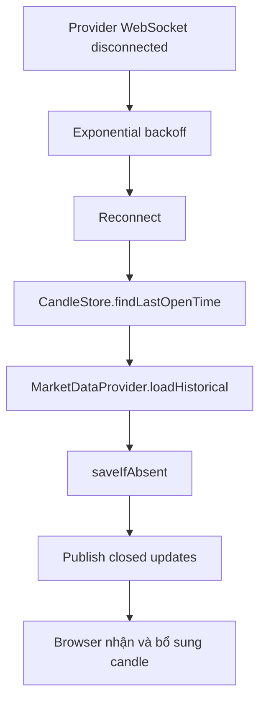

### Quan hệ giữa `MarketDataScheduler` và `ExecutorMarketDataScheduler`

`MarketDataStreamService` không tự tạo `ScheduledExecutorService`. Khi provider disconnect, service gọi port:

```java
state.reconnectTask = scheduler.schedule(delay, () -> {
	// đến thời điểm này mới gọi lại connect(state)
});
```

Hai thành phần phối hợp như sau:

| Thành phần | Bản chất, thông số và trách nhiệm | File |
|---|---|---|
| `MarketDataScheduler` | Port/functional interface; nhận `Duration delay` và `Runnable task`, trả về `ScheduledTask` có thể `cancel()`. Core chỉ biết hợp đồng này. | [MarketDataScheduler.java](../crypto-strategy-lab/core/src/main/java/com/cryptolab/marketdata/port/MarketDataScheduler.java) |
| `ExecutorMarketDataScheduler` | Adapter/implementation; dùng `ScheduledExecutorService.schedule(task, delay, TimeUnit.MILLISECONDS)`, sau đó bọc `ScheduledFuture` thành `ScheduledTask`. | [ExecutorMarketDataScheduler.java](../crypto-strategy-lab/infrastructure/src/main/java/com/cryptolab/infrastructure/marketdata/adapter/ExecutorMarketDataScheduler.java) |

Luồng gọi thực tế:

```text
MarketDataStreamService.disconnected()
	-> MarketDataScheduler.schedule(delay, reconnectTask)
	-> ExecutorMarketDataScheduler.schedule(...)
	-> ScheduledExecutorService.schedule(...)
	-> hết delay
	-> chạy reconnectTask
	-> MarketDataStreamService.connect(state)
```

`MarketDataScheduler` không chứa thuật toán reconnect. Nó chỉ định nghĩa cách hẹn giờ. Thuật toán reconnect và exponential backoff nằm ở `MarketDataStreamService`; cách chạy task bằng Java executor nằm ở `ExecutorMarketDataScheduler`. Nhờ vậy có thể thay executor bằng scheduler khác trong test hoặc infrastructure mà không sửa core service.

### Bản chất và thông số

- Không reconnect liên tục; delay tăng dần, bị giới hạn bởi maximum delay.
- `recoverGap()` lấy mốc candle cuối trong DB rồi tải historical từ provider.
- `saveIfAbsent` làm cho việc recovery idempotent.
- Listener cũ bị loại bằng `generation`, tránh stream cũ gửi dữ liệu sau khi đã reconnect.
- Nếu provider lỗi nhưng DB có cache, `MarketDataService` trả dữ liệu cache ở trạng thái degraded.

### Câu trả lời vấn đáp

> WebSocket là kênh realtime nhưng không phải nguồn duy nhất. Sau disconnect, hệ thống reconnect bằng exponential backoff; khi kết nối lại, nó dùng historical API để lấy phần bị thiếu. Candle được lưu idempotent nên recovery không tạo duplicate.

---

## Yêu cầu 5: Chịu tải và fan-out

### Class và file

| Thành phần | Bản chất, thông số và trách nhiệm | File |
|---|---|---|
| `MarketSubscriptionTracker` | Theo dõi STOMP `SUBSCRIBE`, `UNSUBSCRIBE`, `DISCONNECT`. | [MarketSubscriptionTracker.java](../crypto-strategy-lab/api-app/src/main/java/com/cryptolab/api/marketdata/MarketSubscriptionTracker.java) |
| `MarketDataStreamService` | Gom stream theo `(TradingPair, Timeframe)` và reference count. | [MarketDataStreamService.java](../crypto-strategy-lab/core/src/main/java/com/cryptolab/marketdata/application/MarketDataStreamService.java) |
| `MarketWebSocketConfiguration` | Bật STOMP simple broker tại `/topic`, endpoint `/ws`. | [MarketWebSocketConfiguration.java](../crypto-strategy-lab/api-app/src/main/java/com/cryptolab/api/marketdata/MarketWebSocketConfiguration.java) |
| `RealtimeFanoutCapacityTest` | Test 1.000 user x 4 chart = 4.000 registrations nhưng chỉ 4 provider streams. | [RealtimeFanoutCapacityTest.java](../crypto-strategy-lab/core/src/test/java/com/cryptolab/marketdata/application/RealtimeFanoutCapacityTest.java) |
| `load-test-realtime.js` | k6 runtime test cho 1.000 WebSocket users và 4 topic/user. | [load-test-realtime.js](../crypto-strategy-lab/scripts/load-test-realtime.js) |

### Cách phối hợp

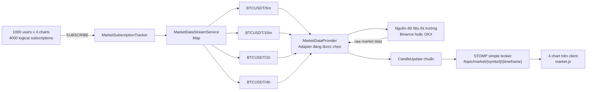

### Dữ liệu đi từ đâu và người dùng thấy ở đâu?

1. **Nguồn dữ liệu:** Binance hoặc OKX gửi dữ liệu historical/realtime đến Adapter tương ứng. Đây là nguồn dữ liệu bên ngoài, không phải Frontend.
2. **Backend nhận và gom stream:** `MarketSubscriptionTracker` nhận các logical subscriptions của client; `MarketDataStreamService` gom chúng theo `pair + timeframe` để mở số provider stream tối thiểu.
3. **Dữ liệu chuẩn đi vào hai nơi:** Adapter chuyển raw payload thành `Candle`/`CandleUpdate`. Stream service gửi dữ liệu đã đóng vào `CandleStore` để lưu PostgreSQL, đồng thời gửi mọi update qua `CandleUpdatePublisher`.
4. **Nơi người dùng nhìn thấy:** `StompCandleUpdatePublisher` đổ `CandleUpdate` vào STOMP topic. `market.js` subscribe topic tương ứng và đổ dữ liệu vào `chartStates[index].candles`, sau đó `drawMarketChart()` vẽ lên canvas của từng chart.

```text
Nguồn dữ liệu Binance/OKX
    -> Provider Adapter
    -> Candle/CandleUpdate chuẩn
    -> MarketDataStreamService
        -> CandleStore -> PostgreSQL       (lưu dữ liệu đã đóng)
        -> CandleUpdatePublisher -> STOMP  (phát realtime)
                                      -> market.js
                                      -> chartStates[].candles
                                      -> canvas chart              (người dùng nhìn thấy)
```

### Bản chất và số đo

- Mỗi user có một WebSocket vật lý và tối đa bốn STOMP logical subscriptions.
- Backend stream được chia sẻ theo `symbol + timeframe`.
- 4.000 logical subscriptions không đồng nghĩa 4.000 kết nối đến Binance.
- Test in-memory kiểm tra cấu trúc fan-out: 4.000 registrations, 4 provider subscriptions.
- k6 kiểm tra runtime: WebSocket upgrade, STOMP connect, nhận đủ bốn topic và latency.
- Kết quả đã ghi nhận: 1.000 sessions, 59.583 candle messages, connection p95 2,45 giây, first-update p95 4,40 giây.

### Câu trả lời vấn đáp

> Tracker dùng reference counting. Key của stream là cặp coin và timeframe. Nhiều user cùng xem BTCUSDT/5m sẽ dùng chung một provider stream; khi reference count về 0 thì stream mới đóng. Đây là kỹ thuật fan-out để bảo vệ rate limit của sàn và giảm tài nguyên backend.

---

## Sơ đồ tổng hợp Module 1

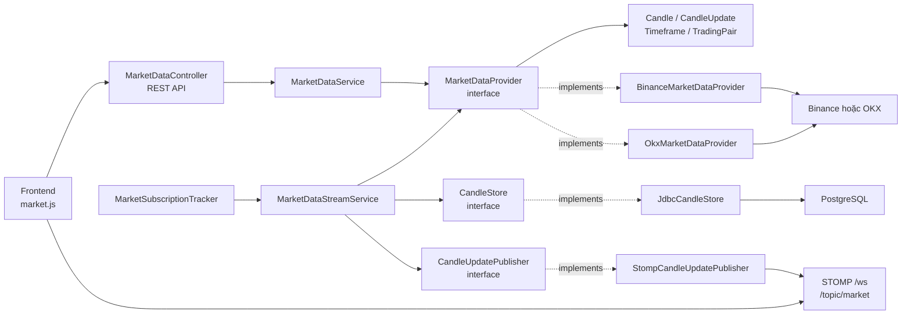

## Các ý phải nhớ khi bảo vệ

1. Frontend chỉ gọi backend: REST `/api/v1/market/candles`, STOMP `/ws`.
2. `MarketDataProvider` là port; Binance/OKX là adapter implementation.
3. `Candle` và `CandleUpdate` là normalized domain contract.
4. `closed=false` broadcast realtime; `closed=true` persist idempotent rồi broadcast.
5. Disconnect được xử lý bằng reconnect, exponential backoff và gap recovery.
6. Reference counting biến 4.000 chart subscriptions thành 4 provider streams trong kịch bản cùng symbol/timeframe.
7. Không nói quá: provider hiện được chọn lúc startup; chưa có simultaneous multi-exchange hoặc automatic failover.
8. Bằng chứng phải phân biệt: `RealtimeFanoutCapacityTest` là test logic, k6 là runtime load test.

---

# MODULE 2: MULTI-TIMEFRAME CHART

### Phạm vi yêu cầu

Module 2 phải hiển thị tối đa 4 biểu đồ độc lập. Mỗi biểu đồ có timeframe riêng; đổi timeframe hoặc cập nhật một biểu đồ không được reload toàn trang hay ảnh hưởng các biểu đồ còn lại. Biểu đồ cần hiển thị candle, volume, MA và các tín hiệu/marker phù hợp.

## Yêu cầu 1: Bốn biểu đồ có state và timeframe độc lập

### Class và file

| Thành phần | Bản chất, thông số và trách nhiệm | File |
|---|---|---|
| `index.html` | Khai báo 4 `market-card`, 4 canvas và 4 select timeframe với các mã 1m, 5m, 15m, 30m, 1h, 2h, 4h, 1d. | [index.html](../crypto-strategy-lab/api-app/src/main/resources/static/index.html) |
| `chartStates` | Mảng state phía browser; mỗi state giữ canvas, select, candle list, destination, request version, zoom/pan state. | [market.js](../crypto-strategy-lab/api-app/src/main/resources/static/market.js) |
| `loadChart` | Tải lịch sử cho đúng chart được chọn bằng REST. | [market.js](../crypto-strategy-lab/api-app/src/main/resources/static/market.js) |
| `reloadChart` | Hủy subscription cũ, tải lại chart đó rồi subscribe lại; không dùng `location.reload`. | [market.js](../crypto-strategy-lab/api-app/src/main/resources/static/market.js) |
| `Timeframe` | Enum domain dùng chung cho validation, provider, persistence và API. | [Timeframe.java](../crypto-strategy-lab/core/src/main/java/com/cryptolab/marketdata/domain/Timeframe.java) |

### Cách phối hợp

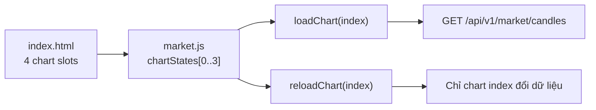

### Bản chất và thông số

- Mỗi chart có `timeframeSelect` và `candles` riêng.
- `requestVersion` ngăn response cũ ghi đè request mới.
- Đổi timeframe gọi `reloadChart(index)` cho đúng chart.
- Không dùng `location.reload`, nên không reload toàn bộ trang.
- Backend contract chỉ nhận timeframe code chuẩn từ `Timeframe`.

### Câu trả lời vấn đáp

> Frontend không dùng một timeframe global cho cả dashboard. Nó tạo bốn `chartStates`, mỗi state sở hữu timeframe, candle list, canvas và subscription riêng. Khi đổi timeframe, `reloadChart(index)` chỉ hủy và tạo lại subscription của chart đó; ba chart còn lại không bị tải lại.

---

## Yêu cầu 2: Hiển thị dữ liệu lịch sử và realtime trên chart

### Class và file

| Thành phần | Bản chất, thông số và trách nhiệm | File |
|---|---|---|
| `loadChart` | Gọi REST lấy lịch sử, lưu vào `state.candles`, sau đó render. | [market.js](../crypto-strategy-lab/api-app/src/main/resources/static/market.js) |
| `loadEarlier` | Tải thêm nến cũ khi người dùng kéo/đọc lịch sử; giới hạn mặc định 20.000 nến. | [market.js](../crypto-strategy-lab/api-app/src/main/resources/static/market.js) |
| `acceptRealtimeCandle` | Nhận `CANDLE_UPDATE`, thay candle cùng `openTime` hoặc append candle mới. | [market.js](../crypto-strategy-lab/api-app/src/main/resources/static/market.js) |
| `drawMarketChart` | Vẽ OHLC, volume, MA20, Bollinger, RSI, support/resistance và marker. | [market.js](../crypto-strategy-lab/api-app/src/main/resources/static/market.js) |
| `MarketCandleEvent` | DTO response WebSocket chuẩn của backend, không phải Binance DTO. | [MarketCandleEvent.java](../crypto-strategy-lab/api-app/src/main/java/com/cryptolab/api/marketdata/MarketCandleEvent.java) |

### Cách phối hợp

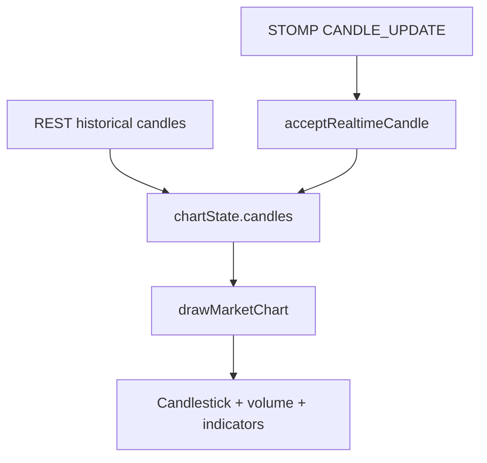

### Bản chất và thông số

- Dữ liệu lịch sử dùng REST vì cần tải một tập candle ban đầu.
- Dữ liệu realtime dùng STOMP vì server chủ động đẩy update.
- Cùng `openTime` thì replace; `openTime` mới thì append.
- Chart hiện đang dùng Canvas tự vẽ, có MA20 mặc định và các indicator theo strategy type.
- Đây là giao diện TradingView-like về hành vi cơ bản, chưa phải sử dụng thư viện TradingView chính thức.

### Câu trả lời vấn đáp

> REST dùng để tải snapshot lịch sử; STOMP dùng để nhận thay đổi realtime. Frontend giữ candle list trong từng chart state. Khi update có cùng `openTime`, nó thay cây nến hiện tại; khi có `openTime` mới, nó thêm cây nến mới rồi render lại canvas.

---

## Yêu cầu 3: Chart không phụ thuộc dữ liệu sàn

### Class và file

| Thành phần | Bản chất, thông số và trách nhiệm | File |
|---|---|---|
| `MarketDataController` | Trả dữ liệu lịch sử qua API contract của ứng dụng. | [MarketDataController.java](../crypto-strategy-lab/api-app/src/main/java/com/cryptolab/api/marketdata/MarketDataController.java) |
| `MarketCandlesResponse` | Response chuẩn cho Frontend, gồm symbol, timeframe, candles và trạng thái degraded. | [MarketCandlesResponse.java](../crypto-strategy-lab/api-app/src/main/java/com/cryptolab/api/marketdata/MarketCandlesResponse.java) |
| `MarketCandleEvent` | Event chuẩn cho WebSocket. | [MarketCandleEvent.java](../crypto-strategy-lab/api-app/src/main/java/com/cryptolab/api/marketdata/MarketCandleEvent.java) |
| `market.js` | Chỉ đọc field contract chuẩn như `openTime`, `open`, `high`, `low`, `close`, `volume`. | [market.js](../crypto-strategy-lab/api-app/src/main/resources/static/market.js) |

### Cách phối hợp

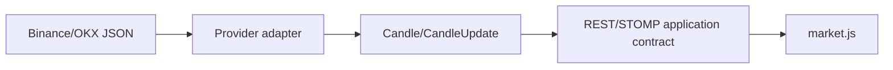

### Câu trả lời vấn đáp

> Chart chỉ biết contract của ứng dụng, không biết field hay mã timeframe riêng của Binance/OKX. Việc đổi format được xử lý ở adapter trước khi dữ liệu đến API và Frontend.

---

## MODULE 2 - Sơ đồ tổng hợp

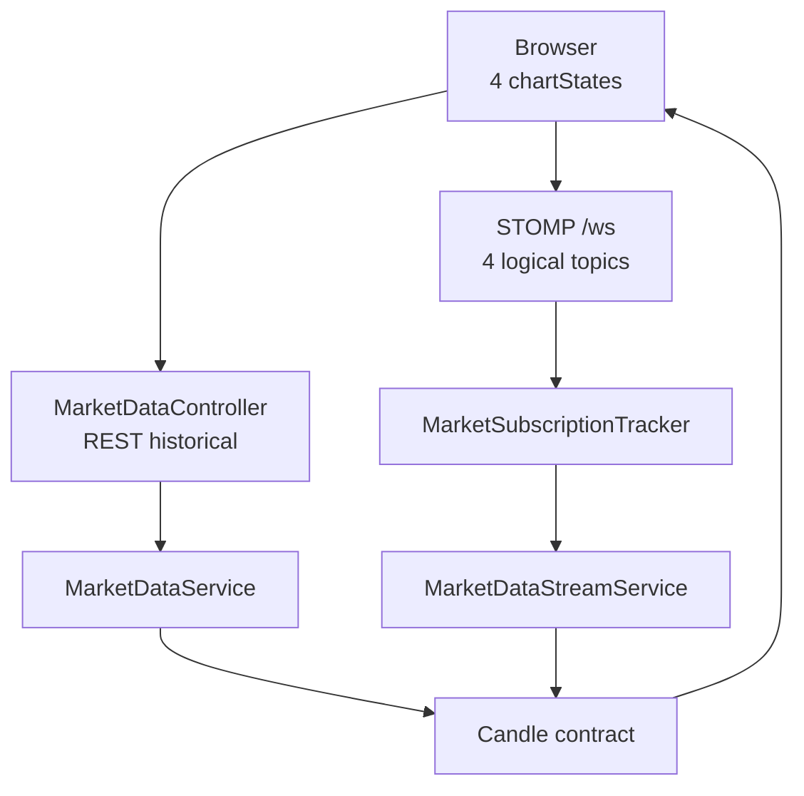

---

# MODULE 3: STRATEGY ENGINE

### Phạm vi yêu cầu

Strategy nhận dữ liệu thị trường và tạo một tín hiệu chuẩn `BUY`, `SELL` hoặc `HOLD`. Strategy chỉ chứa logic phân tích; không gọi Binance, không truy cập database, không vẽ chart và không gửi WebSocket.

## Yêu cầu 1: Contract input/output của Strategy

### Class và file

| Thành phần | Bản chất, thông số và trách nhiệm | File |
|---|---|---|
| `Strategy` | Interface; khai báo `descriptor()` và `analyze(StrategyContext)`. | [Strategy.java](../crypto-strategy-lab/core/src/main/java/com/cryptolab/strategy/domain/Strategy.java) |
| `StrategyContext` | Input bất biến gồm pair, timeframe, candle list, evaluation time và sentiment observations. | [StrategyContext.java](../crypto-strategy-lab/core/src/main/java/com/cryptolab/strategy/domain/StrategyContext.java) |
| `Signal` | Output gồm `SignalType`, strength trong `[-1, 1]`, thời điểm và reason. | [Signal.java](../crypto-strategy-lab/core/src/main/java/com/cryptolab/strategy/domain/Signal.java) |
| `SignalType` | Enum `BUY`, `SELL`, `HOLD`. | [SignalType.java](../crypto-strategy-lab/core/src/main/java/com/cryptolab/strategy/domain/SignalType.java) |
| `StrategyDescriptor` | Mô tả type, version và parameters của strategy instance. | [StrategyDescriptor.java](../crypto-strategy-lab/core/src/main/java/com/cryptolab/strategy/domain/StrategyDescriptor.java) |

### Cách phối hợp

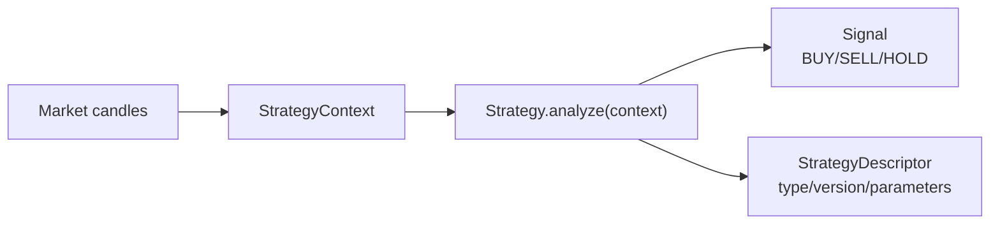

### Bản chất và thông số

- `StrategyContext` copy danh sách candle để tránh strategy sửa dữ liệu bên ngoài.
- Candle phải cùng pair, cùng timeframe và tăng nghiêm ngặt theo `openTime`.
- Sentiment observation không được nằm sau `evaluatedAt`, tránh nhìn trước tương lai.
- `Signal.strength` bị giới hạn từ `-1` đến `1`.
- Strategy không chứa infrastructure dependency.

### Câu trả lời vấn đáp

> Strategy là policy nghiệp vụ. Nó nhận `StrategyContext` chuẩn và trả `Signal`. Context bảo đảm candle đúng pair, timeframe và thứ tự thời gian; signal chuẩn hóa thành BUY, SELL hoặc HOLD. Strategy không biết dữ liệu đến từ Binance hay database.

---

## Yêu cầu 2: Bốn strategy tối thiểu

### Class và file

| Thành phần | Bản chất, thông số và trách nhiệm | File |
|---|---|---|
| `MovingAverageStrategy` | MA crossover; `fastPeriod`, `slowPeriod`; BUY khi fast cắt lên, SELL khi cắt xuống. | [MovingAverageStrategy.java](../crypto-strategy-lab/core/src/main/java/com/cryptolab/strategy/domain/baseline/MovingAverageStrategy.java) |
| `RsiStrategy` | RSI; `period`, `oversold`, `overbought`; BUY dưới oversold, SELL trên overbought. | [RsiStrategy.java](../crypto-strategy-lab/core/src/main/java/com/cryptolab/strategy/domain/baseline/RsiStrategy.java) |
| `BollingerBandsStrategy` | Bollinger; `window`, `deviationMultiplier`; BUY dưới lower band, SELL trên upper band. | [BollingerBandsStrategy.java](../crypto-strategy-lab/core/src/main/java/com/cryptolab/strategy/domain/baseline/BollingerBandsStrategy.java) |
| `SupportResistanceStrategy` | Rolling support/resistance; `window`; BUY tại support, SELL tại resistance. | [SupportResistanceStrategy.java](../crypto-strategy-lab/core/src/main/java/com/cryptolab/strategy/domain/baseline/SupportResistanceStrategy.java) |
| `BaselineStrategySupport` | Helper tạo signal và tính trung bình close dùng chung cho baseline strategies. | [BaselineStrategySupport.java](../crypto-strategy-lab/core/src/main/java/com/cryptolab/strategy/domain/baseline/BaselineStrategySupport.java) |

### Sơ đồ kế thừa/implements

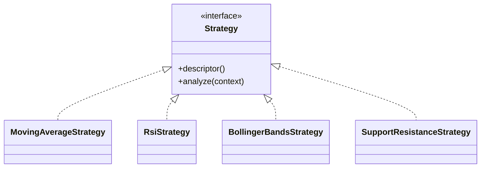

### Câu trả lời vấn đáp

> Bốn strategy đều implement cùng interface `Strategy` nhưng mỗi class chỉ có một trách nhiệm phân tích. Ví dụ MA chỉ xử lý crossover, RSI chỉ xử lý ngưỡng RSI. Không strategy nào gọi provider, database hay UI.

---

## MODULE 3 - Sơ đồ tổng hợp

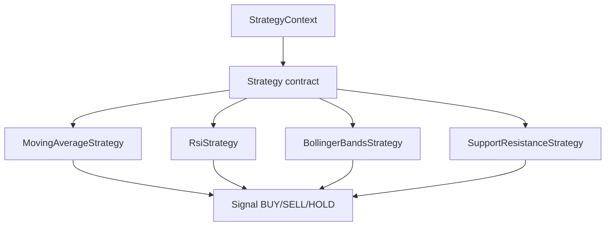

---

# MODULE 4: STRATEGY PLUGIN ARCHITECTURE

### Phạm vi yêu cầu

Thêm strategy mới như MACD phải ảnh hưởng tối thiểu đến hệ thống, không tạo switch-case trung tâm và không cần sửa Backtester, Evaluator, Leaderboard, UI hoặc schema strategy-specific.

## Yêu cầu 1: Factory và Registry

### Class và file

| Thành phần | Bản chất, thông số và trách nhiệm | File |
|---|---|---|
| `StrategyFactory` | Port tạo strategy; khai báo type, version, parameter schema và `create`. | [StrategyFactory.java](../crypto-strategy-lab/core/src/main/java/com/cryptolab/strategy/port/StrategyFactory.java) |
| `StrategyRegistry` | Port đăng ký factory, tạo strategy từ definition và liệt kê plugin. | [StrategyRegistry.java](../crypto-strategy-lab/core/src/main/java/com/cryptolab/strategy/port/StrategyRegistry.java) |
| `SpringStrategyRegistry` | Infrastructure implementation; nhận danh sách Spring factories, kiểm tra trùng type/version và tạo instance. | [SpringStrategyRegistry.java](../crypto-strategy-lab/infrastructure/src/main/java/com/cryptolab/infrastructure/strategy/adapter/SpringStrategyRegistry.java) |
| `StrategyDefinition` | Cấu hình bất biến gồm type, version và parameters. | [StrategyDefinition.java](../crypto-strategy-lab/core/src/main/java/com/cryptolab/strategy/domain/StrategyDefinition.java) |
| `StrategyPluginDescriptor` | Metadata public gồm type, version và parameter schema. | [StrategyPluginDescriptor.java](../crypto-strategy-lab/core/src/main/java/com/cryptolab/strategy/domain/StrategyPluginDescriptor.java) |

### Cách phối hợp

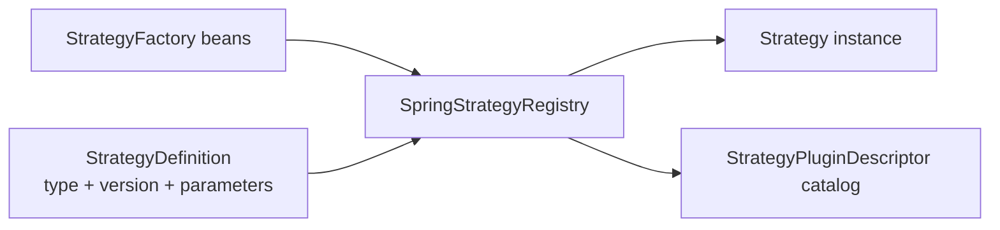

### Bản chất và thông số

- `type + version` là khóa định danh plugin.
- Factory sở hữu validation và parameter schema của strategy.
- Registry không cần biết logic MA, RSI hay MACD.
- Database lưu definition/configuration dạng JSON, không cần cột riêng cho từng strategy.
- Spring tự discover các factory bean trong runtime.

### Câu trả lời vấn đáp

> Registry không chứa `if strategy == MA`. Nó giữ các `StrategyFactory` theo khóa `type@version`. Khi nhận `StrategyDefinition`, registry tìm factory tương ứng và gọi `create`. Vì vậy plugin mới được thêm như một implementation mới, không làm thay đổi pipeline phía sau.

---

## Yêu cầu 2: Minh chứng thêm plugin MACD

### Class và file

| Thành phần | Bản chất, thông số và trách nhiệm | File |
|---|---|---|
| `MacdStrategy` | Plugin strategy mở rộng; tính MACD với `fastPeriod`, `slowPeriod`, `signalPeriod`; implement `Strategy`. | [MacdStrategy.java](../crypto-strategy-lab/core/src/main/java/com/cryptolab/strategy/domain/extension/MacdStrategy.java) |
| `MacdStrategyFactory` | Factory của MACD; cung cấp type/version/schema và validate definition. | [MacdStrategyFactory.java](../crypto-strategy-lab/infrastructure/src/main/java/com/cryptolab/infrastructure/strategy/adapter/MacdStrategyFactory.java) |
| `StrategyExtensionArchitectureTest` | Kiểm tra plugin mới không kéo dependency vào API, worker, experiment hoặc backtest concrete. | [StrategyExtensionArchitectureTest.java](../crypto-strategy-lab/integration-tests/src/test/java/com/cryptolab/architecture/StrategyExtensionArchitectureTest.java) |
| `ArchitectureRulesTest` | Bảo vệ pipeline không phụ thuộc trực tiếp concrete MACD. | [ArchitectureRulesTest.java](../crypto-strategy-lab/integration-tests/src/test/java/com/cryptolab/architecture/ArchitectureRulesTest.java) |

### Sơ đồ kế thừa/implements

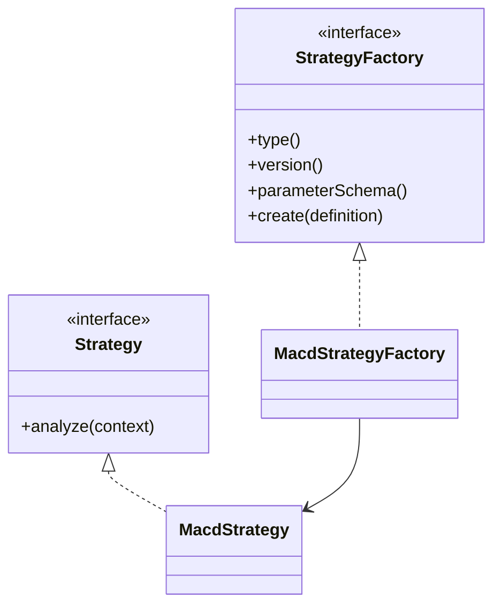

### Câu trả lời vấn đáp

> Để thêm MACD, nhóm thêm `MacdStrategy` và `MacdStrategyFactory`. Factory là Spring bean nên được đưa vào `SpringStrategyRegistry`. Backtester, Evaluator, Leaderboard và UI chỉ dùng contract chung. Đây là extensibility proof.

### Giới hạn phải nói rõ

Đối với plugin Java compile-time, vẫn cần build/deploy code mới để đưa class factory vào application. Cơ chế user authoring hiện tại tạo cấu hình `RULE` hạn chế từ các plugin đã đăng ký; nó không cho user tùy ý nạp một plugin Java mới.

---

## MODULE 4 - Sơ đồ tổng hợp

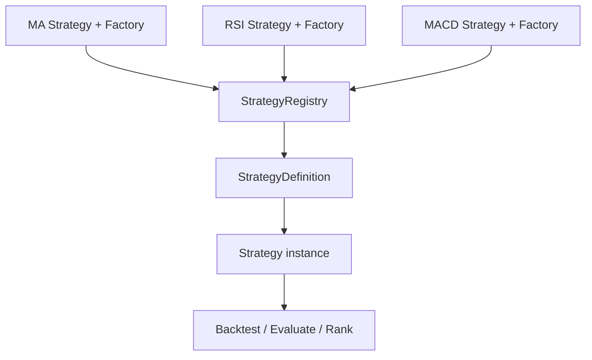

---

# MODULE 5: COMPOSITE STRATEGY

### Phạm vi yêu cầu

Module 5 cho phép kết hợp nhiều strategy con, ví dụ MA + RSI + Support/Resistance. Khi các strategy cho tín hiệu khác nhau, hệ thống dùng một `CombinationPolicy` để tạo quyết định tổng hợp.

## Yêu cầu 1: Tách signal strategy khỏi combination policy

### Class và file

| Thành phần | Bản chất, thông số và trách nhiệm | File |
|---|---|---|
| `Strategy` | Mỗi strategy độc lập chỉ phân tích context và trả `Signal`. | [Strategy.java](../crypto-strategy-lab/core/src/main/java/com/cryptolab/strategy/domain/Strategy.java) |
| `Signal` | Kết quả của một strategy: type, strength, timestamp, reason. | [Signal.java](../crypto-strategy-lab/core/src/main/java/com/cryptolab/strategy/domain/Signal.java) |
| `WeightedSignal` | Gắn signal với strategy descriptor và weight dùng cho combination. | [WeightedSignal.java](../crypto-strategy-lab/core/src/main/java/com/cryptolab/strategy/domain/WeightedSignal.java) |
| `CombinationPolicy` | Port; nhận danh sách weighted signals và trả `CombinedSignal`. | [CombinationPolicy.java](../crypto-strategy-lab/core/src/main/java/com/cryptolab/strategy/domain/CombinationPolicy.java) |
| `CombinedSignal` | Kết quả tổng hợp gồm type, score và timestamp. | [CombinedSignal.java](../crypto-strategy-lab/core/src/main/java/com/cryptolab/strategy/domain/CombinedSignal.java) |
| `CombinationPolicyDefinition` | Cấu hình policy: type, version, weights và threshold. | [CombinationPolicyDefinition.java](../crypto-strategy-lab/core/src/main/java/com/cryptolab/strategy/domain/CombinationPolicyDefinition.java) |

### Cách phối hợp

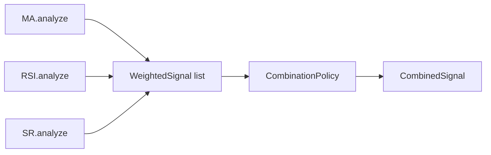

### Bản chất và thông số

- Strategy con không biết strategy con khác.
- Policy không tính MA/RSI/Bollinger; policy chỉ xử lý conflict giữa các signal.
- `WeightedSignal.weight` là trọng số của từng signal.
- `CombinedSignal.score` là điểm tổng hợp dùng để giải thích/ranking.
- `CombinationPolicyDefinition` cho phép lưu lại policy version, weight và threshold.

### Câu trả lời vấn đáp

> Strategy con đóng vai trò các bộ phân tích độc lập. Chúng chỉ trả signal. `CombinationPolicy` là thành phần riêng làm nhiệm vụ phân xử. Vì hai trách nhiệm thay đổi độc lập nên có thể đổi cách voting mà không sửa logic MA, RSI hoặc Backtester.

---

## Yêu cầu 2: Majority Vote

### Class và file

| Thành phần | Bản chất, thông số và trách nhiệm | File |
|---|---|---|
| `MajorityVotePolicy` | Implementation của `CombinationPolicy`; mã hóa BUY = +1, SELL = -1, HOLD = 0 rồi cộng điểm. | [MajorityVotePolicy.java](../crypto-strategy-lab/core/src/main/java/com/cryptolab/strategy/domain/policy/MajorityVotePolicy.java) |
| `CombinationPolicySupport` | Validate signals, đổi signal type thành direction và lấy timestamp mới nhất. | [CombinationPolicySupport.java](../crypto-strategy-lab/core/src/main/java/com/cryptolab/strategy/domain/policy/CombinationPolicySupport.java) |

### Cách phối hợp

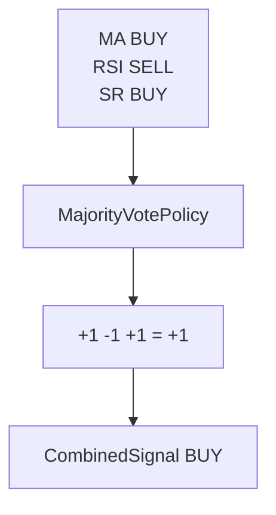

### Câu trả lời vấn đáp

> Majority Vote quy đổi hướng của từng signal rồi cộng lại. Nếu tổng dương thì BUY, âm thì SELL, bằng 0 thì HOLD. Ví dụ MA BUY, RSI SELL, SR BUY cho tổng +1 nên kết quả là BUY.

---

## Yêu cầu 3: Weighted Vote

### Class và file

| Thành phần | Bản chất, thông số và trách nhiệm | File |
|---|---|---|
| `WeightedVotePolicy` | Implementation của `CombinationPolicy`; tính tổng `direction(signal) * weight`. | [WeightedVotePolicy.java](../crypto-strategy-lab/core/src/main/java/com/cryptolab/strategy/domain/policy/WeightedVotePolicy.java) |
| `WeightedSignal` | Chứa signal và trọng số không âm. | [WeightedSignal.java](../crypto-strategy-lab/core/src/main/java/com/cryptolab/strategy/domain/WeightedSignal.java) |
| `CombinationPolicyDefinition` | Lưu weights và threshold để tái lập kết quả. | [CombinationPolicyDefinition.java](../crypto-strategy-lab/core/src/main/java/com/cryptolab/strategy/domain/CombinationPolicyDefinition.java) |

### Cách phối hợp

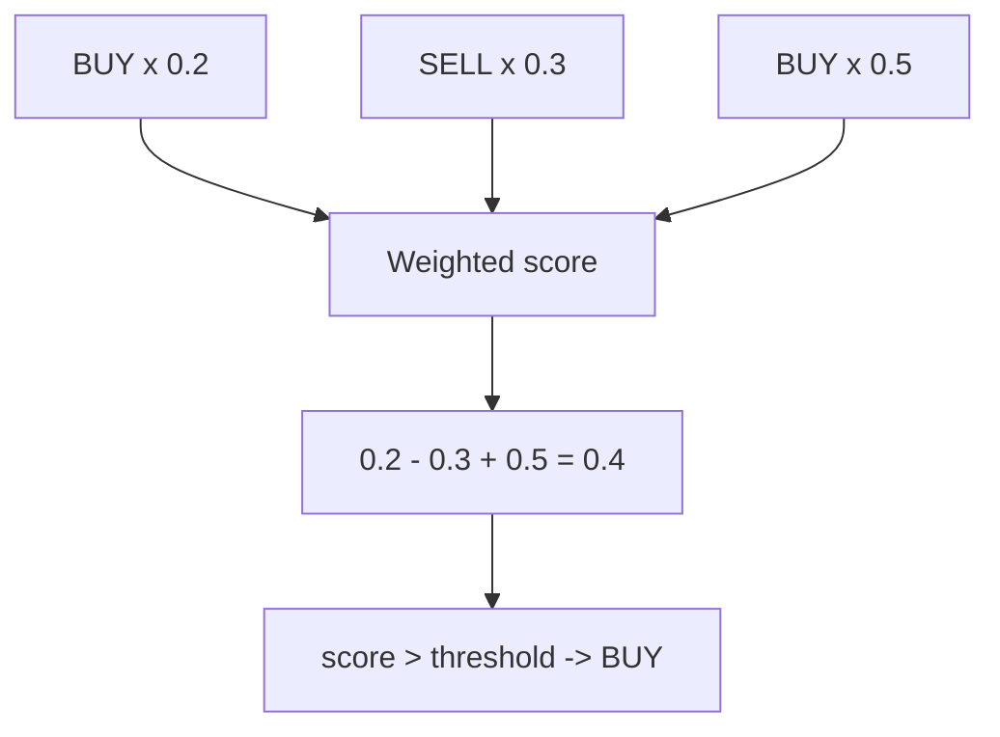

### Bản chất và thông số

- BUY có direction `+1`.
- SELL có direction `-1`.
- HOLD có direction `0`.
- Weight phải không âm.
- `WeightedVotePolicy` mặc định dùng threshold `0.10`; có thể truyền threshold khác.
- Nếu score lớn hơn threshold thì BUY; nhỏ hơn `-threshold` thì SELL; còn lại HOLD.

### Câu trả lời vấn đáp

> Weighted Vote cho phép strategy có độ tin cậy khác nhau. Score bằng tổng hướng tín hiệu nhân trọng số. Với MA = 0.2, RSI = 0.3, SR = 0.5 và tín hiệu BUY, SELL, BUY thì score là 0.4; nếu threshold là 0.1, kết quả là BUY.

---

## MODULE 5 - Sơ đồ tổng hợp

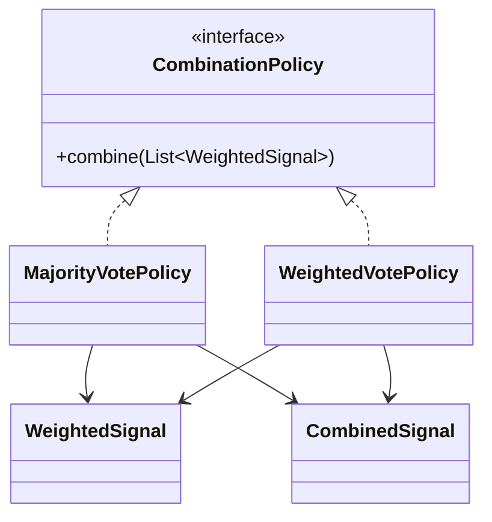

## Các ý phải nhớ khi bảo vệ Module 2-5

1. Module 2: bốn `chartStates`, mỗi chart có timeframe/candle/subscription riêng.
2. Module 2: REST tải history, STOMP nhận update, `openTime` là khóa upsert phía browser.
3. Module 3: `StrategyContext -> Strategy.analyze() -> Signal`.
4. Module 3: strategy chỉ chứa policy phân tích, không chứa infrastructure.
5. Module 4: `StrategyFactory` tạo plugin, `StrategyRegistry` quản lý plugin theo `type@version`.
6. Module 4: thêm MACD bằng strategy + factory, pipeline phía sau dùng interface chung.
7. Module 5: signal generation và conflict resolution là hai trách nhiệm khác nhau.
8. Module 5: Majority cộng hướng; Weighted cộng hướng nhân trọng số rồi so với threshold.

---

# MODULE 6: STRATEGY SEARCH ENGINE

### Phạm vi yêu cầu

Search Engine phải tự sinh candidate từ nhiều strategy và parameter. Không gian tìm kiếm có thể rất lớn nên không được bắt buộc vét cạn. Hệ thống cần ít nhất Random Search; code hiện tại có thêm Genetic Search.

## Yêu cầu 1: Sinh candidate qua contract thay thế được

### Class và file

| Thành phần | Bản chất, thông số và trách nhiệm | File |
|---|---|---|
| `StrategyGenerator` | Port; trả `Stream<CandidateStrategy>`, có `type`, `version`, hỗ trợ fitness cho generator nâng cao. | [StrategyGenerator.java](../crypto-strategy-lab/core/src/main/java/com/cryptolab/experiment/port/StrategyGenerator.java) |
| `RandomStrategyGenerator` | Sinh lazy, deterministic theo seed; thay đổi cả membership và parameters. | [RandomStrategyGenerator.java](../crypto-strategy-lab/core/src/main/java/com/cryptolab/experiment/application/RandomStrategyGenerator.java) |
| `GeneticStrategyGenerator` | Genetic Search; population, fitness, selection, crossover và mutation. | [GeneticStrategyGenerator.java](../crypto-strategy-lab/core/src/main/java/com/cryptolab/experiment/application/GeneticStrategyGenerator.java) |
| `CandidateStrategy` | Candidate bất biến gồm ID, strategy definitions, combination policy và candidate hash. | [CandidateStrategy.java](../crypto-strategy-lab/core/src/main/java/com/cryptolab/experiment/domain/CandidateStrategy.java) |
| `SearchContext` | Input bất biến gồm dataset, strategy types/version, parameter space, seed, stop conditions và batch size. | [SearchContext.java](../crypto-strategy-lab/core/src/main/java/com/cryptolab/experiment/domain/SearchContext.java) |

### Cách phối hợp

```mermaid
flowchart LR
	Context["SearchContext"] --> Generator["StrategyGenerator"]
	Generator --> Candidate["CandidateStrategy"]
	Generator -. replace .-> Random["RandomStrategyGenerator"]
	Generator -. replace .-> Genetic["GeneticStrategyGenerator"]
	Candidate --> Coordinator["SearchCoordinator"]
```

### Bản chất và thông số

- Generator chỉ sinh candidate; không backtest, evaluate hoặc rank.
- `Stream` cho phép sinh lazy, không materialize toàn bộ hàng trăm nghìn candidate.
- `SearchContext.randomSeed` giúp kết quả có thể tái lập.
- Candidate bắt buộc có ít nhất một strategy.
- Generator có thể thay bằng implementation khác mà `BacktestPort` không đổi.

### Câu trả lời vấn đáp

> Search Engine phụ thuộc vào interface `StrategyGenerator`, không phụ thuộc Random hoặc Genetic cụ thể. Generator chỉ tạo `CandidateStrategy`; các bước backtest và evaluate nhận candidate qua contract chung. Vì vậy đổi Random sang Genetic không làm sửa Backtester.

---

## Yêu cầu 2: Random Search và Genetic Search không vét cạn

### Class và file

| Thành phần | Bản chất, thông số và trách nhiệm | File |
|---|---|---|
| `SearchCoordinator` | Điều phối generation theo batch, chọn generator theo type và lưu tiến độ. | [SearchCoordinator.java](../crypto-strategy-lab/core/src/main/java/com/cryptolab/experiment/application/SearchCoordinator.java) |
| `SearchParameterSpace` | Mô tả các lựa chọn parameter theo strategy type. | [SearchParameterSpace.java](../crypto-strategy-lab/core/src/main/java/com/cryptolab/experiment/domain/SearchParameterSpace.java) |
| `StopConditions` | Giới hạn `maxCandidates`, `maxDuration`, `noImprovementIterations`. | [StopConditions.java](../crypto-strategy-lab/core/src/main/java/com/cryptolab/experiment/domain/StopConditions.java) |
| `StopConditionEvaluator` | Kiểm tra candidate count, thời gian, cải thiện và source exhausted. | [StopConditionEvaluator.java](../crypto-strategy-lab/core/src/main/java/com/cryptolab/experiment/domain/StopConditionEvaluator.java) |
| `GeneratorReplacementArchitectureTest` | Chứng minh generator có thể thay thế qua contract. | [GeneratorReplacementArchitectureTest.java](../crypto-strategy-lab/integration-tests/src/test/java/com/cryptolab/architecture/GeneratorReplacementArchitectureTest.java) |

### Cách phối hợp

```mermaid
flowchart TD
	Start["SearchStartCommand"] --> Coordinator["SearchCoordinator"]
	Coordinator --> Generator["Random hoặc Genetic"]
	Generator --> Batch["Candidate batch"]
	Batch --> Queue["Backtest jobs"]
	Coordinator --> Stop["StopConditionEvaluator"]
	Stop -->|chưa dừng| Generator
	Stop -->|dừng| Terminal["Run terminal/EVALUATING"]
```

### Câu trả lời vấn đáp

> Hệ thống không tạo trước toàn bộ không gian tổ hợp. Random tạo candidate lazy theo seed; Genetic tìm kiếm theo population, fitness, crossover và mutation. Coordinator giới hạn batch và stop condition nên có thể dừng trước khi vét cạn.

---

# MODULE 7: BACKTESTING ENGINE

### Phạm vi yêu cầu

Backtester giả lập strategy trên historical dataset, tạo signals/trades/equity curve và không được look-ahead. Tín hiệu tại candle N phải được thực thi ở candle tiếp theo.

## Yêu cầu 1: Tách contract Backtest khỏi implementation

### Class và file

| Thành phần | Bản chất, thông số và trách nhiệm | File |
|---|---|---|
| `BacktestPort` | Port duy nhất cho thao tác `run(BacktestCommand)`. | [BacktestPort.java](../crypto-strategy-lab/core/src/main/java/com/cryptolab/experiment/port/BacktestPort.java) |
| `BacktestCommand` | Input gồm experiment, candidate, dataset và execution config. | [BacktestCommand.java](../crypto-strategy-lab/core/src/main/java/com/cryptolab/experiment/domain/BacktestCommand.java) |
| `DeterministicBacktestEngine` | Implementation deterministic; chạy strategy, policy và portfolio. | [DeterministicBacktestEngine.java](../crypto-strategy-lab/core/src/main/java/com/cryptolab/experiment/application/DeterministicBacktestEngine.java) |
| `BacktestResult` | Output gồm trades, recorded signals, equity curve và ending capital. | [BacktestResult.java](../crypto-strategy-lab/core/src/main/java/com/cryptolab/experiment/domain/BacktestResult.java) |
| `ExecutionConfig` | Cấu hình vốn, fee, short, position size, SL/TP/trailing và fill policy. | [ExecutionConfig.java](../crypto-strategy-lab/core/src/main/java/com/cryptolab/experiment/domain/ExecutionConfig.java) |

### Cách phối hợp

```mermaid
flowchart LR
	Command["BacktestCommand"] --> Port["BacktestPort"]
	Port -. implements .-> Engine["DeterministicBacktestEngine"]
	Engine --> Registry["StrategyRegistry"]
	Engine --> Dataset["MarketDatasetProvider"]
	Engine --> Policy["CombinationPolicyResolver"]
	Engine --> Result["BacktestResult"]
```

### Bản chất và thông số

- Backtester không biết generator nào đã sinh candidate.
- Strategy được tạo từ registry và policy được resolve qua port.
- `VERSION = deterministic-next-open-v5` và `FILL_POLICY = NEXT_CANDLE_OPEN` được lưu để tái lập.
- Portfolio hiện hỗ trợ một vị thế tại một thời điểm, long/short, sizing và risk exits.

### Câu trả lời vấn đáp

> `BacktestPort` là boundary của engine. Implementation hiện tại là `DeterministicBacktestEngine`, nhưng pipeline chỉ gọi port. Engine nhận dataset và candidate, chạy strategy rồi trả `BacktestResult`; nó không phụ thuộc search algorithm hay UI.

---

## Yêu cầu 2: Không look-ahead bias

### Class và file

| Thành phần | Bản chất, thông số và trách nhiệm | File |
|---|---|---|
| `DeterministicBacktestEngine` | Tại index N, context chỉ chứa `candles.subList(0, index + 1)`. | [DeterministicBacktestEngine.java](../crypto-strategy-lab/core/src/main/java/com/cryptolab/experiment/application/DeterministicBacktestEngine.java) |
| `StrategyContext` | Chỉ cung cấp prefix candle đến thời điểm đang đánh giá. | [StrategyContext.java](../crypto-strategy-lab/core/src/main/java/com/cryptolab/strategy/domain/StrategyContext.java) |
| `RecordedSignal` | Lưu signal, strategy type/version để kiểm tra và visualize. | [RecordedSignal.java](../crypto-strategy-lab/core/src/main/java/com/cryptolab/experiment/domain/RecordedSignal.java) |
| `DeterministicBacktestEngineTest` | Kiểm tra next-open fill và không dùng giá tương lai. | [DeterministicBacktestEngineTest.java](../crypto-strategy-lab/core/src/test/java/com/cryptolab/experiment/DeterministicBacktestEngineTest.java) |

### Cách phối hợp

```mermaid
sequenceDiagram
	participant Engine as BacktestEngine
	participant Strategy as Strategy
	participant Portfolio as Portfolio
	Engine->>Strategy: analyze(context through candle N)
	Strategy-->>Engine: Signal at N
	Engine->>Portfolio: execute pending signal at candle N+1 open
	Engine->>Strategy: analyze next prefix
	Portfolio-->>Engine: Trade/equity result
```

### Câu trả lời vấn đáp

> Ở candle N, Strategy chỉ nhìn thấy dữ liệu từ đầu dataset đến N. Signal được lưu thành pending và chỉ execute ở open của candle N+1. Vì vậy signal không thể dùng high, low hoặc close của candle tương lai để quyết định giao dịch hiện tại.

---

# MODULE 8: EVALUATOR VÀ LEADERBOARD

### Phạm vi yêu cầu

Kết quả backtest phải được đánh giá bằng nhiều metric, không chỉ profit, rồi xếp hạng Top-K. Evaluator và Ranking phải độc lập với Backtest Engine.

## Yêu cầu 1: Tách Evaluation khỏi Backtest

### Class và file

| Thành phần | Bản chất, thông số và trách nhiệm | File |
|---|---|---|
| `ExperimentEvaluator` | Port tính evaluation từ `BacktestResult`. | [ExperimentEvaluator.java](../crypto-strategy-lab/core/src/main/java/com/cryptolab/experiment/port/ExperimentEvaluator.java) |
| `DefaultExperimentEvaluator` | Tính return, drawdown, win rate, trades và score. | [DefaultExperimentEvaluator.java](../crypto-strategy-lab/core/src/main/java/com/cryptolab/experiment/application/DefaultExperimentEvaluator.java) |
| `EvaluationMetrics` | Value object chứa `totalReturnPct`, `maxDrawdownPct`, `totalTrades`, `winRatePct`, `score`. | [EvaluationMetrics.java](../crypto-strategy-lab/core/src/main/java/com/cryptolab/experiment/domain/EvaluationMetrics.java) |
| `Evaluation` | Kết quả evaluation gắn experiment ID và evaluator version. | [Evaluation.java](../crypto-strategy-lab/core/src/main/java/com/cryptolab/experiment/domain/Evaluation.java) |
| `DefaultRankingService` | Sắp xếp Evaluation thành danh sách Ranking deterministic. | [DefaultRankingService.java](../crypto-strategy-lab/core/src/main/java/com/cryptolab/experiment/application/DefaultRankingService.java) |

### Cách phối hợp

```mermaid
flowchart LR
	Result["BacktestResult"] --> Evaluator["ExperimentEvaluator"]
	Evaluator -. implements .-> DefaultEval["DefaultExperimentEvaluator"]
	DefaultEval --> Metrics["EvaluationMetrics"]
	Metrics --> Ranking["DefaultRankingService"]
	Ranking --> Entries["Ranking list"]
```

### Bản chất và thông số

- Evaluator không gọi `DeterministicBacktestEngine`.
- Return = `(endingCapital - initialCapital) / initialCapital * 100`.
- Win rate = số trade có `pnl > 0` chia tổng closed trades, nhân 100.
- Max drawdown tính trên equity curve.
- Score hiện tại = `totalReturnPct - 0.5 * abs(maxDrawdownPct)`.
- Evaluator version hiện tại: `return-minus-half-drawdown-v1`.

### Câu trả lời vấn đáp

> Backtest chỉ mô phỏng và trả kết quả. Evaluator mới tính metric. Việc tách hai bước cho phép đổi công thức score hoặc thêm metric mà không sửa logic mô phỏng giao dịch.

---

## Yêu cầu 2: Leaderboard deterministic và provenance

### Class và file

| Thành phần | Bản chất, thông số và trách nhiệm | File |
|---|---|---|
| `DefaultRankingService` | Sort theo score giảm dần, return giảm dần, drawdown tuyệt đối tăng dần, experiment ID. | [DefaultRankingService.java](../crypto-strategy-lab/core/src/main/java/com/cryptolab/experiment/application/DefaultRankingService.java) |
| `LeaderboardEntry` | Đại diện một dòng leaderboard gồm rank, experiment và metrics. | [LeaderboardEntry.java](../crypto-strategy-lab/core/src/main/java/com/cryptolab/experiment/domain/LeaderboardEntry.java) |
| `ExperimentProvenance` | Snapshot candidate, strategy/policy, dataset, execution, generator, evaluator, code/build và metrics. | [ExperimentProvenance.java](../crypto-strategy-lab/core/src/main/java/com/cryptolab/experiment/domain/ExperimentProvenance.java) |
| `ExperimentController` | API đọc detail, trades, signals, provenance và rerun. | [ExperimentController.java](../crypto-strategy-lab/api-app/src/main/java/com/cryptolab/api/experiment/ExperimentController.java) |

### Cách phối hợp

```mermaid
flowchart TD
	Evaluation["Evaluation"] --> Rank["DefaultRankingService"]
	Rank --> Leaderboard["Top-K Leaderboard"]
	Leaderboard --> Experiment["experimentId"]
	Experiment --> Provenance["ExperimentProvenance"]
	Provenance --> Reproduce["Exact configuration/version"]
```

### Câu trả lời vấn đáp

> Leaderboard không chỉ lưu một con số profit. Từ `experimentId`, hệ thống truy ra candidate hash, strategy parameters/version, dataset checksum, execution config, generator, evaluator, code commit, build version, signals và trades. Vì vậy Top 1 có thể giải thích và chạy lại.

---

# MODULE 9: CONTINUOUS LOOP, QUEUE VÀ WORKER

### Phạm vi yêu cầu

Luồng Generate -> Backtest -> Evaluate -> Rank phải chạy nền, có queue/worker để scale, retry/cancel, quan sát trạng thái và stop condition. Không được để API request giữ toàn bộ backtest tuần tự.

## Yêu cầu 1: SearchCoordinator và trạng thái search

### Class và file

| Thành phần | Bản chất, thông số và trách nhiệm | File |
|---|---|---|
| `SearchCoordinator` | Sinh candidate theo batch, append jobs, publish progress và chuyển trạng thái. | [SearchCoordinator.java](../crypto-strategy-lab/core/src/main/java/com/cryptolab/experiment/application/SearchCoordinator.java) |
| `SearchRun` | Aggregate lưu generator type/version, context, timestamps, status và cancel flag. | [SearchRun.java](../crypto-strategy-lab/core/src/main/java/com/cryptolab/experiment/domain/SearchRun.java) |
| `SearchRunStateMachine` | Bảo vệ chuyển trạng thái hợp lệ. | [SearchRunStateMachine.java](../crypto-strategy-lab/core/src/main/java/com/cryptolab/experiment/domain/SearchRunStateMachine.java) |
| `SearchRunStatus` | Các trạng thái `CREATED`, `RUNNING`, `EVALUATING`, `COMPLETED`, `CANCELLED`, `FAILED`. | [SearchRunStatus.java](../crypto-strategy-lab/core/src/main/java/com/cryptolab/experiment/domain/SearchRunStatus.java) |
| `SearchProgressPublisher` | Port publish tiến độ, không làm durability phụ thuộc WebSocket. | [SearchProgressPublisher.java](../crypto-strategy-lab/core/src/main/java/com/cryptolab/experiment/port/SearchProgressPublisher.java) |

### Cách phối hợp

```mermaid
flowchart TD
	Start["Start Search"] --> Coordinator["SearchCoordinator"]
	Coordinator --> Running["RUNNING: generate/dispatch"]
	Running --> Evaluating["EVALUATING: generation finished, jobs remain"]
	Evaluating --> Completed["COMPLETED: all jobs terminal"]
	Running --> Cancelled["CANCELLED"]
	Evaluating --> Cancelled
```

### Bản chất và thông số

- `RUNNING` là giai đoạn sinh và dispatch candidate.
- `EVALUATING` là non-terminal, chờ worker xử lý hết job.
- Cancellation được kiểm tra ở batch boundary và database.
- Stop condition gồm số candidate, thời gian, no-improvement hoặc source exhausted.
- Progress WebSocket chỉ là presentation; search vẫn bền vững nếu browser disconnect.

### Câu trả lời vấn đáp

> Không đánh dấu SearchRun hoàn thành ngay khi sinh xong candidate. Khi generation kết thúc, run chuyển sang `EVALUATING`; chỉ job terminal cuối cùng mới hoàn tất run. Cách này phản ánh đúng trạng thái async và cho phép cancel khi worker vẫn đang chạy.

---

## Yêu cầu 2: Durable queue, retry, idempotency và scale worker

### Class và file

| Thành phần | Bản chất, thông số và trách nhiệm | File |
|---|---|---|
| `BacktestJob` | Message domain gồm command, attempt và correlation ID. | [BacktestJob.java](../crypto-strategy-lab/core/src/main/java/com/cryptolab/experiment/domain/BacktestJob.java) |
| `BacktestWorkerService` | Claim job, gọi backtest/evaluator, retry transient failure và ghi completion. | [BacktestWorkerService.java](../crypto-strategy-lab/core/src/main/java/com/cryptolab/experiment/application/BacktestWorkerService.java) |
| `RabbitBacktestJobListener` | Rabbit consumer manual ACK; reject poison, requeue retry và ACK sau xử lý. | [RabbitBacktestJobListener.java](../crypto-strategy-lab/worker-app/src/main/java/com/cryptolab/worker/RabbitBacktestJobListener.java) |
| `JdbcBacktestWorkerRepository` | Claim bằng lease, chống concurrent duplicate và lưu worker state. | [JdbcBacktestWorkerRepository.java](../crypto-strategy-lab/infrastructure/src/main/java/com/cryptolab/infrastructure/experiment/adapter/JdbcBacktestWorkerRepository.java) |
| `JdbcBacktestJobOutboxRepository` | Lưu dispatch intent và relay job sau broker confirm. | [JdbcBacktestJobOutboxRepository.java](../crypto-strategy-lab/infrastructure/src/main/java/com/cryptolab/infrastructure/experiment/messaging/JdbcBacktestJobOutboxRepository.java) |
| `BacktestJobTopology` | Khai báo durable queue, exchange, routing key và DLQ. | [BacktestJobTopology.java](../crypto-strategy-lab/infrastructure/src/main/java/com/cryptolab/infrastructure/experiment/messaging/BacktestJobTopology.java) |
| `BacktestWorkerIT` | Kiểm tra retry, lease reclaim, duplicate delivery và worker 1 -> 3. | [BacktestWorkerIT.java](../crypto-strategy-lab/integration-tests/src/test/java/com/cryptolab/worker/BacktestWorkerIT.java) |

### Cách phối hợp

```mermaid
flowchart LR
	Coordinator["SearchCoordinator"] --> Outbox["Transactional outbox"]
	Outbox --> Rabbit["RabbitMQ durable queue"]
	Rabbit --> W1["Worker 1"]
	Rabbit --> W2["Worker 2"]
	Rabbit --> W3["Worker N"]
	W1 & W2 & W3 --> Worker["BacktestWorkerService"]
	Worker --> DB["PostgreSQL transaction"]
	Worker --> Event["BacktestCompleted event"]
	Rabbit --> DLQ["Dead-letter queue"]
```

### Bản chất và thông số

- Outbox chống mất job giữa database commit và broker publish.
- Worker claim job bằng lease; worker crash thì lease hết hạn và worker khác reclaim.
- Message delivery là at-least-once nên completion và artifact phải idempotent.
- Transient failure retry tối đa `MAX_RETRIES = 3`.
- Poison message reject không requeue vào DLQ.
- Tăng worker bằng replica count, không sửa core code.

### Câu trả lời vấn đáp

> API không tự chạy toàn bộ backtest trong HTTP request. Candidate được ghi cùng dispatch intent vào outbox, relay đưa job vào RabbitMQ, rồi nhiều worker xử lý. Worker claim bằng lease và manual ACK; crash thì job được reclaim, duplicate delivery không tạo duplicate artifact.

---

## MODULE 9 - Sơ đồ tổng hợp

```mermaid
flowchart TD
	User["User/API"] --> Coordinator["SearchCoordinator"]
	Coordinator --> Outbox["Outbox"]
	Outbox --> Rabbit["RabbitMQ"]
	Rabbit --> Workers["BacktestWorkerService x N"]
	Workers --> Evaluate["Evaluator"]
	Evaluate --> Event["BacktestCompleted"]
	Event --> Ranking["Async Evaluation/Ranking"]
	Ranking --> Leaderboard["Leaderboard projection"]
```

---

# MODULE 10: NEWS CRAWLER

### Phạm vi yêu cầu

News phải được thu thập từ provider, chuẩn hóa thành `NewsItem`, lưu bền vững và chạy độc lập. News provider lỗi không được làm Market, Strategy hoặc Backtest dừng.

## Yêu cầu 1: Provider và collector tách biệt

### Class và file

| Thành phần | Bản chất, thông số và trách nhiệm | File |
|---|---|---|
| `NewsProvider` | Port lấy news theo thời điểm và category. | [NewsProvider.java](../crypto-strategy-lab/core/src/main/java/com/cryptolab/news/port/NewsProvider.java) |
| `CryptoCompareNewsProvider` | Adapter gọi CryptoCompare và map response thành `NewsItem`. | [CryptoCompareNewsProvider.java](../crypto-strategy-lab/infrastructure/src/main/java/com/cryptolab/infrastructure/news/adapter/cryptocompare/CryptoCompareNewsProvider.java) |
| `NewsCollector` | Điều phối collect, deduplicate, lưu news, gọi sentiment và cập nhật health. | [NewsCollector.java](../crypto-strategy-lab/core/src/main/java/com/cryptolab/news/application/NewsCollector.java) |
| `NewsItem` | Contract chuẩn gồm ID, provider, title, URL, publishedAt, normalizedText và inputVersion. | [NewsItem.java](../crypto-strategy-lab/core/src/main/java/com/cryptolab/news/domain/NewsItem.java) |
| `NewsStore` | Port lưu news, prediction và đọc insight. | [NewsStore.java](../crypto-strategy-lab/core/src/main/java/com/cryptolab/news/port/NewsStore.java) |
| `JdbcNewsStore` | Persistence adapter cho news và sentiment prediction. | [JdbcNewsStore.java](../crypto-strategy-lab/infrastructure/src/main/java/com/cryptolab/infrastructure/news/adapter/persistence/JdbcNewsStore.java) |

### Cách phối hợp

```mermaid
flowchart LR
	Source["CryptoCompare/RSS/API"] --> Provider["NewsProvider"]
	Provider --> Collector["NewsCollector"]
	Collector --> Item["NewsItem"]
	Item --> Store["NewsStore"]
	Store --> UI["News API/UI"]
```

### Bản chất và thông số

- Provider chỉ thu thập và chuẩn hóa, không biết sentiment model.
- `NewsItem` là contract nội bộ, không đưa provider DTO ra ngoài.
- News được deduplicate theo ID và lưu idempotent.
- Collector có health riêng và bắt lỗi provider/inference; Market path không phụ thuộc nó.
- `inputVersion` giúp biết dữ liệu preprocessing nào đã được phân tích.

### Câu trả lời vấn đáp

> `NewsProvider` là port, `CryptoCompareNewsProvider` là adapter. Collector nhận `NewsItem` chuẩn, lưu qua `NewsStore` và chuyển sang sentiment port. Nếu provider đổi hoặc lỗi, chỉ adapter/news health thay đổi; market chart và backtest vẫn hoạt động.

---

## Yêu cầu 2: Crawler selector có version và human review

### Class và file

| Thành phần | Bản chất, thông số và trách nhiệm | File |
|---|---|---|
| `CrawlerTemplateService` | Tạo template, kiểm tra selector, yêu cầu repair và promote version. | [CrawlerTemplateService.java](../crypto-strategy-lab/core/src/main/java/com/cryptolab/news/application/CrawlerTemplateService.java) |
| `CrawlerTemplateRepository` | Port lưu template và các selector versions. | [CrawlerTemplateRepository.java](../crypto-strategy-lab/core/src/main/java/com/cryptolab/news/port/CrawlerTemplateRepository.java) |
| `JdbcCrawlerTemplateRepository` | Lưu template/selector version trong PostgreSQL. | [JdbcCrawlerTemplateRepository.java](../crypto-strategy-lab/infrastructure/src/main/java/com/cryptolab/infrastructure/news/adapter/JdbcCrawlerTemplateRepository.java) |
| `CrawlerSelectorRepairModel` | Port để LLM đề xuất selector mới từ HTML/failure. | [CrawlerSelectorRepairModel.java](../crypto-strategy-lab/core/src/main/java/com/cryptolab/news/port/CrawlerSelectorRepairModel.java) |
| `GeminiCrawlerSelectorRepairModel` | Adapter gọi Gemini cho selector repair. | [GeminiCrawlerSelectorRepairModel.java](../crypto-strategy-lab/infrastructure/src/main/java/com/cryptolab/infrastructure/strategy/adapter/GeminiCrawlerSelectorRepairModel.java) |
| `CrawlerTemplateMonitor` | Scheduler kiểm tra template và khởi động repair flow. | [CrawlerTemplateMonitor.java](../crypto-strategy-lab/api-app/src/main/java/com/cryptolab/api/news/CrawlerTemplateMonitor.java) |

### Cách phối hợp

```mermaid
flowchart TD
	Page["HTML page"] --> Monitor["CrawlerTemplateMonitor"]
	Monitor --> Service["CrawlerTemplateService"]
	Service --> Repair["CrawlerSelectorRepairModel"]
	Repair --> Gemini["Gemini adapter"]
	Gemini --> Review["NEEDS_REVIEW"]
	Review --> User["User confirms"]
	User --> Active["ACTIVE selector version"]
```

### Câu trả lời vấn đáp

> Selector được lưu trong database theo version, không hardcode duy nhất trong code. Khi cấu trúc trang thay đổi, Gemini đề xuất selector mới và hệ thống lưu ở `NEEDS_REVIEW`; user xác nhận thì mới promote thành `ACTIVE`. Đây là human-in-the-loop, chưa phải auto-promote zero-touch.

---

# MODULE 11: SENTIMENT ANALYSIS VÀ YÊU CẦU BỔ SUNG

### Phạm vi yêu cầu

Sentiment Analyzer nhận `NewsItem`, trả POSITIVE/NEGATIVE/NEUTRAL cùng score và model metadata. Sentiment có thể trở thành `NewsSentimentStrategy` để tham gia composite. Module này cũng ghi nhận các yêu cầu bổ sung về auth và AI authoring.

## Yêu cầu 1: Sentiment Analyzer là port thay thế được

### Class và file

| Thành phần | Bản chất, thông số và trách nhiệm | File |
|---|---|---|
| `SentimentAnalyzer` | Port; khai báo model descriptor, preprocessing version và `analyze(NewsItem)`. | [SentimentAnalyzer.java](../crypto-strategy-lab/core/src/main/java/com/cryptolab/news/port/SentimentAnalyzer.java) |
| `SentimentResult` | Kết quả gồm news ID, label, score, model, input/preprocessing version và thời điểm. | [SentimentResult.java](../crypto-strategy-lab/core/src/main/java/com/cryptolab/news/domain/SentimentResult.java) |
| `ModelDescriptor` | Định danh model name/version/provider. | [ModelDescriptor.java](../crypto-strategy-lab/core/src/main/java/com/cryptolab/news/domain/ModelDescriptor.java) |
| `DeterministicKeywordSentimentAnalyzer` | Implementation mặc định deterministic, không cần API key. | [DeterministicKeywordSentimentAnalyzer.java](../crypto-strategy-lab/infrastructure/src/main/java/com/cryptolab/infrastructure/news/adapter/DeterministicKeywordSentimentAnalyzer.java) |
| `GeminiSentimentAnalyzer` | Implementation tùy chọn gọi Gemini semantic analysis. | [GeminiSentimentAnalyzer.java](../crypto-strategy-lab/infrastructure/src/main/java/com/cryptolab/infrastructure/news/adapter/GeminiSentimentAnalyzer.java) |
| `NewsCollector` | Gọi analyzer, bounded retry, validate metadata và lưu result. | [NewsCollector.java](../crypto-strategy-lab/core/src/main/java/com/cryptolab/news/application/NewsCollector.java) |

### Cách phối hợp

```mermaid
flowchart LR
	News["NewsItem"] --> Port["SentimentAnalyzer"]
	Port -. implements .-> Keyword["Keyword analyzer"]
	Port -. implements .-> Gemini["Gemini analyzer"]
	Keyword & Gemini --> Result["SentimentResult"]
	Result --> Store["NewsStore"]
```

### Bản chất và thông số

- Collector không phụ thuộc model cụ thể.
- Prediction phải giữ model version, input version và preprocessing version.
- Inference có bounded retry, tối đa theo cấu hình `maximumInferenceAttempts` từ 1 đến 10.
- Keyword analyzer là fallback/deterministic baseline, không nên mô tả là FinBERT.
- Gemini semantic sentiment cần `GEMINI_API_KEY`; mặc định project dùng keyword.

### Câu trả lời vấn đáp

> `SentimentAnalyzer` là port nên có thể thay keyword bằng Gemini hoặc model tài chính khác mà `NewsCollector` không đổi. Mỗi kết quả lưu model và preprocessing version để biết prediction được tạo bởi phiên bản nào.

---

## Yêu cầu 2: Sentiment tham gia Strategy Engine nhưng không phá reproducibility

### Class và file

| Thành phần | Bản chất, thông số và trách nhiệm | File |
|---|---|---|
| `SentimentObservation` | Snapshot sentiment observation gồm source, observedAt, score và model metadata. | [SentimentObservation.java](../crypto-strategy-lab/core/src/main/java/com/cryptolab/shared/domain/SentimentObservation.java) |
| `MarketDataset` | Dataset bất biến gồm candles và sentiment observations. | [MarketDataset.java](../crypto-strategy-lab/core/src/main/java/com/cryptolab/experiment/domain/MarketDataset.java) |
| `MarketDatasetChecksum` | Tính checksum từ candle và sentiment data. | [MarketDatasetChecksum.java](../crypto-strategy-lab/core/src/main/java/com/cryptolab/experiment/domain/MarketDatasetChecksum.java) |
| `NewsSentimentStrategy` | Strategy đọc sentiment observations trong cửa sổ thời gian và trả signal. | [NewsSentimentStrategy.java](../crypto-strategy-lab/core/src/main/java/com/cryptolab/strategy/domain/extension/NewsSentimentStrategy.java) |
| `NewsSentimentStrategyFactory` | Factory đăng ký strategy type/version và parameter schema. | [NewsSentimentStrategyFactory.java](../crypto-strategy-lab/infrastructure/src/main/java/com/cryptolab/infrastructure/strategy/adapter/NewsSentimentStrategyFactory.java) |

### Cách phối hợp

```mermaid
flowchart TD
	NewsStore["Stored sentiment prediction"] --> Observation["SentimentObservation"]
	Observation --> Dataset["Immutable MarketDataset + checksum"]
	Dataset --> Context["StrategyContext"]
	Context --> Strategy["NEWS_SENTIMENT strategy"]
	Strategy --> Signal["BUY/SELL/HOLD"]
```

### Bản chất và thông số

- Backtest không đọc news database live trong lúc chạy.
- Sentiment được snapshot vào dataset trước experiment.
- Context chỉ đưa observation có `observedAt <= evaluatedAt`, tránh future leakage.
- Strategy được đăng ký như plugin bình thường, có thể combine với MA/RSI.

### Câu trả lời vấn đáp

> News sentiment muốn dùng trong backtest phải được chụp vào immutable dataset trước khi chạy. Backtester chỉ cung cấp observation đã xuất hiện trước thời điểm đánh giá. Nhờ vậy cùng dataset, strategy version và execution config sẽ cho kết quả tái lập được.

---

## Yêu cầu 3: Auth và người dùng tự tạo strategy

### Class và file

| Thành phần | Bản chất, thông số và trách nhiệm | File |
|---|---|---|
| `AccountController` | REST register/login/logout/me và khởi tạo server-side session. | [AccountController.java](../crypto-strategy-lab/api-app/src/main/java/com/cryptolab/api/account/AccountController.java) |
| `AuthenticatedAccount` | Identity lưu trong HTTP session: account ID và username. | [AuthenticatedAccount.java](../crypto-strategy-lab/api-app/src/main/java/com/cryptolab/api/account/AuthenticatedAccount.java) |
| `AccountService` | Register/authenticate và kiểm tra credential. | [AccountService.java](../crypto-strategy-lab/core/src/main/java/com/cryptolab/account/application/AccountService.java) |
| `StrategyAuthoringService` | Nhận prompt/article, tạo idea, chờ confirm, validate JSON, smoke test, lưu version và delete. | [StrategyAuthoringService.java](../crypto-strategy-lab/core/src/main/java/com/cryptolab/strategy/application/StrategyAuthoringService.java) |
| `GeminiStrategyAuthoringModel` | Adapter gọi Gemini để propose idea và generate/retry JSON. | [GeminiStrategyAuthoringModel.java](../crypto-strategy-lab/infrastructure/src/main/java/com/cryptolab/infrastructure/strategy/adapter/GeminiStrategyAuthoringModel.java) |
| `UserStrategyRepository` | Port lưu strategy theo account và version. | [UserStrategyRepository.java](../crypto-strategy-lab/core/src/main/java/com/cryptolab/strategy/port/UserStrategyRepository.java) |

### Cách phối hợp

```mermaid
flowchart TD
	User["User prompt hoặc article URL"] --> Controller["StrategyAuthoringController"]
	Controller --> Service["StrategyAuthoringService"]
	Service --> Model["Gemini model port"]
	Model --> Idea["IDEA_PENDING_CONFIRMATION"]
	Idea --> Confirm["User confirms"]
	Confirm --> JSON["Restricted strategy JSON"]
	JSON --> Smoke["Registry create + smoke test"]
	Smoke --> Repository["UserStrategyRepository\naccount-owned version"]
```

### Bản chất và giới hạn

- User strategy thuộc account, có version và xóa được bởi owner.
- Idea phải hiện ra trước khi build/save.
- JSON chỉ tham chiếu plugin/combination policy đã đăng ký.
- Có tối đa 3 lần repair sau decode, validation hoặc smoke-test failure.
- Thiết kế hiện tại cố ý **không chạy arbitrary code do LLM sinh**; user tạo được rule/configuration, không tự nạp Java plugin mới.

### Câu trả lời vấn đáp

> User đăng nhập, nhập prompt hoặc URL, hệ thống yêu cầu Gemini tạo idea trước. User xác nhận thì mới tạo restricted JSON, resolve qua registry và smoke test với dữ liệu cố định. Nếu hợp lệ, strategy được lưu theo account và version. Cách này đáp ứng runtime authoring mà không cho chạy arbitrary code nguy hiểm.

---

## MODULE 6-11 - Các ý phải nhớ khi bảo vệ

1. Search: `StrategyGenerator` là port; Random và Genetic là implementation có thể thay thế.
2. Search: candidate sinh lazy, có seed, batch và stop condition; không mặc định vét cạn.
3. Backtest: `BacktestPort` tách contract khỏi `DeterministicBacktestEngine`.
4. Backtest: signal ở candle N chỉ execute ở open candle N+1.
5. Evaluation: Evaluator tính metric; Ranking chỉ xếp thứ tự, không chạy backtest.
6. Leaderboard: score hiện tại phạt 50% drawdown tuyệt đối; tie-break deterministic bằng experiment ID.
7. Loop: `RUNNING` khác `EVALUATING`; run chỉ complete khi toàn bộ job terminal.
8. Queue: outbox, RabbitMQ, lease, retry, manual ACK, DLQ và idempotency giúp scale worker.
9. News: provider/collector/store/analyzer là các port riêng; News lỗi không kéo sập Market.
10. Sentiment: prediction phải có model/input/preprocessing version và snapshot vào immutable dataset.
11. Auth/AI: user strategy có idea confirmation, restricted JSON, smoke test, account ownership và version.
12. Giới hạn cần nói thật: Gemini/semantic model cần API key; crawler selector cần user promotion; API session chưa phù hợp scale ngang nếu chưa có shared session store; full `mvn verify` hiện còn test dashboard wording cần cập nhật.